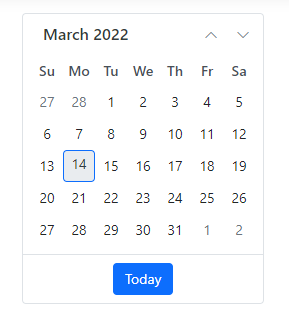

# How to Render the ASP.NET Core Application in IE11 Web Browser

This section explains how to render the ASP.NET Core application in IE11 web browser. The Microsoft Internet Explorer supports `ASP.NET Core` app with additional polyfills in .NET Core apps

## Prerequisites

[System requirements for ASP.NET Core components](https://ej2.syncfusion.com/aspnetcore/documentation/system-requirements/)

## ASP.NET Core application.

Find the following steps to add the polyfills in the ASP.NET Core application.

1. Create a ASP.NET Core application using [ASP.NET Core Getting Started](../../getting-started/razor-pages) documentation.

2. Add the polyfill script reference in the `<head>` element of the `~/Pages/Shared/_Layout.cshtml` page.




    <head>
        ...
        <!-- Minified version of `es6-promise` below. -->
        
    </head>




> This [polyfill](https://cdn.jsdelivr.net/npm/es6-promise@4/dist/es6-promise.min.js) is required to configure in ASP.NET Core application for IE 11 web browser. For further detail, refer to the link [here](https://github.com/stefanpenner/es6-promise).

3. Run the application in the IE 11 web browser and the Syncfusion ASP.NET Core Control is now rendered on IE 11.

    

## See Also

* [ASP.NET Core supported platforms](https://docs.microsoft.com/en-us/aspnet/core/blazor/supported-platforms)
