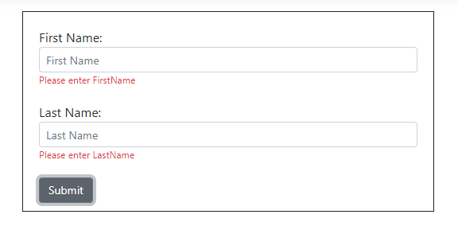

# Input Form Validation

The Syncfusion ASP.NET Core UI input and editor controls can be validated by using [FormValidator](https://ej2.syncfusion.com/javascript/documentation/api/form-validator/) in client side.

## How to Validate Syncfusion ASP.NET Core UI Controls

1.Add the `Form` component in the **Index.cshtml** page. Also, declare the Syncfusion ASP.NET Core [TextBox](../textbox/getting-started) control inside the `Form` component.




<form id="form-element">
    

        <label for="first-name">First Name:</label>
        <ejs-textbox id="firstname" name="FirstName" placeholder="First Name" width="50%"></ejs-textbox>
    

    

        <label for="last-name">Last Name:</label>
        <ejs-textbox id="lastname" name="LastName" placeholder="Last Name"  width="50%"></ejs-textbox>
    

    <ejs-button id="submit" content="Submit"></ejs-button>
</form>




2.The following code shows how to perform client side validation using `FormValidator` inside the script tag.







3.The `Form` validates the input values and displays the validation message on the `FormValidator` rules when submitting the form.

**Validation Failure:**

> TextBox control supports three types of validation styles. Refer [here](https://ej2.syncfusion.com/aspnetcore/documentation/textbox/validation).

4.You can use the FormValidator [rules](https://ej2.syncfusion.com/javascript/documentation/api/form-validator/#rules) property to display the custom validation error message for each input control.







5.You can also use the [submit](https://ej2.syncfusion.com/javascript/documentation/api/form-validator/#submit) event from FromValidator to validate the form manually.

## ASP.NET Core Form Validation Supported Controls

The following section provides the details about the Syncfusion ASP.NET Core UI controls that are supported with form validation.

* [Masked TextBox](https://ej2.syncfusion.com/aspnetcore/documentation/maskedtextbox/how-to/perform-custom-validation-using-form-validator)
* [NumericTextBox](https://ej2.syncfusion.com/aspnetcore/documentation/numerictextbox/how-to/perform-custom-validation-using-form-validator)
* [Range Slider](https://ej2.syncfusion.com/aspnetcore/documentation/range-slider/how-to/form-slider-with-form-validator)
* [CheckBox](https://ej2.syncfusion.com/aspnetcore/documentation/check-box/how-to/name-and-value-in-form-submit)
* [Radio Button](https://ej2.syncfusion.com/aspnetcore/documentation/radio-button/how-to/name-and-value-in-form-submit)
* [Switch](https://ej2.syncfusion.com/aspnetcore/documentation/switch/how-to/submit-name-and-value-in-form)
* [DatePicker](https://ej2.syncfusion.com/aspnetcore/documentation/datepicker/how-to/client-side-validation)
* [TimePicker](https://ej2.syncfusion.com/aspnetcore/documentation/timepicker/how-to/client-side-validation-using-form-validator)
* [ListBox](https://ej2.syncfusion.com/aspnetcore/documentation/list-box/how-to/form-submit)
* [In-place Editor](https://ej2.syncfusion.com/aspnetcore/documentation/in-place-editor/validation)
* [TextBox](https://ej2.syncfusion.com/aspnetcore/documentation/textbox/validation)
* [RichTextEditor](https://ej2.syncfusion.com/aspnetcore/documentation/rich-text-editor/validation)
* DateTimePicker
* Calendar
* ColorPicker
* DateRangePicker
* Auto Complete
* ComboBox
* DropDownList
* MultiSelect

## See Also

* [ASP.NET Core Forms and Validation](https://docs.microsoft.com/en-us/aspnet/core/mvc/views/working-with-forms?view=aspnetcore-6.0)
* [Model validation in ASP.NET Core and Razor Pages](https://docs.microsoft.com/en-us/aspnet/core/mvc/models/validation?view=aspnetcore-6.0)