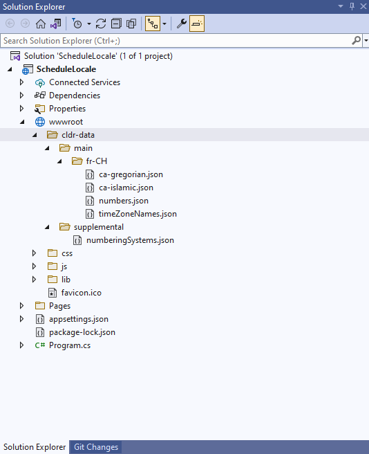
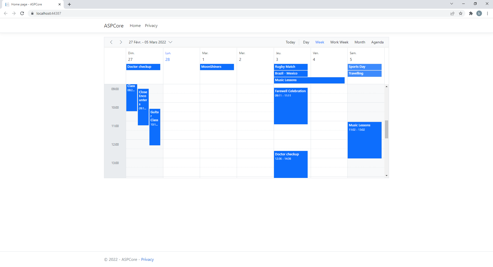
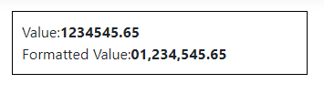
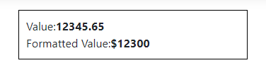
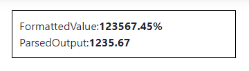
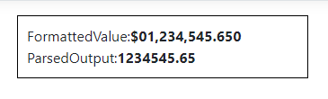
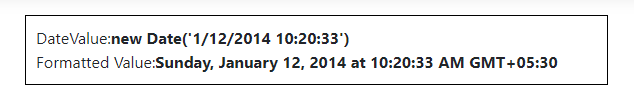
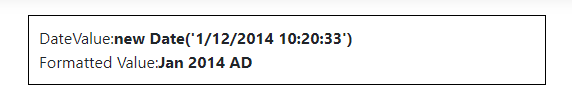
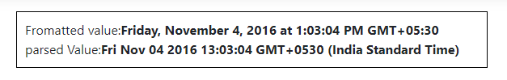

# Globalization

 Globalization is the combination of adapting the control to various languages by parsing and formatting the date or numbers (`Internationalization (L18N)`), adding cultural-specific customizations and translating the text (`Localization (L10N)`). The `American English (en-US)` locale is set as default _culture_ and `USD` is set as default _currencyCode_ for all Syncfusion ASP.NET Core controls.

## Loading Culture Data

It requires the following [CLDR](http://cldr.unicode.org/) data to be loaded using `loadCldr` function for cultures other than `en-US`.

| File Name | Path |
| ------------- | ------------- |
| ca-gregorian | cldr/main/en/ca-gregorian.json |
| timeZoneNames |cldr/main/en/timeZoneNames.json |
| numbers | cldr/main/en/numbers.json |
| numberingSystems | cldr/supplemental/numberingSystems.json |
| currencies | cldr/main/en/currencies.json |

> For `en`, dependency files are already loaded in the library.

### Installing CLDR Data and enable localization in schedule control

1. CLDR data is available as npm package. So, you can install it through the below command in the application root directory. Once the package is installed, you can find the culture specific JSON data under the location `node_modules\cldr-data`.




npm install cldr-data




2. Once the `CLDR-Data` installed create a folder `cldr-data` inside the `wwwroot` folder. Then create the folder directory like shown below in the structure inside the `wwwroot` folder.

* `wwwroot\cldr-data\supplemental`
* `wwwroot\cldr-data\main`

3. The files named as below are required to setup the specific culture to the Schedule control.

* numberingSystems.json
* ca-gregorian.json
* numbers.json
* timeZoneNames.json
* ca-islamic.json

4. The file named `numberingSystems.json` is available in the location `node_modules\cldr-data\supplemental` which is common for all the cultures. Now, you can move this file to the location `wwwroot\cldr-data\supplemental`.

5. The other required files mentioned above are available in the location `node_modules\cldr-data\main\culture_code`. In this location every culture has the culture files inside the folder named as its language culture code. For example if the German culture is loaded, then the German culture files could be found inside the location `node_modules\cldr-data\main\fr-CH`. Now, create a folder named `fr-CH` inside the location `wwwroot\cldr-data\main` and move the files inside it.

6. Now, use the below `loadCultureFiles` method to load the culture specific CLDR JSON data.







7. The following code example lets you to set the culture to the Schedule control by using the locale property.




@using Syncfusion.EJ2
@{
    var dataManager = new DataManager()
    {
        Url = "https://ej2services.syncfusion.com/production/web-services/api/Schedule",
        Adaptor = "ODataV4Adaptor",
        CrossDomain = true
    };
}

<ejs-schedule id="schedule" width="100%" height="550" selectedDate="DateTime.Now" readonly="true" locale="fr-CH">
    <e-schedule-eventsettings dataSource="dataManager">
    </e-schedule-eventsettings>
</ejs-schedule>




> Refer this documentation to [localizing the static Scheduler text](../schedule/localization#localizing-the-static-scheduler-text)

## Changing Global Culture and Currency Code

To set the default culture and the currencyCode for all ASP.NET Core controls, you can use the methods `setCulture` for setting default locale and `setCurrencyCode` for setting the currencyCode in view page.

### Setting Global Culture







### Setting Currency Code







> If global culture is not set, then `en-US` is set as default locale and `USD` is set as default currency code.

## Manipulating Numbers

<!-- markdownlint-disable MD024 -->

### Supported Format String

<!-- markdownlint-disable MD024 -->

Based on the  `NumberFormatOptions` number formatting and parsing operations are processed. You need to specify some or all of the following properties mentioned in the below table.

| No | Properties | Description |
| --- | --- | --- |
| 1 | `format` | Denotes the format to be set. Possible values are     1. **N -** denotes numeric type.    2. **C -** denotes currency type.    3. **P -**  denotes percentage type.    E.g:    `formatNumber`( **1234344** ,{format:&#39;N4&#39;}).       > If no format is specified it takes numeric as default format type. |
| 2 | `minimumFractionDigits` | Indicates the minimum number of fraction digits . Possible values are 0 to 20.  |
| 3 | `maximumFractionDigits` | Indicates the maximum number of fraction digits. Possible values are 0 to 20.  |
| 4 | `minimumSignificantDigits` | Indicates the minimum number of significant digits. Possible values are  1 to 21.   > If `minimumSignificantDigits` is given it is mandatory to give `maximumSignificantDigits`  |
| 5 | `maximumSignificantDigits` | Indicates the maximum number of significant digits. . Possible values are  1 to 21.    > If `maximumSignificantDigits` is given it is mandatory to give `minimumSignificantDigits`  |
| 6 | `useGrouping` | Indicates whether to enable the group separator or not. By default grouping value will be true.  |
| 7 | `minimumIntegerDigits` | Indicates the minimum number of the integer digits to be placed in the value. Possible values are 1 to 21.  |
| 8 | `currency`| Indicates the currency code which needs to considered for the currency formatting.  |

> The `minimumIntegerDigits`, `minimumFractionDigits` and `maximumFractionDigits` are categorized as group one, `minimumSignificantDigits` and `maximumSignificantDigits` are categorized as group two. If group two properties are defined, then the group one properties will be ignored.

### Custom number formatting and parsing

Custom number formatting and parsing are also be supported by specifying the pattern directly in the **format** property of `NumberFormatOptions`. Custom number format can be achieved by using one or more custom format specifiers listed in the below table.

| Specifier | Description | Input | Format Output |
| ------- |--------------- | ---------------- | --------------- |
| 0 | Replaces the zero with the corresponding digit if one is present. Otherwise, zero appears in the result string. | `instance.formatNumber`(123,{format: '0000' }) | '0123' |
| # | Replaces the "#" symbol with the corresponding digit if one is present; otherwise, no digit appears in the result string.| `instance.formatNumber`(1234,{format: '####' }) | ‘1234’ |
| . | Denotes the number of digits allowed after the decimal points  if it’s not specified then no need to specify decimal point values. | `instance.formatNumber`(546321,{format: '###0.##0#' }) | ‘546321.000’ |
| % | Percent specifier denotes the percentage type format. | `instance.formatNumber`(1,{format: '0000 %' }) | ‘0100 %’ |
| $ | Denotes the currency type format based on the global currency code specified. | `instance.formatNumber`(13,{format: '$ ###.00' }); | ‘$ 13.00’ |
| ; | Denotes separate formats for positive, negative and zero values. | `instance.formatNumber`(-120,{format: '###.##;(###.00);-0'}); | ‘(120.00)’    |
| 'String' (single Quotes) | Denotes the characters enclosed within single Quote(') to be replaced in the resultant string. | `instance.formatNumber`(-123.44,{format: "####.## '@'"}) | ‘123.44 @’    |

>If custom format pattern is specified other `NumberFormatOptions` properties will not be considered.

### Number formatting

#### `getNumberFormat`

The `getNumberFormat` method will return a function that formats given number based on the `NumberFormatOptions` specified.




Value:1234545.65

Formatted Value:




#### `formatNumber`

 The `formatNumber` method which takes two arguments numeric value and `NumberFormatOptions`, returns the formatted string.




Value:12345.65

Formatted Value: 

 




### Parsing

#### `getNumberParser`

The `getNumberParser` method will return a function that parses given string based on the `NumberFormatOptions` specified.




FormattedValue:123567.45%

ParsedOutput: 




#### `parseNumber`

The `parseNumber` method takes two arguments the string value, `NumberFormatOptions` and returns the numeric value.




FormattedValue:$01,234,545.650

ParsedOutput: 




## Manipulating DateTime

### Supported Format String

Based on the `DateFormatOptions`, date formatting and parsing operations are processed. You need to specify some or all of the following properties mentioned below table.

| Options | Descriptions |
| --- | --- |
| Type | It specifies the type of format to be used supported types . 1. **`date`**   2. **`dateTime`**   3. **`time`**   Based on the type specified the supported skeletons are given below.   1. short   2. medium,  3. long  4. full    **E.g:** `formatDate`(new Date(), {type: &#39;date&#39;, skeleton:medium})  > If no type is specified then **date** type is set by default.   |
| skeleton | Specifies the format in which the `dateTime` format will process |

<!-- markdownlint-disable MD036 -->

**Date type skeletons**

| skeleton | Option input |  Format Output |
| --- | --- | --- |
| short | {type: &#39;date&#39;, skeleton:&#39;short&#39;}) | 11/4/16 |
| medium  | {type: &#39;date&#39;, skeleton:&#39;medium&#39;}) | Nov 4, 2016 |
| long | {type: &#39;date&#39;, skeleton:&#39;long&#39;} | November 4, 2016 |
| full | {type: &#39;date&#39;, skeleton:full}) | Friday, November 4, 2016   |

**Time type skeletons**

| skeleton | Option input | Format Output |
| --- | --- | --- |
| short | {type: &#39;time&#39;, skeleton:&#39;short&#39;}  | 1:03 PM  |
| medium  | {type: &#39;time&#39;, skeleton:&#39;medium&#39;}  | 1:03:04 PM |
| Long | {type: &#39;time&#39;, skeleton:&#39;long&#39;})  | 1:03:04 PM GMT+5 |
| full | {type: &#39;time&#39;, skeleton:&#39;full&#39;})  | 1:03:04 PM GMT+05:30 |

**DateTime type skeletons**

| Skeleton | Option input | Format Output |
| --- | --- | --- |
| short | {type: &#39;`dateTime`&#39;, skeleton:&#39;short&#39;}  | 11/4/16, 1:03 PM  |
| medium  | {type: &#39;`dateTime`, skeleton:&#39;medium&#39;}  | Nov 4, 2016, 1:03:04 PM |
| Long | {type: &#39;`dateTime`&#39;, skeleton:&#39;long&#39;})  | November 4, 2016 at 1:03:04 PM GMT+5 |
| full | {type: &#39;`dateTime`&#39;, skeleton:&#39;full&#39;})  | Friday, November 4, 2016 at 1:03:04 PM GMT+05:30  |

**Additional skeletons**

Apart from the standard date type formats additional format are supported by using the additional skeletons given in below table.

| skeleton | Option input |  Format Output |
| --- | --- | --- |
| d | {skeleton:&#39;d&#39;} | 7 |
| E |  {skeleton:&#39;E&#39;} |   Mon |
| Ed | {skeleton:&#39;Ed&#39;} | 7 Mon |
| Ehm | {skeleton:&#39;Ehm&#39;}) | Mon 12:43 AM |
| EHm | {skeleton:&#39;EHm;}); |   Mon 12:43 |
| Ehms | {skeleton:&#39;Ehms&#39; } |   Mon 2:45:23 PM |
|  EHms | {skeleton:&#39;EHms&#39;}) |   Mon 12:45:45   |
| Gy | {skeleton:&#39;Gy&#39; } |  2016 AD |
| GyMMM | {skeleton:&#39;GyMMM&#39;} | : Nov 2016 AD   |
| GyMMMd | {skeleton:&#39;GyMMMd&#39;} |  Nov 7, 2016 AD |
| GyMMMEd | {skeleton:&#39;GyMMMEd&#39;} | Mon, Nov 7, 2016 AD |
| h | {skeleton:&#39;h&#39;} |   12 PM |
| H | {skeleton:&#39;H&#39;} |   12   |
| hm | {skeleton:&#39;hm&#39;} |   12:59 PM |
| Hm | {skeleton:&#39;Hm&#39;}  |   12:59 |
| hms | {skeleton:&#39;hms&#39;}  | 12:59:13 PM |
| Hms | {skeleton:&#39;Hms&#39;}  | 12:59:13 |
| M | {skeleton:&#39;M&#39;} | 11  |
| Md | {skeleton:&#39;Md&#39;} |   11/7   |
| MEd | {skeleton:&#39;hms&#39;}  | Mon, 11/7 |
| MMM | {skeleton:&#39;MMM&#39;}  | Nov |
| MMMEd | {skeleton:&#39;MMMEd&#39;}  | Mon, Nov 7   |
| MMMd | {skeleton:&#39;MMMEd&#39;}  | Nov 7 |
| ms | {skeleton:&#39;ms&#39;}  | 59:13 |
| y | {skeleton:&#39;y&#39; } | 2016 |
| yM | {skeleton:&#39;yM&#39; } |   11/2016   |
| yMd | {skeleton:&#39;yMd&#39; } | 11/7/2016 |
| yMEd | {skeleton:&#39;yMEd&#39; } |  Mon, 11/7/2016 |
| yMMM | {skeleton:&#39;yMMM&#39; } | Nov 2016   |
|  yMMMd | {skeleton:&#39;yMMMd&#39;}  |  Nov 7, 2016 |
| yMMMEd | {skeleton:&#39;yMMMEd&#39;}  |  Mon, Nov 7, 2016 |
| yMMM | {skeleton:&#39;yMMM&#39;} | Nov 2016   |

>Culture specific format skeletons are also supported.

### Custom Formats

To use the custom date and time formats, specify the date/time pattern directly in the *format* property. Custom format string must contain one or more of the following standard date/time symbols

| Symbols | Description |
|--------- |------------- |
| G | Denotes the era in the date |
| y | Denotes the year.|
| M / L | Denotes month.|
| E / c | Denotes the day of week. |
| d | Denotes the day of month. |
| h / H | Denotes the hour. *h* for 12 hour and *H* for 24 hours format. |
| m | Denotes minutes. |
| s | Denotes seconds. |
| a | Denotes the am/pm designator it will only be displayed if hour is specified in the h format. |
| z | Denotes the time zone. |
| ' (single quotes) | To display words in the formatted date you can specify the words with in the single quotes |

**Custom format example**




DateValue:new Date('1/12/2014 10:20:33')

Formatted Value: 




>If format property is given in options other properties are not considered.

<!-- markdownlint-enable MD036 -->

### Formatting

#### `getDateFormat`

The `getDateFormat` method which will return a function that formats given date object based on the `DateFormatOptions` specified.




DateValue:new Date('1/12/2014 10:20:33')

Formatted Value: 




#### `formatDate`

 The `formatDate` method takes two arguments date object and `DateFormatOptions`, and returns the formatted string.




DateValue:new Date('1/12/2014 10:20:33')

Formatted Value: 




<!-- markdownlint-enable MD036 -->

### Parsing

#### `getDateParser`

The `getDateParser` method will return a function that parses given string based on the `DateFormatOptions` specified.




Fromatted value:Friday, November 4, 2016 at 1:03:04 PM GMT+05:30

parsed Value: 




#### `parseDate`

The `parseDate` method takes two arguments string value, `DateFormatOptions` and returns the date Object.




Fromatted value:11/2016

parsed Value: 




