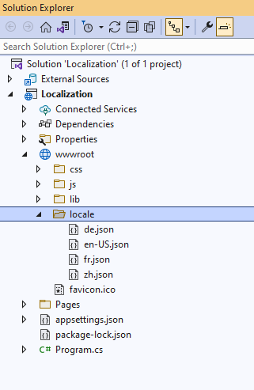
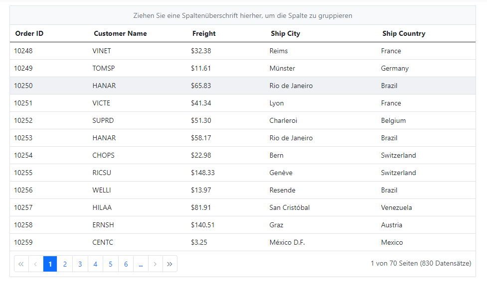
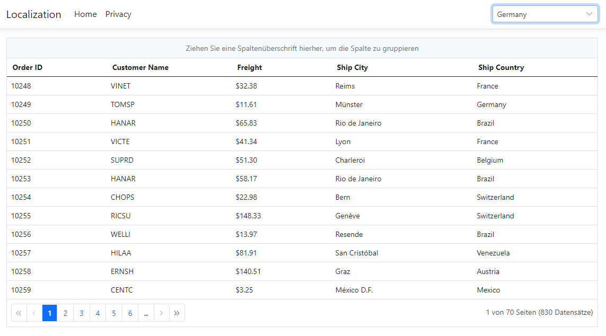

# Localization (Multi-Language) support in ASP.NET Core

Localization (L10N) is the process of adapting application controls and content to the desired language with its corresponding region. This page shows, how to use the Localization feature in the ASP.NET Core application.

## Localization of Syncfusion ASP.NET Core Controls

Syncfusion controls can be localized using the culture based JSON files. You can find the default and culture based localization files in the following GitHub repository.

> You can get default and culture based JSON files from [GitHub](https://github.com/syncfusion/ej2-locale).

### Adding culture based JSON files

Syncfusion [locale data](https://www.npmjs.com/package/@syncfusion/ej2-locale) is also available as npm package. So, you can install it through the below command in the application root directory. Once the package is installed, you can find the culture specific JSON data under the location `node_modules\@syncfusion\ej2-locale\src`.




npm i @syncfusion/ej2-locale




Once the `ej2-locale` package has installed, create a folder `locale` inside the `wwwroot` folder. Then copy the specific culture files from `node_modules\@syncfusion\ej2-locale\src` location and paste it inside the `wwwroot/locale` folder like below. The culture file contains all Syncfusion ASP.NET Core controls locale text.

## Statically set the culture

If you don't want to change culture dynamically, you can specify the static culture using `load` function of `L10n` class in **~/Pages/Shared/_Layout.cshtml** file as in the below code.




<body>
    ...
    
</body>




Now, you can add the Syncfusion ASP.NET Core control in `~/Pages/Index.cshtml` page.




<ejs-grid id="Grid" allowPaging="true" allowGrouping="true">
    <e-data-manager url="https://services.odata.org/V4/Northwind/Northwind.svc/Orders/" adaptor="ODataV4Adaptor" crossdomain="true"></e-data-manager>
    <e-grid-pagesettings pageCount="6"></e-grid-pagesettings>
    <e-grid-columns>
        <e-grid-column field="OrderID" headerText="Order ID" isPrimaryKey="true" width="120"></e-grid-column>
        <e-grid-column field="CustomerID" headerText="Customer Name" width="150"></e-grid-column>
        <e-grid-column field="Freight" headerText="Freight" format="C2" width="120"></e-grid-column>
        <e-grid-column field="ShipCity" headerText="Ship City" width="170"></e-grid-column>
        <e-grid-column field="ShipCountry" headerText="Ship Country" width="150"></e-grid-column>
    </e-grid-columns>
</ejs-grid>




> [View sample in GitHub](https://github.com/SyncfusionExamples/asp-net-core-localization/tree/main/Localization-with-static-culture)

## Dynamically set the culture

The culture can be set dynamically based on user's preference. The following example demonstrates how to dynamically change the culture in the ASP.NET Core application.

Modify the **~/Pages/Shared/_Layout.cshtml** page with the below code to implement a culture change dynamically using the dropdown in the application.




@model IndexModel
<!DOCTYPE html>
<html lang="en">
<body>
<header>
    ...
    

        <ejs-dropdownlist id="culture-swtich" dataSource="@Model.Cultures" index="0" change="onCultureChange" floatLabelType="Always">
        <e-dropdownlist-fields text="Text" value="ID"></e-dropdownlist-fields>
        </ejs-dropdownlist>
    

</header>

<body>
</html>



Add the following code for dropdown data in the **~/Pages/Index.cshtml.cs** model page.




public List<CultureDetails> Cultures = new List<CultureDetails>() 
{
    new CultureDetails(){ ID = "en-US", Text = "English" },
    new CultureDetails(){ ID = "de", Text = "Germany" },
    new CultureDetails(){ ID = "fr", Text = "French" },
    new CultureDetails(){ ID = "zh", Text = "Chinese" }
};

public class CultureDetails
{
    public string ID { get; set; }
    public string Text { get; set; }
}




> [View sample in GitHub](https://github.com/SyncfusionExamples/asp-net-core-localization/tree/main/Localization-with-dynamic-culture)

## Changing current locale

Current locale can be changed for all the Syncfusion ASP.NET Core controls in the application by invoking `setCulture` function with the desired culture name and set locale property. You can change the different culture in Syncfusion ASP.NET Core controls by setting [locale](https://help.syncfusion.com/cr/aspnetcore-js2/Syncfusion.EJ2.Grids.Grid.html#Syncfusion_EJ2_Grids_Grid_Locale) property with culture codes.

The following example demonstrates the Grid in Deutsch culture.




<ejs-grid id="Grid" allowPaging="true" locale="de-DE" allowGrouping="true">
    <e-data-manager url="https://services.odata.org/V4/Northwind/Northwind.svc/Orders/" adaptor="ODataV4Adaptor" crossdomain="true"></e-data-manager>
    <e-grid-pagesettings pageCount="6"></e-grid-pagesettings>
    <e-grid-columns>
        <e-grid-column field="OrderID" headerText="Order ID" isPrimaryKey="true" width="120"></e-grid-column>
        <e-grid-column field="CustomerID" headerText="Customer Name" width="150"></e-grid-column>
        <e-grid-column field="Freight" headerText="Freight" format="C2" width="120"></e-grid-column>
        <e-grid-column field="ShipCity" headerText="Ship City" width="170"></e-grid-column>
        <e-grid-column field="ShipCountry" headerText="Ship Country" width="150"></e-grid-column>
    </e-grid-columns>
</ejs-grid>




> Before changing a culture globally, ensure that locale text for the concerned culture is loaded through `L10n.load` function. 

## See also

* [Globalization](https://ej2.syncfusion.com/aspnetcore/documentation/common/internationalization)
