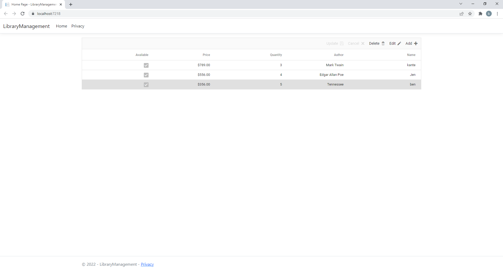
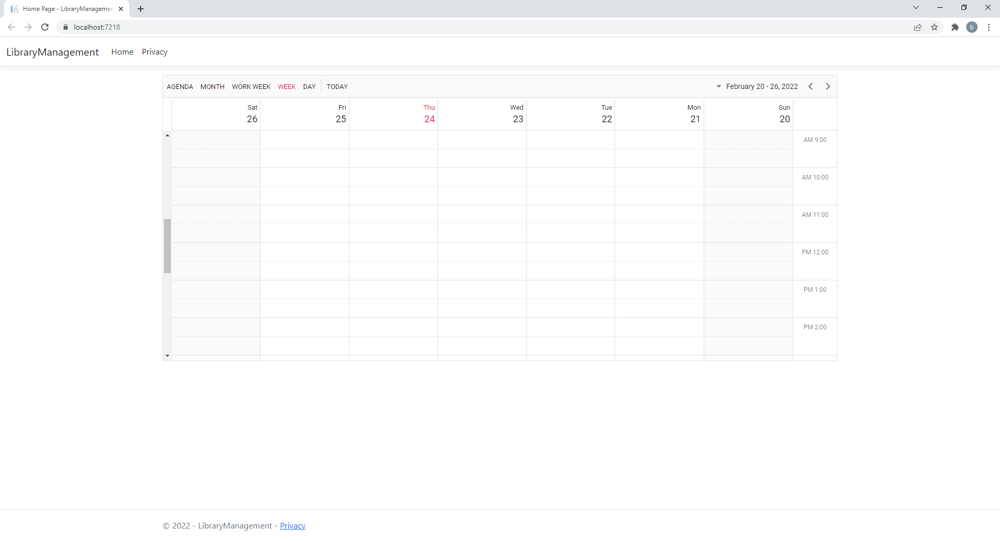

# Right-To-Left support in Syncfusion ASP.NET Core controls

The right-to-left (RTL) support can be enabled for Syncfusion ASP.NET Core controls by setting `enableRtl` property to `true`. This will render all the Syncfusion ASP.NET Core controls in the right-to-left direction.

## Enable RTL for all controls

You can enable right to left (RTL) for all Syncfusion controls used in the application by setting `enableRtl` property to `true` in the script tag. Add the below code snippet in the **_Layout.cshtml** file inside **body** tag.







The output will be as follows.

## Enable RTL to individual control

To control a control’s direction individually you can directly set the control’s `enableRtl` property as true. For illustration, we have enabled RTL for Schedule control in following code snippet.





<ejs-schedule id="schedule" height="550px" enableRtl="true"></ejs-schedule>









The output will be as follows.

