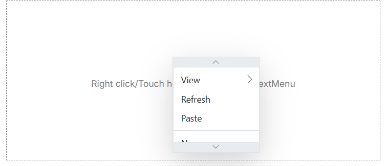

# Render Scrollable Context Menu

To enable scrolling for the Context Menu, use the [enableScrolling](https://help.syncfusion.com/cr/cref_files/aspnetcore-js2/aspnetcore/Syncfusion.EJ2~Syncfusion.EJ2.Navigations.ContextMenu.Enablescrolling.html) property to manage the overflow behavior of menu items by enabling or disabling scroll functionality. This is especially useful when dealing with a large number of menu items that exceed the viewport height, ensuring the context menu remains accessible without affecting the page layout.

To achieve this functionality, set the `EnableScrolling` property to `true`. Additionally, use the [BeforeOpen](https://help.syncfusion.com/cr/cref_files/aspnetcore-js2/aspnetcore/Syncfusion.EJ2~Syncfusion.EJ2.Navigations.ContextMenu.BeforeOpen.html) event to adjust the height of the menu's parent element, ensuring the scrollable area is applied correctly.
























