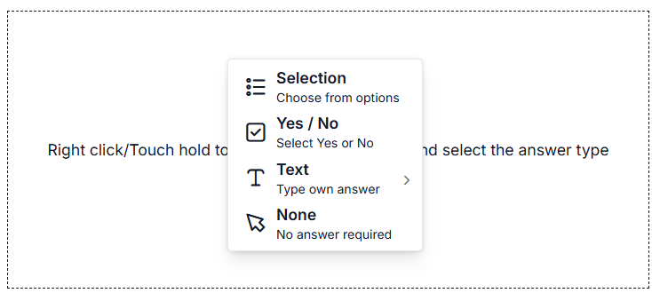

# Template and Nesting in ##Platform_Name## Context Menu

## Item template

The [itemTemplate](https://help.syncfusion.com/cr/aspnetcore-js2/Syncfusion.EJ2.Navigations.ContextMenu.html#Syncfusion_EJ2_Navigations_ContextMenu_ItemTemplate) property in the ContextMenu component allows you to define custom templates for displaying menu items within the context menu. This feature is particularly useful when you want to customize the appearance or layout of the menu items beyond the default text-based list.
























## Template



The ContextMenu items can be customized by using the [`beforeItemRender`](https://help.syncfusion.com/cr/aspnetcore-js2/Syncfusion.EJ2.Navigations.ContextMenu.html#Syncfusion_EJ2_Navigations_ContextMenu_BeforeItemRender) event. The event triggers before each menu item is rendered. The event argument will be used to identify the menu item and customize it based on the requirement. In the following sample, the menu item is rendered with a keyboard shortcut for the specified action in the ContextMenu using the template. Here, the shortcut is specified for Save as, View page source, and Inspect in the right-side corner of the menu items by adding a span element in the [`beforeItemRender`](https://help.syncfusion.com/cr/aspnetcore-js2/Syncfusion.EJ2.Navigations.ContextMenu.html#Syncfusion_EJ2_Navigations_ContextMenu_BeforeItemRender) event.



The ContextMenu items can be customized by using the [`beforeItemRender`](https://help.syncfusion.com/cr/aspnetmvc-js2/Syncfusion.EJ2.Navigations.ContextMenu.html#Syncfusion_EJ2_Navigations_ContextMenu_BeforeItemRender) event. The event triggers before each menu item is rendered. The event argument will be used to identify the menu item and customize it based on the requirement. In the following sample, the menu item is rendered with a keyboard shortcut for the specified action in the ContextMenu using the template. Here, the shortcut is specified for Save as, View page source, and Inspect in the right-side corner of the menu items by adding a span element in the [`beforeItemRender`](https://help.syncfusion.com/cr/aspnetmvc-js2/Syncfusion.EJ2.Navigations.ContextMenu.html#Syncfusion_EJ2_Navigations_ContextMenu_BeforeItemRender) event.


























## Multilevel nesting



Multiple-level nesting is supported in the ContextMenu. It can be achieved by mapping the [`items`](https://help.syncfusion.com/cr/aspnetcore-js2/Syncfusion.EJ2.Navigations.ContextMenuItem.html#Syncfusion_EJ2_Navigations_ContextMenuItem_Items) property inside the parent [`menuItems`](https://help.syncfusion.com/cr/aspnetcore-js2/Syncfusion.EJ2.Navigations.ContextMenuItem.html).



Multiple-level nesting is supported in the ContextMenu. It can be achieved by mapping the [`items`](https://help.syncfusion.com/cr/aspnetmvc-js2/Syncfusion.EJ2.Navigations.ContextMenuItem.html#Syncfusion_EJ2_Navigations_ContextMenuItem_Items) property inside the parent [`menuItems`](https://help.syncfusion.com/cr/aspnetmvc-js2/Syncfusion.EJ2.Navigations.ContextMenuItem.html).


























## See also

* [Populate menu items with data source](./how-to#data-binding)
