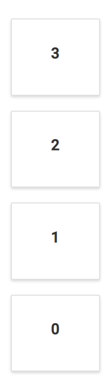

# Responsive and adaptive layout

The control is provided with built-in responsive support, where panels within the layout get adjusted based on their parent element's dimensions to accommodate any resolution which relieves the burden of building responsive dashboards.

The dashboard layout is designed to automatically adapt with lower resolutions by transforming the entire layout into a stacked one, so that, the panels will be displayed in a vertical column. By default, whenever the screen resolution meets 600px or lower resolutions this layout transformation occurs. This transformation can be modified for any user defined resolution by defining the for the [`mediaQuery`](https://help.syncfusion.com/cr/cref_files/aspnetcore-js2/Syncfusion.EJ2~Syncfusion.EJ2.Layouts.DashboardLayout~MediaQuery.html) property of the component.

The following sample demonstrates the usage of the [`mediaQuery`](https://help.syncfusion.com/cr/cref_files/aspnetcore-js2/Syncfusion.EJ2~Syncfusion.EJ2.Layouts.DashboardLayout~MediaQuery.html) property to turn out the layout into a stacked one in user defined resolution. Here, whenever, the window size reaches 700px or lesser, the layout becomes a stacked layout.





Output be like the below.

> You can refer to our [ASP.NET Core Dashboard Layout](https://www.syncfusion.com/aspnet-core-ui-controls/dashboard-layout) feature tour page for its groundbreaking feature representations. You can also explore our [ASP.NET Core Dashboard Layout example](https://ej2.syncfusion.com/aspnetcore/DashboardLayout/DefaultFunctionalities#/material) to knows how to present and manipulate data.