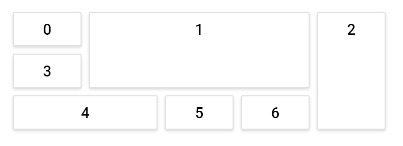

# Configuring the layout

The entire layout dimensions are assigned based on the height and width of the parent element. Hence, a responsive or static layout can be created by assigning a percentage or static dimension values to the parent element. The layout adapts to mobile resolutions by transforming the entire layout into a stacked orientation, so that, the panels will be displayed in a vertical column.

The **Dashboard Layout** is a grid structured component which can be split into subsections of equal size known as cells. The total number of cells in each row is defined by using the [`columns`](https://help.syncfusion.com/cr/cref_files/aspnetcore-js2/Syncfusion.EJ2~Syncfusion.EJ2.Layouts.DashboardLayout~Columns.html) property of the component. The width of each cell will be auto calculated based on the total number of cells placed in a row and the height of a cell will be same as that of its width. However, the height of these cells can also be configured to any desired size using the [`cellAspectRatio`](https://help.syncfusion.com/cr/cref_files/aspnetcore-js2/Syncfusion.EJ2~Syncfusion.EJ2.Layouts.DashboardLayout~CellAspectRatio.html) property (cellwidth/cellheight ratio) which defines the cell width to height ratio.

The number of rows within the layout has no limits and can have any number of rows based on the panels count and position. Panels which acts as data containers will be placed or positioned over these cells.

## Modifying cell size

In a dashboard, the data to be held by the panel in a cell may be of different size, hence different cell dimensions may be required in different scenarios. In this case, the size of these grid cells can be modified to the required size using the [`columns`](https://help.syncfusion.com/cr/cref_files/aspnetcore-js2/Syncfusion.EJ2~Syncfusion.EJ2.Layouts.DashboardLayout~Columns.html) and [`cellAspectRatio`](https://help.syncfusion.com/cr/cref_files/aspnetcore-js2/Syncfusion.EJ2~Syncfusion.EJ2.Layouts.DashboardLayout~CellAspectRatio.html) properties.

The following sample demonstrates how to modify a cell size using the [`columns`](https://help.syncfusion.com/cr/cref_files/aspnetcore-js2/Syncfusion.EJ2~Syncfusion.EJ2.Layouts.DashboardLayout~Columns.html) and [`cellAspectRatio`](https://help.syncfusion.com/cr/cref_files/aspnetcore-js2/Syncfusion.EJ2~Syncfusion.EJ2.Layouts.DashboardLayout~CellAspectRatio.html) properties. In the following sample, the width of the parent element is divided into 5 equal cells based on the columns property value resulting the width of each cell as 100px. The height of these cells will be 50px based on the cellAspectRatio value 100/50 (i.e., for every 100px of width, 50px will be the height of the cell).
























Output be like the below.

## Setting cell spacing

The spacing between each panel in a row and column can be defined using the [`cellSpacing`](https://help.syncfusion.com/cr/cref_files/aspnetcore-js2/Syncfusion.EJ2~Syncfusion.EJ2.Layouts.DashboardLayout~CellSpacing.html) property. Adding spacing between the panels will make the layout effective and provides a clear data representation.

The following sample demonstrates the usage of the [`cellSpacing`](https://help.syncfusion.com/cr/cref_files/aspnetcore-js2/Syncfusion.EJ2~Syncfusion.EJ2.Layouts.DashboardLayout~CellSpacing.html) property, which helps in a neat and clear representation of a data.
























Output be like the below.

## Graphical representation of the layout

These cells combinedly forms a grid-structured layout which will be hidden initially. This grid structured layout can be made visible by enabling the [`showGridLines`](https://help.syncfusion.com/cr/cref_files/aspnetcore-js2/Syncfusion.EJ2~Syncfusion.EJ2.Layouts.DashboardLayout~ShowGridLines.html) property, which clearly pictures the cells split-up within the layout. These gridlines will be helpful in panels sizing and placement within the layout during initial designing of a dashboard.

In the following sample, the gridlines indicate the cells split-up of the layout and the data containers placed over these cells are known as panels.
























Output be like the below.

## Rendering component in right-to-left direction

It is possible to render the Dashboard Layout in right-to-left direction by setting the [enableRtl](https://help.syncfusion.com/cr/cref_files/aspnetcore-js2/Syncfusion.EJ2~Syncfusion.EJ2.Layouts.DashboardLayout~EnableRtl.html) API to true.

The following sample demonstrates Dashboard Layout in right-to-left direction.
























Output be like the below.

> You can refer to our [ASP.NET Core Dashboard Layout](https://www.syncfusion.com/aspnet-core-ui-controls/dashboard-layout) feature tour page for its groundbreaking feature representations. You can also explore our [ASP.NET Core Dashboard Layout example](https://ej2.syncfusion.com/aspnetcore/DashboardLayout/DefaultFunctionalities#/material) to knows how to present and manipulate data.