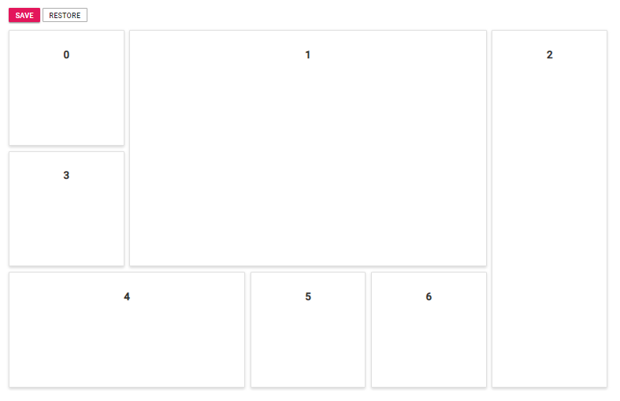

# Panel state maintenance

The current layout structure of the Dashboard Layout component can be obtained and saved to construct another dashboard with same panel structure using the `serialize` public method of the component. This method returns the component's current panel setting which can be used to construct a dashboard with the same layout settings.

The following sample demonstrates how to save and restore the state of the panels using the serialize method. Click Save to store the panel's settings and click Restore to restore the previously saved panel settings.
























Output be like the below.

> You can refer to our [ASP.NET Core Dashboard Layout](https://www.syncfusion.com/aspnet-core-ui-controls/dashboard-layout) feature tour page for its groundbreaking feature representations. You can also explore our [ASP.NET Core Dashboard Layout example](https://ej2.syncfusion.com/aspnetcore/DashboardLayout/DefaultFunctionalities#/material) to knows how to present and manipulate data.