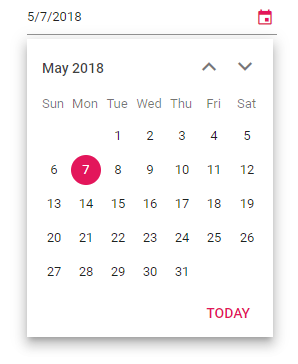

# How to customize day header in ##Platform_Name## DatePicker

You can change the format of the day that has to be displayed in header using [dayHeaderFormat](https://help.syncfusion.com/cr/aspnetcore-js2/Syncfusion.EJ2.Calendars.DatePicker.html#Syncfusion_EJ2_Calendars_DatePicker_DayHeaderFormat) property.

N> By default, the format is `Short`.

You can find the possible formats on below.

| **Name** | **Description** |
|------|---------------------|
| `Short` | Sets the short format of day name (like Su ) in day header. |
| `Narrow` | Sets the single character of day name (like S ) in day header. |
| `Abbreviated` | Sets the min format of day name (like Sun ) in day header. |
| `Wide` | Sets the long format of day name (like Sunday ) in day header. |




















