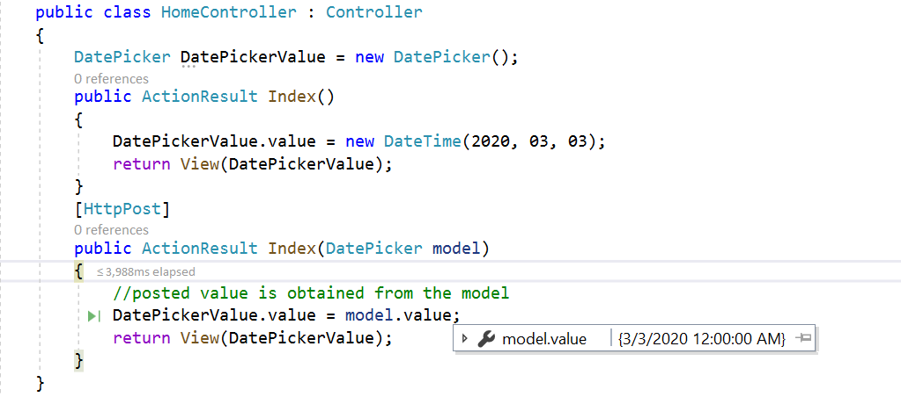

# How to render DatePickerFor in ##Platform_Name## DatePicker

The DatePickerFor component can be rendered by passing a value from the model. The selected date value can be retrieved during form submission using the post method at the server end.
























