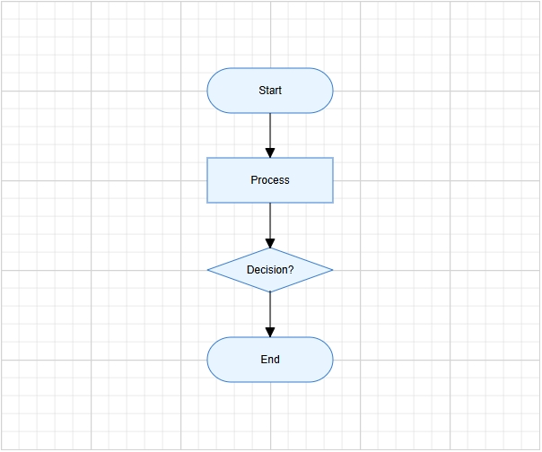

# Getting Started with ASP.NET Core Diagram Control

This section explains the steps required to create a simple diagram and demonstrates the basic usage of the ASP.NET Core Diagram control.

> **Ready to streamline your Syncfusion<sup style="font-size:70%">&reg;</sup> ASP.NET Core development?** Discover the full potential of Syncfusion<sup style="font-size:70%">&reg;</sup> ASP.NET Core controls with Syncfusion<sup style="font-size:70%">&reg;</sup> AI Coding Assistant. Effortlessly integrate, configure, and enhance your projects with intelligent, context-aware code suggestions, streamlined setups, and real-time insights—all seamlessly integrated into your preferred AI-powered IDEs like Visual Studio, Visual Studio Code, Cursor, Syncfusion<sup style="font-size:70%">&reg;</sup> CodeStudio and more. [Explore Syncfusion<sup style="font-size:70%">&reg;</sup> AI Coding Assistant](https://ej2.syncfusion.com/aspnetcore/documentation/ai-coding-assistant/overview)

## Prerequisites

Before getting started, ensure that your development environment meets the [system requirements for Syncfusion® ASP.NET Core controls](https://ej2.syncfusion.com/aspnetcore/documentation/system-requirements).

## Before You Begin

This guide uses the Razor Pages application structure generated by the latest .NET SDK.

The main files used in this guide are:

- `~/Pages/_ViewImports.cshtml` — Imports the Syncfusion<sup style="font-size:70%">&reg;</sup> tag helpers.
- `~/Pages/Shared/_Layout.cshtml` — Contains shared layout, style, and script references.
- `~/Pages/Index.cshtml` — Hosts the Diagram control.
- `~/Pages/Index.cshtml.cs` — Defines the nodes and connectors data passed to the view.

N> If your application uses the MVC pattern instead of Razor Pages, the equivalent files are typically `~/Views/_ViewImports.cshtml`, `~/Views/Shared/_Layout.cshtml`, `~/Views/Home/Index.cshtml`, and `~/Controllers/HomeController.cs`.

## Step 1: Create an ASP.NET Core web application

Create a new ASP.NET Core Razor Pages application using Visual Studio or the .NET CLI.

Using the .NET CLI:

```
dotnet new webapp -n MyDiagramApp
```

Navigate to the project folder:

```
cd MyDiagramApp
```

N> You can also create a project using [Microsoft templates](https://learn.microsoft.com/en-us/aspnet/core/tutorials/razor-pages/razor-pages-start) or the [Syncfusion<sup style="font-size:70%">&reg;</sup> ASP.NET Core Extension](https://ej2.syncfusion.com/aspnetcore/documentation/visual-studio-integration/create-project) in Visual Studio.

## Step 2: Install the Syncfusion® ASP.NET Core Diagram package

All Syncfusion<sup style="font-size:70%">&reg;</sup> ASP.NET Core packages are available on [nuget.org](https://www.nuget.org/packages?q=syncfusion.EJ2).

Install the [Syncfusion.EJ2.AspNet.Core](https://www.nuget.org/packages/Syncfusion.EJ2.AspNet.Core/) NuGet package using the Package Manager Console:

```
Install-Package Syncfusion.EJ2.AspNet.Core -Version {{ site.releaseversion }}
```

Or using the .NET CLI:

```
dotnet add package Syncfusion.EJ2.AspNet.Core
```

N> The `Syncfusion.EJ2.AspNet.Core` package automatically installs its required dependencies, including [Newtonsoft.Json](https://www.nuget.org/packages/Newtonsoft.Json/) and [Syncfusion.Licensing](https://www.nuget.org/packages/Syncfusion.Licensing/).

## Step 3: Register the Syncfusion® Tag Helper

Open the `~/Pages/_ViewImports.cshtml` file and add the Syncfusion<sup style="font-size:70%">&reg;</sup> tag helper reference.

```razor
@addTagHelper *, Syncfusion.EJ2
```

This makes the `<ejs-*>` tag helpers, including `<ejs-diagram>`, available in all Razor pages.

## Step 4: Add the required style and script references

Add the Syncfusion<sup style="font-size:70%">&reg;</sup> theme and script references inside the `<head>` of the `~/Pages/Shared/_Layout.cshtml` file along with the existing content.

```razor
<head>
    ...
    <!-- Syncfusion® ASP.NET Core controls styles -->
    <link rel="stylesheet" href="https://cdn.syncfusion.com/ej2/{{ site.ej2version }}/tailwind3.css" />
    <!-- Syncfusion® ASP.NET Core controls scripts -->
    <script src="https://cdn.syncfusion.com/ej2/{{ site.ej2version }}/dist/ej2.min.js"></script>
</head>
```

N> Syncfusion<sup style="font-size:70%">&reg;</sup> provides multiple built-in themes. To use a different theme, replace `tailwind3.css` with the corresponding theme file, such as `material3.css` or `fluent.css`. See the [Themes topic](https://ej2.syncfusion.com/aspnetcore/documentation/appearance/theme) for more details.

N> Refer to the [Adding Script Reference](https://ej2.syncfusion.com/aspnetcore/documentation/common/adding-script-references) topic to learn other approaches such as NPM and CRG for adding script references.

## Step 5: Register the Syncfusion® Script Manager

Add the `<ejs-scripts>` tag at the end of the `<body>` in the `~/Pages/Shared/_Layout.cshtml` file. The script manager renders the scripts required for Syncfusion<sup style="font-size:70%">&reg;</sup> controls to function correctly.

```razor
<body>
    ...
    <!-- Syncfusion® ASP.NET Core Script Manager -->
    <ejs-scripts></ejs-scripts>
</body>
```

## Step 6: Add the Diagram control

Add the `<ejs-diagram>` tag helper to the `~/Pages/Index.cshtml` file.

```razor
@page
@model IndexModel
<ejs-diagram id="diagram" width="100%" height="580px"></ejs-diagram>
```

This renders an empty diagram in the application.

N> The Diagram control must have a valid height. If the height is not set, the Diagram canvas may not be visible.

## Create your first Diagram with nodes and connectors

This section explains how to create a simple flowchart by adding nodes, customizing their appearance, and connecting them using connectors.

The following example creates a flowchart with four nodes: **Start**, **Process**, **Decision**, and **End**. Nodes and connectors are defined in `Index.cshtml.cs` and passed to the view through `ViewBag`. The view then binds them to the `<ejs-diagram>` tag helper.

### Define nodes and connectors in Index.cshtml.cs

Open `~/Pages/Index.cshtml.cs` and declare `nodes` and `connectors` as public properties on the page model. Populate them inside the `OnGet` method so they are available to the view when the page loads.

```csharp
using Microsoft.AspNetCore.Mvc.RazorPages;
using Syncfusion.EJ2.Diagrams;
using System.Collections.Generic;

public class IndexModel : PageModel
{
    public List<DiagramNode> nodes { get; set; }
    public List<DiagramConnector> connectors { get; set; }

    public void OnGet()
    {
        // Define nodes
        nodes = new List<DiagramNode>()
        {
            new DiagramNode()
            {
                Id = "node1", OffsetX = 300, OffsetY = 100,
                Shape = new { type = "Flow", shape = "Terminator" },
                Annotations = new List<DiagramNodeAnnotation>()
                {
                    new DiagramNodeAnnotation() { Content = "Start" }
                }
            },
            new DiagramNode()
            {
                Id = "node2", OffsetX = 300, OffsetY = 200,
                Shape = new { type = "Flow", shape = "Process" },
                Annotations = new List<DiagramNodeAnnotation>()
                {
                    new DiagramNodeAnnotation() { Content = "Process" }
                }
            },
            new DiagramNode()
            {
                Id = "node3", OffsetX = 300, OffsetY = 300,
                Shape = new { type = "Flow", shape = "Decision" },
                Annotations = new List<DiagramNodeAnnotation>()
                {
                    new DiagramNodeAnnotation() { Content = "Decision?" }
                }
            },
            new DiagramNode()
            {
                Id = "node4", OffsetX = 300, OffsetY = 400,
                Shape = new { type = "Flow", shape = "Terminator" },
                Annotations = new List<DiagramNodeAnnotation>()
                {
                    new DiagramNodeAnnotation() { Content = "End" }
                }
            }
        };

        // Define connectors
        connectors = new List<DiagramConnector>()
        {
            new DiagramConnector() { Id = "connector1", SourceID = "node1", TargetID = "node2" },
            new DiagramConnector() { Id = "connector2", SourceID = "node2", TargetID = "node3" },
            new DiagramConnector() { Id = "connector3", SourceID = "node3", TargetID = "node4" }
        };
    }
}
```

### Bind the data in Index.cshtml

Update `~/Pages/Index.cshtml` to bind `@Model.nodes` and `@Model.connectors` to the `<ejs-diagram>` tag helper. The JavaScript function names are passed as string variables using the Razor `@{ }` block.

```razor
@page
@model IndexModel
@{
    var getNodeDefaults = "getNodeDefaults";
    var getConnectorDefaults = "getConnectorDefaults";
}

<ejs-diagram id="diagram" width="100%" height="580px"
             nodes="@Model.nodes"
             connectors="@Model.connectors"
             getNodeDefaults="getNodeDefaults"
             getConnectorDefaults="getConnectorDefaults">
</ejs-diagram>

<script>
    function getNodeDefaults(node) {
        node.width = 140;
        node.height = 50;
        node.style = {
            fill: '#E8F4FF',
            strokeColor: '#357BD2'
        };
        return node;
    }

    function getConnectorDefaults(connector) {
        connector.type = 'Orthogonal';
        connector.targetDecorator = {
            shape: 'Arrow',
            width: 10,
            height: 10
        };
        return connector;
    }
</script>
```

In this example:

* Nodes and connectors are defined in `HomeController.cs` and passed to the view via `ViewBag`.
* [`OffsetX`](https://help.syncfusion.com/cr/aspnetcore-js2/Syncfusion.EJ2.Diagrams.DiagramNode.html#Syncfusion_EJ2_Diagrams_DiagramNode_OffsetX) and [`OffsetY`](https://help.syncfusion.com/cr/aspnetcore-js2/Syncfusion.EJ2.Diagrams.DiagramNode.html#Syncfusion_EJ2_Diagrams_DiagramNode_OffsetY) define the position of each node.
* [`Shape`](https://help.syncfusion.com/cr/aspnetcore-js2/Syncfusion.EJ2.Diagrams.DiagramNode.html#Syncfusion_EJ2_Diagrams_DiagramNode_Shape) sets the flowchart shape type, such as `Terminator`, `Process`, or `Decision`.
* [`Annotations`](https://help.syncfusion.com/cr/aspnetcore-js2/Syncfusion.EJ2.Diagrams.DiagramNode.html#Syncfusion_EJ2_Diagrams_DiagramNode_Annotations) adds a text label inside each node using the [`Content`](https://help.syncfusion.com/cr/aspnetcore-js2/Syncfusion.EJ2.Diagrams.DiagramNodeAnnotation.html#Syncfusion_EJ2_Diagrams_DiagramNodeAnnotation_Content) property.
* [`SourceID`](https://help.syncfusion.com/cr/aspnetcore-js2/Syncfusion.EJ2.Diagrams.DiagramConnector.html#Syncfusion_EJ2_Diagrams_DiagramConnector_SourceID) and [`TargetID`](https://help.syncfusion.com/cr/aspnetcore-js2/Syncfusion.EJ2.Diagrams.DiagramConnector.html#Syncfusion_EJ2_Diagrams_DiagramConnector_TargetID) connect one node to another.
* [`getNodeDefaults`](https://help.syncfusion.com/cr/aspnetcore-js2/Syncfusion.EJ2.Diagrams.Diagram.html#Syncfusion_EJ2_Diagrams_Diagram_GetNodeDefaults) applies common width, height, fill color, and stroke color to all nodes.
* [`getConnectorDefaults`](https://help.syncfusion.com/cr/aspnetcore-js2/Syncfusion.EJ2.Diagrams.Diagram.html#Syncfusion_EJ2_Diagrams_Diagram_GetConnectorDefaults) applies common connector settings such as orthogonal routing and target arrows.

## Step 7: Run the application

Run the application using the following command:

```
dotnet run
```

Alternatively, press <kbd>Ctrl</kbd>+<kbd>F5</kbd> (Windows) or <kbd>⌘</kbd>+<kbd>F5</kbd> (macOS) in Visual Studio.

Open the generated local URL in the browser. The application displays the flowchart with four connected nodes.

The output will appear as follows:



N> [View Sample in GitHub](https://github.com/SyncfusionExamples/ASP-NET-Core-Getting-Started-Examples/tree/main/Diagram/ASP.NET%20Core%20Tag%20Helper%20Examples).
