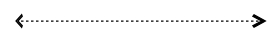

# Shapes

BPMN shapes are used to represent the internal business procedure in a graphical notation and enable you to communicate the procedures in a standard manner. To create a BPMN shape, in the node property shape, type should be set as “bpmn” and its shape should be set as any one of the built-in shapes. The following code example illustrates how to create a simple business process.

> If you want to use BPMN shapes in diagram, you need to inject BpmnDiagrams in the diagram.





















>Note : The default value for the property `shape` is “event”.

The list of BPMN shapes are as follows:

| Shape | Image |
| -------- | -------- |
| Event |  |
| Gateway |  |
| Task |  |
| Message |  |
| DataSource |  |
| DataObject |  |
| Group |  |

The BPMN shapes and its types are explained as follows.

<!-- markdownlint-disable MD033 -->

## Event

An [`event`](https://help.syncfusion.com/cr/aspnetcore-js2/Syncfusion.EJ2.Diagrams.DiagramBpmnEvent.html) is notated with a circle and it represents an event in a business process. The type of events are as follows:

    * Start
    * End
    * Intermediate
The event property of the node allows you to define the type of the event. The default value of the event is **start**. The following code example illustrates how to create a BPMN event.





















Event triggers are notated as icons inside the circle and they represent the specific details of the process. The [`trigger`](https://help.syncfusion.com/cr/aspnetcore-js2/Syncfusion.EJ2.Diagrams.DiagramBpmnEvent.html#Syncfusion_EJ2_Diagrams_DiagramBpmnEvent_Trigger) property of the node allows you to set the type of trigger and by default, it is set as **none**. The following table illustrates the type of event triggers.

| Triggers | Start | Non-Interrupting Start | Intermediate | Non-Interrupting Intermediate | Throwing Intermediate | End |
| -------- | -------- | -------- | -------- | -------- | -------- | -------- |
| None |   |  |  |  | |  |
| Message |  |  |  |  | |  |
| Timer |  |  | | | | |
| Conditional |  |  |  | | | |
| Link | | | | |  | |
| Signal |  |  |  |  |  |  |
| Error |  | |  | | | |
| Escalation |  |  |  | |  |  |
| Termination | | | | | | |
| Compensation |  | |  | |  | |
| Cancel | | |  | | |  |
| Multiple |  |   |  |  |   |  |
| Parallel |  |  |  |  | | |

## Gateway

Gateway is used to control the flow of a process and it is represented as a diamond shape. To create a gateway, the shape property of the node should be set as “gateway” and the [`gateway`](https://help.syncfusion.com/cr/aspnetcore-js2/Syncfusion.EJ2.Diagrams.DiagramBpmnGateway.html) property can be set with any of the appropriate gateways. The following code example illustrates how to create a BPMN Gateway.





















> By default, the `gateway` will be set as **none**.

There are several types of gateways as tabulated:

| Shape | Image |
| -------- | -------- |
| Exclusive |  |
| Parallel |  |
| Inclusive |  |
| Complex |  |
| EventBased |  |
| ExclusiveEventBased |  |
| ParallelEventBased |  |

## Activity

The [`activity`](https://help.syncfusion.com/cr/aspnetcore-js2/Syncfusion.EJ2.Diagrams.DiagramBpmnActivity.html) is the task that is performed in a business process. It is represented by a rounded rectangle.

There are two types of activities. They are listed as follows:

* Task: Occurs within a process and it is not broken down to a finer level of detail.
* Subprocess: Occurs within a process and it is broken down to a finer level of detail.

To create a BPMN activity, set the shape as **activity**. You also need to set the type of the BPMN activity by using the activity property of the node. By default, the type of the activity is set as **task**. The following code example illustrates how to create an activity.





















The different activities of BPMN process are listed as follows.

## Tasks

The [`task`](https://help.syncfusion.com/cr/aspnetcore-js2/Syncfusion.EJ2.Diagrams.DiagramBpmnTask.html) property of the node allows you to define the type of task such as sending, receiving, user based task, etc. By default, the [`type`](https://help.syncfusion.com/cr/aspnetcore-js2/Syncfusion.EJ2.Diagrams.DiagramBpmnTask.html#Syncfusion_EJ2_Diagrams_DiagramBpmnTask_Type) property of task is set as **none**. The following code illustrates how to create different types of
BPMN tasks.
The events property of tasks allow to represent these results as an event attached to the task.





















The various types of BPMN tasks are tabulated as follows.

| Shape | Image |
| -------- | -------- |
| Service |  |
| Send |  |
| Receive |  |
| Instantiating Receive |  |
| Manual | |
| Business Rule |  |
| User |  |
| Script |  |

## Subprocess

A [`sub-process`](https://help.syncfusion.com/cr/aspnetcore-js2/Syncfusion.EJ2.Diagrams.DiagramBpmnSubProcess.html) is a group of tasks, which is used to hide or reveal details of additional levels using the [`collapsed`](https://help.syncfusion.com/cr/aspnetcore-js2/Syncfusion.EJ2.Diagrams.DiagramBpmnSubProcess.html#Syncfusion_EJ2_Diagrams_DiagramBpmnSubProcess_Collapsed) property.





















The different types of subprocess are as follows:

    * Event subprocess
    * Transaction

## Event subprocess

A subprocess is defined as an event subprocess, when it is triggered by an event. An event subprocess is placed within another subprocess which is not part of the normal flow of its parent process. You can set event to a subprocess with the [`event`](https://help.syncfusion.com/cr/aspnetcore-js2/Syncfusion.EJ2.Diagrams.DiagramBpmnSubProcess.html#Syncfusion_EJ2_Diagrams_DiagramBpmnSubProcess_Events) and [`trigger`](https://help.syncfusion.com/cr/aspnetcore-js2/Syncfusion.EJ2.Diagrams.DiagramBpmnEvent.html#Syncfusion_EJ2_Diagrams_DiagramBpmnEvent_Trigger) property of the subprocess. The [`type`](https://help.syncfusion.com/cr/aspnetcore-js2/Syncfusion.EJ2.Diagrams.DiagramBpmnSubProcess.html#Syncfusion_EJ2_Diagrams_DiagramBpmnSubProcess_Type) property of subprocess allows you to define the type of subprocess whether it should be event subprocess or transaction subprocess.





















## Transaction subprocess

* [`transaction`](https://help.syncfusion.com/cr/aspnetcore-js2/Syncfusion.EJ2.Diagrams.DiagramBpmnSubProcess.html#Syncfusion_EJ2_Diagrams_DiagramBpmnSubProcess_Transaction) is a set of activities that logically belong together, in which all contained activities must complete their parts of the transaction; otherwise the process is undone. The execution result of a transaction is one of Successful Completion, Unsuccessful Completion (Cancel), and Hazard (Exception). The `events` property of subprocess allows to represent these results as an event attached to the subprocess.

* The event object allows you to define the type of event by which the subprocess will be triggered. The name of the event can be defined to identify the event at runtime.

* The event’s offset property is used to set the fraction/ratio (relative to parent) that defines the position of the event shape.

* The trigger property defines the type of the event trigger.

* You can also use define ports and labels to subprocess events by using event’s ports and labels properties.





















## Process

Processes is an array collection that defines the children values for BPMN subprocess.

## Loop

[`Loop`](https://help.syncfusion.com/cr/aspnetcore-js2/Syncfusion.EJ2.Diagrams.DiagramBpmnSubProcess.html#Syncfusion_EJ2_Diagrams_DiagramBpmnSubProcess_Loop) is a task that is internally being looped. The loop property of task allows you to define the type of loop. The default value for `loop` is **none**.
You can define the loop property in subprocess BPMN shape as shown in the following code.





















The following table contains various types of BPMN loops.

| Loops | Task | Subprocess |
| -------- | -------- | --------|
| Standard |   |  |
| SequenceMultiInstance |  |  |
| ParallelMultiInstance |  |  |

## Compensation

[`Compensation`](https://help.syncfusion.com/cr/aspnetcore-js2/Syncfusion.EJ2.Diagrams.DiagramBpmnSubProcess.html#Syncfusion_EJ2_Diagrams_DiagramBpmnSubProcess_Compensation) is triggered, when operation is partially failed and enabled it with the compensation property of the task and the subprocess.





















## Call

A [`call`](https://help.syncfusion.com/cr/aspnetcore-js2/Syncfusion.EJ2.Diagrams.DiagramBpmnTask.html#Syncfusion_EJ2_Diagrams_DiagramBpmnTask_Call) activity is a global subprocess that is reused at various points of the business flow and set it with the call property of the task.





















## Adhoc

An adhoc subprocess is a group of tasks that are executed in any order or skipped in order to fulfill the end condition and set it with the [`adhoc`](https://help.syncfusion.com/cr/aspnetcore-js2/Syncfusion.EJ2.Diagrams.DiagramBpmnSubProcess.html#Syncfusion_EJ2_Diagrams_DiagramBpmnSubProcess_Adhoc) property of subprocess.





















## Boundary

Boundary represents the type of task that is being processed. The [`boundary`](https://help.syncfusion.com/cr/aspnetcore-js2/Syncfusion.EJ2.Diagrams.DiagramBpmnSubProcess.html#Syncfusion_EJ2_Diagrams_DiagramBpmnSubProcess_Boundary) property of subprocess allows you to define the type of boundary. By default, it is set as **default**.





















The following table contains various types of BPMN boundaries.

| Boundary | Image |
| -------- | -------- |
| Call |  |
| Event |  |
| Default |  |

## Data

A data object represents information flowing through the process, such as data placed into the process, data resulting from the process, data that needs to be collected, or data that must be stored. To define a [`data object`](https://help.syncfusion.com/cr/aspnetcore-js2/Syncfusion.EJ2.Diagrams.DiagramBpmnDataObject.html), set the shape as **DataObject** and the type property defines whether data is an input or an output. You can create multiple instances of data object with the collection property of data.





















The following table contains various representation of BPMN data object.

| Boundary | Image |
| -------- | -------- |
| Collection Data Object |  |
| Data Input |  |
| Data Output |  |

## Datasource

Datasource is used to store or access data associated with a business process. To create a datasource, set the shape as **datasource**. The following code example illustrates how to create a datasource.





















## Artifact

Artifact is used to show additional information about a process in order to make it easier to understand. There are two types of artifacts in BPMN.

* Text annotation
* Group

## Text annotation

* A BPMN object can be associated with a text annotation which does not affect the flow but gives details about objects within a flow. The annotation property of the node is used to connect an annotation element to the BPMN node.

* The annotation element can be displaced into a different position interactively by dragging the annotation to a particular position.

* The annotation element can be switched from a BPMN node to another BPMN node simply by dragging the source end of the annotation connector into the other BPMN node.

* The annotation angle property is used to set the angle between the BPMN shape and the annotation.

* The annotation direction property is used to set the direction of the text annotation.

* To set the size for text annotation, use width and height properties.

* The annotation length property is used to set the distance between the BPMN shape and the annotation.

* The annotation text property defines the additional information about the flow object in a BPMN process.





















## Group

A group is used to frame a part of the diagram, shows that elements included in it are logically belong together and does not have any other semantics other than organizing elements. To create a group, the shape property of the node should be set as **group**. The following code example illustrates how to create a BPMN group.





















## BPMN flows

`BPMN Flows` are lines that connects BPMN flow objects.

## Association

`BPMN Association` flow is used to link flow objects with its corresponding text or artifact. An association is represented as a dotted graphical line with opened arrow. The types of association are as follows:

* Directional
* BiDirectional
* Default

The association property allows you to define the type of association. The following code example illustrates how to create an association.





















The following table demonstrates the visual representation of association flows.

| Association | Image |
| -------- | -------- |
| Default |  |
| Directional |  |
| BiDirectional |  |

>Note : The default value for the property `association` is **default**.

## Sequence

A `Sequence` flow shows the order in which the activities are performed in a BPMN process and is represented by a solid graphical line. The types of sequence are as follows:

* Normal
* Conditional
* Default

The sequence property allows you to define the type of sequence. The following code example illustrates how to create a sequence flow.





















The following table contains various representation of sequence flows.

| Sequence | Image |
| -------- | -------- |
| Default |  |
| Conditional |  |
| Normal |  |

> The default value for the property `sequence` is **normal**.

## Message

A `Message` flow shows the flow of messages between two participants and is represented by dashed line. The types of message are as follows:

* InitiatingMessage
* NonInitiatingMessage
* Default

The message property allows you to define the type of message. The following code example illustrates how to define a message flow.





















The following table contains various representation of message flows.

| Message | Image |
| -------- | -------- |
| Default |  |
| InitiatingMessage |  |
| NonInitiatingMessage |  |

>The default value for the property `message` is **default**.
