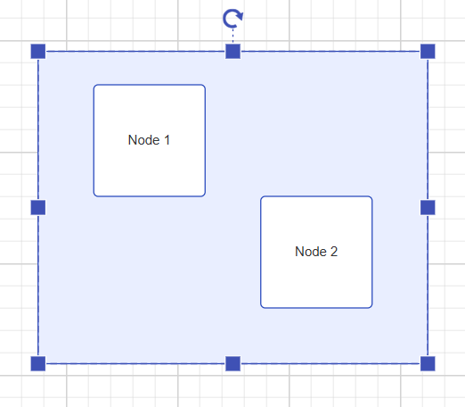
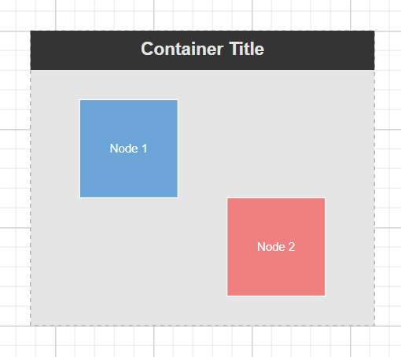
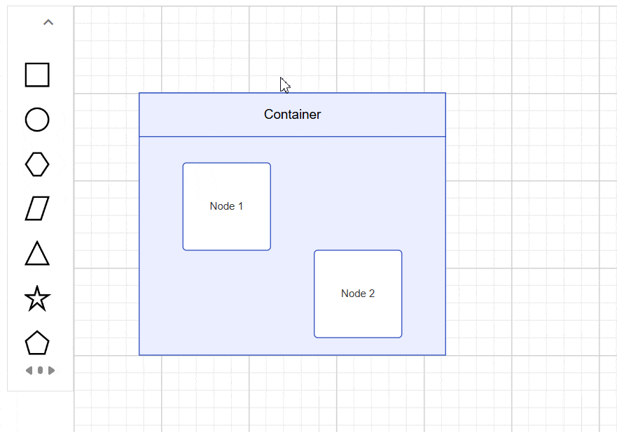

# Container in ##Platform_Name## Diagram Component

A Container is a group of logically related shapes surrounded by a visible boundary. Shapes can be added or removed from the container at runtime. Changes made to the container do not affect its child elements, which can be individually selected, moved, or edited.

## Create Container

### Add a Container

The following code illustrates how to create a container node.
























### Setting a Header

You can provide a textual description for a container using its `Header` property. Also, users can customize the header's appearance using the header's [Style](https://help.syncfusion.com/cr/aspnetcore-js2/Syncfusion.EJ2.Diagrams.DiagramHeader.html#Syncfusion_EJ2_Diagrams_DiagramHeader_Style) property.

The following code example explains how to define a container header and its customization:
























N> You can edit the header by double-clicking the region of the container's header.

### Container from symbol palette

Container nodes can be preconfigured and added to the symbol palette. Users can drag and drop these container nodes into the diagram as needed.

To learn more, refer to the [Symbol Palette](./symbol-palette) documentation.

## Interactively add or remove diagram elements into Container

You can interactively add or remove diagram elements from the Container in the runtime. When a diagram element is dropped near the container's edge, the container automatically resizes to accommodate it.

## Interaction

Containers support the same interactions as regular nodes—such as selection, dragging, resizing, and rotating. For more information refer to the [`nodes interactions`](./nodes)

## Events

The events triggered when interacting with container nodes are similar to those for individual nodes. For more information, refer to the [`nodes events`](./nodes)

## See Also

* [How to add nodes to the symbol palette](./symbol-palette)
* [How to customize nodes](./nodes)
* [How to add ports to the node](./ports)
* [How to enable/disable the behavior of the node](./constraints)
* [How to create diagram nodes using drawing tools](./tools)
