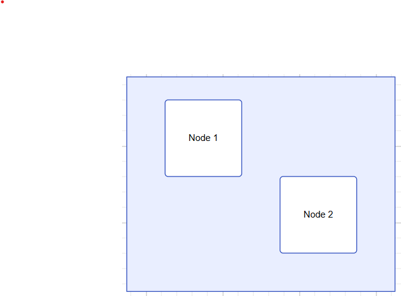
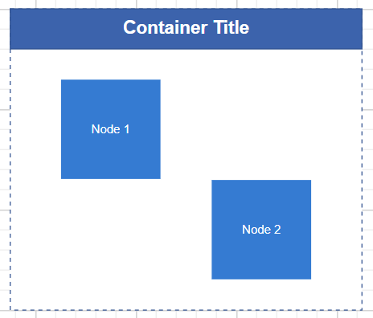
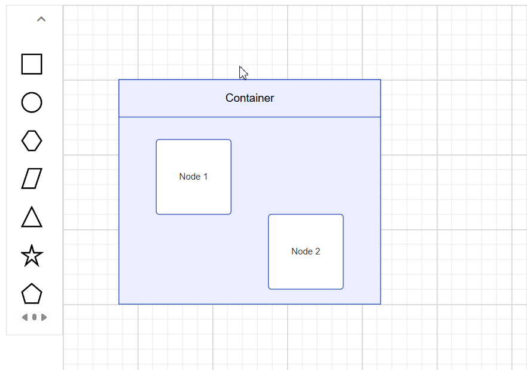

# Constraints in ##Platform_Name## Diagram Component

Containers are collections of logically grouped shapes surrounded by a visible border, which the shapes can be dragged in and out of during runtime. Every change made to the Container has no effect on its children. Child elements can be edited individually.

## Create Container

### Add a Container

The following code illustrates how to create a container node.





















### Setting a Header

You can textually describe a container by using its [Header](https://help.syncfusion.com/cr/aspnetcore-js2/Syncfusion.EJ2.Diagrams.DiagramContainer.html#Syncfusion_EJ2_Diagrams_DiagramContainer_Header) property. Also, users can customize the header's appearance using the header's [style](https://help.syncfusion.com/cr/aspnetcore-js2/Syncfusion.EJ2.Diagrams.DiagramHeader.html#Syncfusion_EJ2_Diagrams_DiagramHeader_Style) property.

The following code example explains how to define a container header and its customization:





















N> You can edit the header by double-clicking the region of the container's header.

### Container from symbol palette

Container Nodes can be predefined and added to the symbol palette. You can drop those Containers into Diagram when required.

To explore how to add Containers from symbol palette, refer to [symbol palette](./symbol-palette).

## Interactively add or remove diagram elements into Container

You can interactively add or remove diagram elements from the Container in the runtime. Container will adjust its size when you drop diagram element into its edges.

## Interaction

Container node interactions can be performed similarly to normal nodes. Fundamental diagram interactions like selecting, dragging, resizing, and rotating apply equally to container nodes. For more informatation refer to the [`nodes interactions`](./nodes)

## Events

The events triggered when interacting with container nodes are similar to those for individual nodes. For more information, refer to the [`nodes events`](./nodes)

## See Also

* [How to add nodes to the symbol palette](./symbol-palette)
* [How to customize nodes](./nodes)
* [How to add ports to the node](./ports)
* [How to enable/disable the behavior of the node](./constraints)
* [How to create diagram nodes using drawing tools](./tools)
