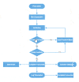

# Zoom pan in diagram
* When a large diagram is loaded, only certain portion of the diagram is visible. The remaining portions are clipped. Clipped portions can be explored by scrolling the scrollbars or panning the diagram.
* Diagram can be zoomed in or out by using Ctrl + mouse wheel.
* When the diagram is zoomed or panned, the [`scrollChange`](https://help.syncfusion.com/cr/aspnetcore-js2/Syncfusion.EJ2.Diagrams.Diagram.html#Syncfusion_EJ2_Diagrams_Diagram_ScrollChange) event gets triggered.



## Zoom pan status

Diagram provides the support to notify the pan status of the zoom pan tool. Whenever the diagram is panning the [`scrollChange`](https://help.syncfusion.com/cr/aspnetcore-js2/Syncfusion.EJ2.Diagrams.Diagram.html#Syncfusion_EJ2_Diagrams_Diagram_ScrollChange), event is triggered and hence the pan status can be obtained. The pan status is notified with Start, Progress, and Completed.

|  Pan Status  | Description|
|--------------|------------|
| Start | When the mouse is clicked and dragged the status is notified as start.|
| Progress | When the mouse is in motion the status is notified as progress.|
| Completed | When panning is stopped the status is notified with completed.|






















```javascript

function Created() {
    var diagram = document.getElementById("container").ej2_instances[0];
    diagram.tool = DiagramTools.ZoomPan;
    diagram.dataBind();
    }
function scrollChange(args) {
    var panStatus = args.panState
}

```