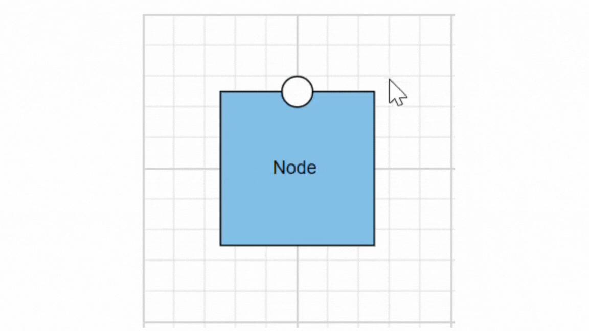

# Tooltip in Diagram Control

<!-- markdownlint-disable MD010 -->

In Graphical User Interface (GUI), the tooltip is a message that is displayed when mouse hovers over an element. The diagram provides tooltip support while dragging, resizing, rotating a node, and when the mouse hovers any diagram element.

## Default tooltip

By default, diagram displays a tooltip to provide the size, position, and angle related information while dragging, resizing, and rotating.

| Drag | Resize | Rotate |
|---|---|---|
|  |  |  |

## Common tooltip for all nodes and connectors

The diagram provides support to show tooltip when the mouse hovers over any node or connector. To show tooltip on mouse over, the [`tooltip`](https://help.syncfusion.com/cr/aspnetcore-js2/Syncfusion.EJ2.Diagrams.DiagramTooltipDiagram.html) property of diagram model needs to be set with the tooltip [`content`](https://help.syncfusion.com/cr/aspnetcore-js2/Syncfusion.EJ2.Diagrams.DiagramDiagramTooltip.html#Syncfusion_EJ2_Diagrams_DiagramDiagramTooltip_Content) and [`position`](https://help.syncfusion.com/cr/aspnetcore-js2/Syncfusion.EJ2.Diagrams.DiagramDiagramTooltip.html#Syncfusion_EJ2_Diagrams_DiagramDiagramTooltip_Position).






















### Disable tooltip at runtime

The tooltip on mouse over can be disabled by assigning the [`tooltip`](https://help.syncfusion.com/cr/aspnetcore-js2/Syncfusion.EJ2.Diagrams.DiagramTooltipDiagram.html) property as `null`.






















## Tooltip for a specific node/connector

The tooltip can be customized for each node and connector. Remove the **InheritTooltip** option from the [`constraints`](https://help.syncfusion.com/cr/aspnetcore-js2/Syncfusion.EJ2.Diagrams.NodeConstraints.html) of that node or connector.






















## Tooltip for Ports

The tooltip feature has been implemented to support Ports, providing the ability to display information or descriptions when the mouse hovers over them.

To display tooltips on mouseover, set the desired tooltip [`content`](https://help.syncfusion.com/cr/aspnetcore-js2/Syncfusion.EJ2.Diagrams.DiagramDiagramTooltip.html#Syncfusion_EJ2_Diagrams_DiagramDiagramTooltip_Content) by utilizing the [`tooltip`](https://help.syncfusion.com/cr/aspnetcore-js2/Syncfusion.EJ2.Diagrams.DiagramTooltipDiagram.html) property.

Tooltips for Ports can be enabled or disabled using the [`PortConstraints`](https://help.syncfusion.com/cr/aspnetcore-js2/Syncfusion.EJ2.Diagrams.PortConstraints.html) Tooltip property.


```js
let ports: [{
        offset: {x: 1,y: 0.5},
        tooltip: {content: 'Port Tootip'},
        
        //enable Port Tooltip Constraints
        constraints: PortConstraints.Default | PortConstraints.ToolTip,
        
        //disable Port Tooltip Constraints
        constraints: PortConstraints.Default ~& PortConstraints.ToolTip
    }]
```

Dynamic modification of tooltip content is supported, allowing you to change the displayed tooltip content during runtime.

```js
{
    //change tooltip content at run time
    diagram.nodes[0].ports[0].tooltip.content = 'New Tooltip Content';
    diagram.databind;
}
```

The following image illustrates how the diagram displays tooltips during an interaction with ports:



Here, the code provided below demonstrates the port tooltip Interaction.





















## Tooltip template content

Any text or image can be added to the tooltip, by default. To customize the tooltip layout or to create your own visualized element on the tooltip, template can be used.






















```javascript
function getContent() {
    var tooltipContent = document.createElement('div');
    tooltipContent.innerHTML = '<div style="background-color: #f4f4f4; color: black; border-width:1px;border-style: solid;border-color: #d3d3d3; border-radius: 8px;white-space: nowrap;"> <span style="margin: 10px;"> Tooltip !!! </span> </div>';
    return tooltipContent;
}
```

## Tooltip alignments

### Tooltip relative to object

The diagram provides support to show tooltip around the node or connector that is hovered by the mouse. The tooltip can be aligned by using the [`position`](https://help.syncfusion.com/cr/aspnetcore-js2/Syncfusion.EJ2.Diagrams.DiagramDiagramTooltip.html#Syncfusion_EJ2_Diagrams_DiagramDiagramTooltip_Position) property of the tooltip. The [`relativeMode`](https://help.syncfusion.com/cr/aspnetcore-js2/Syncfusion.EJ2.Diagrams.DiagramDiagramTooltip.html#Syncfusion_EJ2_Diagrams_DiagramDiagramTooltip_RelativeMode) property of the tooltip defines whether the tooltip has to be displayed around the object or at the mouse position.






















### Tooltip relative to mouse position

To display the tooltip at mouse position, need to set **mouse** option to the [`relativeMode`](https://help.syncfusion.com/cr/aspnetcore-js2/Syncfusion.EJ2.Diagrams.DiagramDiagramTooltip.html#Syncfusion_EJ2_Diagrams_DiagramDiagramTooltip_RelativeMode) property of the tooltip.






















## Tooltip animation

To animate the tooltip, a set of specific animation effects are available, and it can be controlled by using the [`animation`](https://help.syncfusion.com/cr/aspnetcore-js2/Syncfusion.EJ2.Diagrams.DiagramDiagramTooltip.html#Syncfusion_EJ2_Diagrams_DiagramDiagramTooltip_Animation) property. The animation property also allows you to set delay, duration, and various other effects of your choice.






















## Tooltip for Annotation

Tooltips can be added to annotations to display additional information on mouseover. 
To display tooltips on mouseover, set the desired tooltip text to the [`tooltip`](https://help.syncfusion.com/cr/aspnetcore-js2/Syncfusion.EJ2.Diagrams.DiagramDiagramTooltip.html#Syncfusion_EJ2_Diagrams_DiagramDiagramTooltip_Animation) property of the annotation.
Tooltips for Annotations can be enabled or disabled by setting the [`AnnotationConstraints`](https://help.syncfusion.com/cr/aspnetcore-js2/Syncfusion.EJ2.Diagrams.DiagramDiagramTooltip.html#Syncfusion_EJ2_Diagrams_DiagramDiagramTooltip_Animation) property as [`ToolTip`](https://help.syncfusion.com/cr/aspnetcore-js2/Syncfusion.EJ2.Diagrams.DiagramDiagramTooltip.html#Syncfusion_EJ2_Diagrams_DiagramDiagramTooltip_Animation). 




















