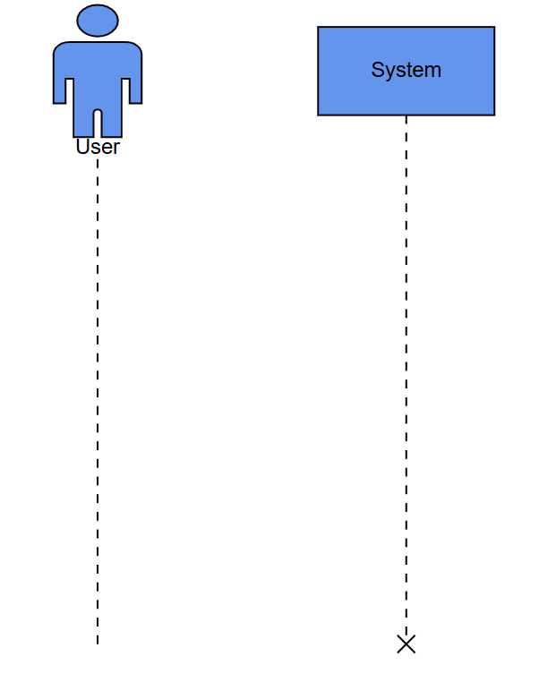
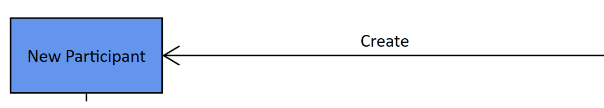
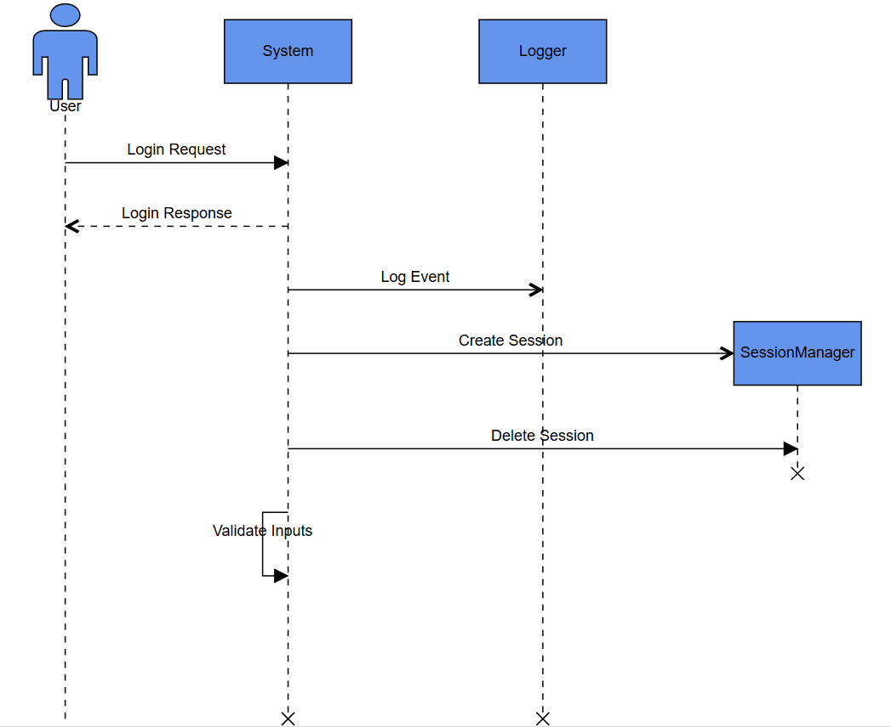
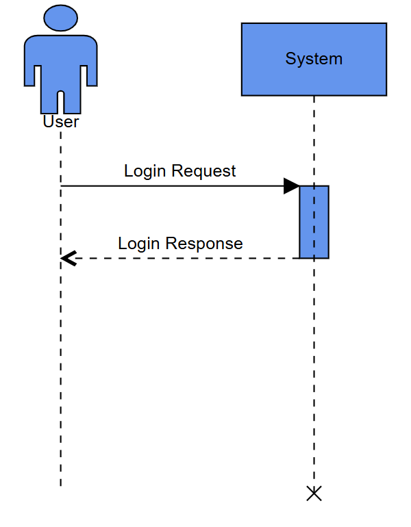
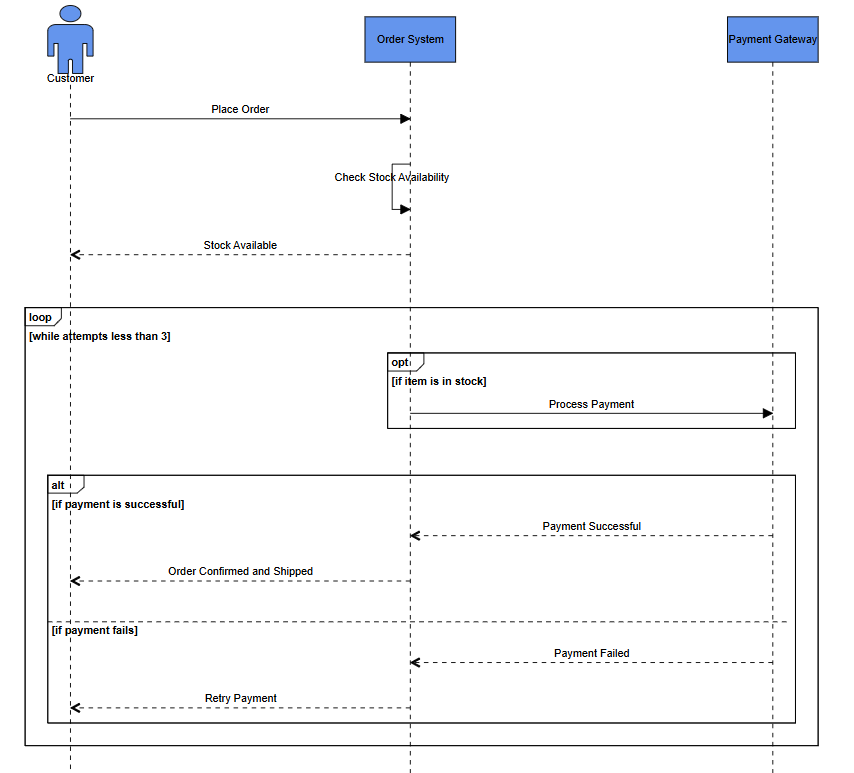

# UML Sequence Diagram Model in Diagram

A UML sequence diagram is an interaction diagram that demonstrates how objects interact with each other and the order of these interactions. The Syncfusion® diagram control provides comprehensive support for creating and visualizing UML sequence diagrams through the `UmlSequenceDiagramModel`. To enable this functionality, assign the `UmlSequenceDiagramModel` to the `Model` property of the diagram control.

## UML Sequence Diagram Elements

A sequence diagram includes several key elements, such as participants, messages, activation boxes, and fragments. The sections below demonstrate how to define and configure these components using the Diagram control.

### Participants

`UmlSequenceParticipantModel` represents an entity that interacts with other entities in a sequence diagram. Participants appear at the top of the diagram with lifelines extending vertically downward.

#### UmlSequenceParticipantModel Properties

| Property | Type | Description |
|---|---|---|
| id | string \| number | A unique identifier for the participant. |
| content | string | The display text of the participant. |
| isActor | boolean | Specifies whether the participant is displayed as an actor (true) or an object (false) |
| showDestructionMarker | boolean | Indicates whether a destruction marker (X) is shown at the end of the lifeline. |
| activationBoxes | UmlSequenceActivationBoxModel[] | A collection of activation boxes associated with the participant. |
| stereotype | UmlSequenceParticipantStereotype | The visual stereotype used to render the participant header, such as Actor, Boundary, Control, Entity, or Database. |

#### Participant Stereotypes

The `UmlSequenceParticipantStereotype` enum defines the visual style of a participant. A stereotype helps show the role of a participant in the interaction.

| Stereotype | Description | Shape |
|---|---|---|
| Default | Standard object participant displayed as a labeled rectangle. |  |
| Actor | External person or system that interacts with the process. |  |
| Boundary | Interface or entry point, such as a UI, API gateway, or external system. |  |
| Control |  Object that manages the flow, such as a controller or coordinator. | ![Control stereotype]
| Entity | Object that represents data, domain objects, or stored information. |  |
| Database | Database or persistent storage system, displayed using a cylindrical shape. |  |

The following code example illustrates how to create participants.
























### Messages

`UmlSequenceMessageModel` represents communication between participants and are displayed as arrows connecting lifelines.

#### Types of Messages

| Message Type | Description | Example |
|---|---|---|
| Synchronous | The sender waits for a response |  |
| Asynchronous | The sender continues without waiting |  |
| Reply | A response to a previous message |  |
| Create | Creates a new participant |  |
| Delete | Terminates a participant |  |
| Self | A message from a participant to itself |  |

#### UmlSequenceMessageModel Properties

| Property | Type | Description |
|---|---|---|
| id | string \| number | A unique identifier for the message |
| content | string | The display text for the message |
| fromParticipantID | string \| number | ID of the participant sending the message |
| toParticipantID | string \| number | ID of the participant receiving the message |
| type | UmlSequenceMessageType | Type of the message (Synchronous, Asynchronous, Reply, Create, Delete, Self) |

The following code example illustrates how to create messages:
























### Activation Boxes

`UmlSequenceActivationBoxModel` represents periods when a participant is active and processing a message. They appear as thin rectangles on participant lifelines.

#### UmlSequenceActivationBoxModel Properties

| Property | Type | Description |
|---|---|---|
| id | string \| number | A unique identifier for the activation box |
| startMessageID | string \| number | ID of the message that initiates the activation |
| endMessageID | string \| number | ID of the message that terminates the activation |

The following code example illustrates how to create activation boxes.
























### Fragments

`UmlSequenceFragmentModel` groups a set of messages based on specific conditions in a sequence diagram. They are displayed as rectangular enclosures that visually separate conditional or looping interactions.

#### Types of Fragments

The [UmlSequenceFragmentType](https://help.syncfusion.com/cr/aspnetcore-js2/Syncfusion.EJ2.Diagrams.UmlSequenceFragmentType) enum defines the following fragment types:

| Fragment Type  | Description  | Example  |  
|---------------|-------------|--------|  
| Optional  | Represents a sequence that is executed only if a specified condition is met; otherwise, it is skipped. |  |  
| Alternative | Represents multiple conditional paths (if-else structure), where only one path executes based on the condition. |  |  
| Loop | Represents a repeating sequence of interactions that continues based on a loop condition. |  |  

#### UmlSequenceFragmentModel Properties

| Property | Type | Description |
|---|---|---|
| id | string \| number | A unique identifier for the fragment |
| type | UmlSequenceFragmentType | Type of the fragment (Optional, Loop, Alternative) |
| conditions | UmlSequenceFragmentConditionModel[] | Collection of conditions for the fragment |

#### UmlSequenceFragmentConditionModel Properties

| Property | Type | Description |
|---|---|---|
| content | string | Text describing the condition or parameter |
| messageIds | (string \| number)[] | Collection of message IDs included in this condition section |
| fragmentIds | string[] | Collection of nested fragments ids (for complex structures) |

The following code example illustrates how to create fragments.
























### Customizing Participant Spacing in Sequence Diagram 

The `SpaceBetweenParticipants` property in `UmlSequenceDiagramModel` controls the horizontal spacing between participants. The default value is 100, and it can be adjusted based on your layout requirements.
