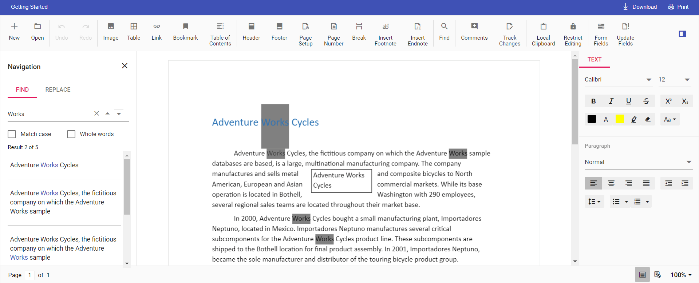

# How to change the default search highlight color in Document Editor component

Document editor provides an options to change the default search highlight color using [`searchHighlightColor`] in Document editor settings. The highlight color which is given in [`documentEditorSettings`](https://help.syncfusion.com/cr/aspnetcore-js2/Syncfusion.EJ2.DocumentEditor.DocumentEditorContainer.html#Syncfusion_EJ2_DocumentEditor_DocumentEditorContainer_DocumentEditorSettings) will be highlighted on the searched text. By default, search highlight color is `yellow`.

Similarly, you can use [`documentEditorSettings`](https://help.syncfusion.com/cr/aspnetcore-js2/Syncfusion.EJ2.DocumentEditor.DocumentEditor.html#Syncfusion_EJ2_DocumentEditor_DocumentEditor_DocumentEditorSettings) property for DocumentEditor also.

The following example code illustrates how to change the default search highlight color.




















Output will be like below:

