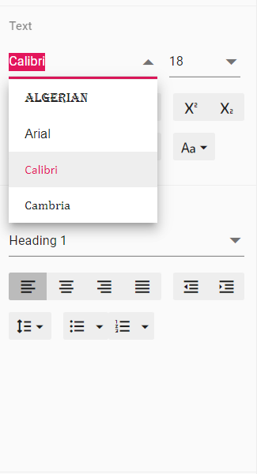

# How to customize the font family drop down in React Document Editor component

Document editor provides an options to customize the font family drop down list values using `fontfamilies` in Document editor settings. Fonts which are added in `fontFamilies` of `documentEditorSettings` will be displayed on font drop down list of text properties pane and font dialog.

Similarly, you can use `documentEditorSettings` property for DocumentEditor also.

The following example code illustrates how to change the font families in Document editor container.




















Output will be like below:

