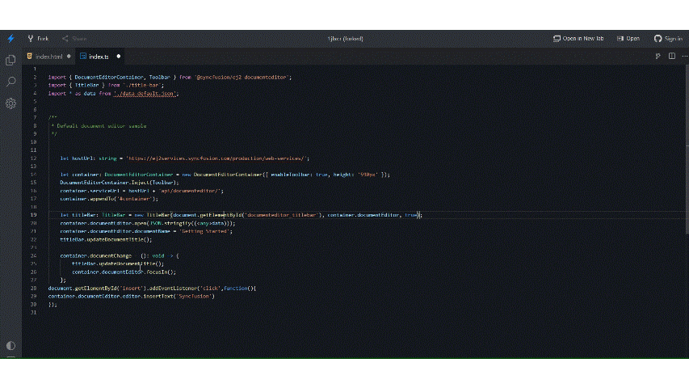

# How to insert text, paragraph and rich-text content in Document Editor

You can insert the text, paragraph and rich-text content in Document Editor component.

## Insert text in current cursor position

You can use `insertText` API in editor module to insert the text in current cursor position.

The following example code illustrates how to add the text in current selection.

```typescript
// It will insert the provided text in current selection
this.container.documentEditor.editor.insertText('Syncfusion');
```



















Please check below gif which illustrates how to insert text in current cursor position on button click:


## Insert paragraph in current cursor position

To insert new paragraph at current selection, you can can use [`insertText`] API with parameter as `\r\n` or `\n`.

The following example code illustrates how to add the new paragraph in current selection.

```typescript
// It will add the new paragraph in current selection
this.container.documentEditor.editor.insertText('\n');
```

## Insert the rich-text content

To insert the HTML content, you have to convert the HTML content to SFDT Format using [`web service`]. Then use [`paste`] API to insert the sfdt at current cursor position.

>Note: Html string should be welformatted html. [`DocIO`](https://help.syncfusion.com/file-formats/docio/html) support only welformatted XHTML.  

The following example illustrates how to insert the HTML content at current cursor position.

* Send the HTML content to server side for SFDT conversion. Refer to the following example to send the HTML content to server side and inserting it in current cursor position.





















* Refer the following code example for server-side web implementation for HTML conversion using DocumentEditor.

```c#
//API controller for the conversion.
[HttpPost]
public string LoadString([FromBody]InputParameter data)
{
    // You can also load HTML file/string from server side.
    Syncfusion.EJ2.DocumentEditor.WordDocument document = Syncfusion.EJ2.DocumentEditor.WordDocument.LoadString(data.content, FormatType.Html); // Convert the HTML to SFDT format.
    string json = Newtonsoft.Json.JsonConvert.SerializeObject(document);
    document.Dispose();
    return json;
}

public class InputParameter
{
    public string content {get; set; }
}
```

>Note: The above example illustrates inserting HTML content. Similarly, you can insert any rich-text content by converting any of the supported file formats (DOCX, DOC, WordML, HTML, RTF) to SFDT.