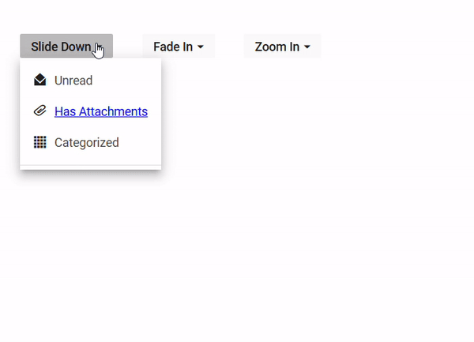

# Animation

To change the animation of the DropDownButton, [`AnimationSettings`](https://help.syncfusion.com/cr/aspnetcore-js2/Syncfusion.EJ2.SplitButtons.DropDownButton.html#Syncfusion_EJ2_SplitButtons_DropDownButton_AnimationSettings) property is used to customize the animation of the DropDownButton popup. The supported effects for DropDownButton are,

| Effect | Functionality |
| ------------ | ----------------------- |
| None | Specifies the Dropdown popup transform with no animation effect. |
| SlideDown | Specifies the Dropdown popup transform with slide down effect. |
| ZoomIn | Specifies the Dropdown popup transform with zoom in effect. |
| FadeIn | Specifies the Dropdown popup transform with fade in effect. |
 
In this sample, three different DropDownButtons are rendered, each showcasing a unique animation effect for the dropdown menu:
























