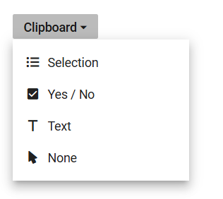

# How to customize Popup Width in ##Platform_Name## DropDownButton

The [PopupWidth](https://help.syncfusion.com/cr/aspnetcore-js2/Syncfusion.EJ2.SplitButtons.DropDownButton.html#Syncfusion_EJ2_SplitButtons_DropDownButton_PopupWidth) property determines the width of the dropdown popup in the DropDownButton component. By default, the popup's width adjusts based on the content. However, this property allows setting a specific width, ensuring consistency and alignment with design requirements. The width can be specified using common CSS units or as a raw pixel value.
























