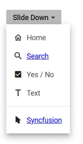

# Item Template in ##Platform_Name## DropDownButton

The [`ItemTemplate`](https://help.syncfusion.com/cr/aspnetcore-js2/Syncfusion.EJ2.SplitButtons.DropDownButton.html#Syncfusion_EJ2_SplitButtons_DropDownButton_ItemTemplate) property in the DropDownButton component allows for the definition of custom templates to display dropdown items. This feature is especially useful for customizing the appearance and layout of dropdown items beyond the default options provided. By utilizing this property, diverse content such as icons, formatted text, and other visual elements can be integrated into the dropdown items for a more engaging and tailored user interface.
























