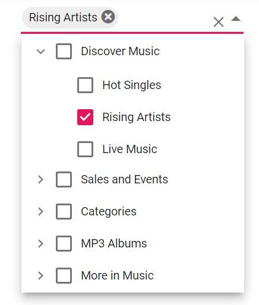
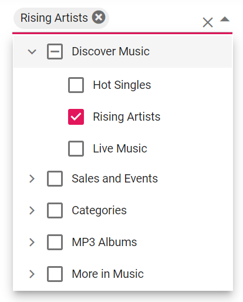
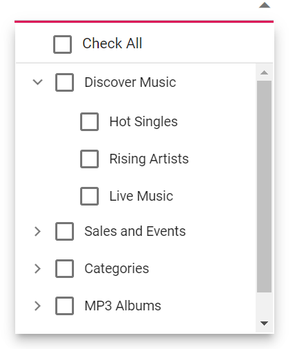

# CheckBox

The Dropdown Tree control allows you to check more than one item from the tree without affecting the UI's appearance by enabling the `showCheckBox` property. When this property is enabled, checkbox appears before each item text in the popup.

In the following example, the `showCheckBox` property is enabled.
























Output be like the below.

## Auto Check

By default, the checkbox state of the parent and child items in the Dropdown Tree will not be dependent over each other. If you need dependent checked state, then enable the `autoCheck` property which is a member of `treeSettings` property.

* If one or more child items are not in the checked state, then the parent item will be in the intermediate state.

* If all the child items are checked, then the parent item will also be in the checked state.

* If a parent item is checked, then all the child items will also be changed to checked state.

In the following example, the `autoCheck` property is enabled.
























Output be like the below.

## Select All

The Dropdown Tree control has in-built support to select all the tree items using Select All options in the header.

When the `showSelectAll` property is set to true, a checkbox will be displayed in the popup header that allows you to select or deselect all the tree items in the popup.

By default, `Select All` and `unSelect All` text values will be showcased along with the checkbox in the popup header to indicate the action to be performed on checking or unchecking the checkbox. You can customize these name attributes by using `selectAllText` and `unSelectAllText` properties respectively.
























Output be like the below.

