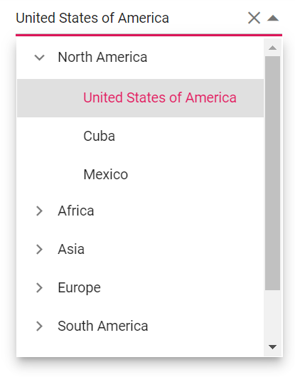
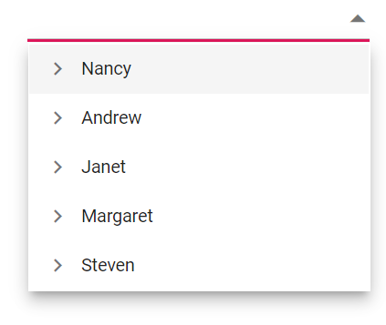

# Data Binding

The Dropdown Tree control provides an option to load the data either from local data sources or from remote data services. This can be done through `dataSource` property that is a member of the `fields` property. The `dataSource` property supports list of data and `DataManager`. It also supports different kinds of data services such as OData, OData V4, Web API, URL, and JSON with the help of `DataManager` adaptors.

Dropdown Tree has `load on demand` (Lazy load) option. It reduces the bandwidth size when consuming the huge data. By default, the `loadOnDemand` is set to false. By enabling this property, it loads first level items initially, and when parent item is expanded, loads the child items based on the `parentValue/child` member.

## Local data

To bind local data to the Dropdown Tree, you can assign a list of data to the `dataSource` property.

The Dropdown Tree control requires three fields (Value, text, and parentValue) to render local data source. When mapper fields are not specified, it takes the default values as the mapping fields. Local data source can also be provided as an instance of the `DataManager`. It supports two kinds of local data binding methods.

* Hierarchical data

* Self-referential data

### Hierarchical data

Dropdown Tree can be populated with the hierarchical data source that contains nested list of data. You can directly map the hierarchical data and the field members with corresponding key values from the hierarchical data to the `fields` property.

In the following example, **code**, **name**, and **countries** columns from hierarchical data have been mapped to **value**, **text**, and **child** fields, respectively.
























Output be like the below.

### Self-referential data

Dropdown Tree can be populated from the self-referential data structure that contains array of JSON objects with `parentValue` mapping.

You can directly assign self-referential data and map all the field members with corresponding key values from self-referential data to the `fields` property.

To render the root level items, specify the parentValue as null or no need to specify the parentValue in the dataSource.

In the following example, **id**, **pid**, **hasChild**, and **name** columns from self-referential data have been mapped to **value**, **parentValue**, **hasChildren**, and **text** fields, respectively.
























Output be like the below.

## Remote data

Dropdown Tree can also be populated from a remote data service with the help of the `DataManager` control and `Query` property.

It supports different kinds of data services such as OData, OData V4, Web API, URL, and JSON with the help of `DataManager` adaptors.

You can assign service data as an instance of `DataManager` to the `dataSource`. To interact with remote data source, you must provide the endpoint `url`.

The `DataManager` that acts as an interface between the service endpoint and the Dropdown Tree requires the following information to interact with service endpoint properly.

* `DataManager->url`: Defines the service endpoint to fetch data.

* `DataManager->adaptor`: Defines the adaptor option. By default, ODataAdaptor is used for remote binding.

Adaptor is responsible for processing response and request from/to the service endpoint. The `@syncfusion/ej2-data` package provides some pre-defined adaptors  designed to interact with service endpoints. They are,

* `UrlAdaptor`: Used to interact with remote services. This is the base adaptor for all remote based adaptors.

* `ODataAdaptor`: Used to interact with OData endpoints.

* `ODataV4Adaptor`: Used to interact with OData V4 endpoints.

* `WebApiAdaptor`: Used to interact with Web API created under OData standards.

* `WebMethodAdaptor`: Used to interact with web methods.

In the following example, `ODataV4Adaptor` is  used to fetch data from the remote services. The **EmployeeID**, **FirstName**, and **EmployeeID**
columns from the Employees table have been mapped to **value**, **text**, and **hasChildren** fields respectively for first level nodes.

The **OrderID**, **EmployeeID**, and **ShipName** columns from the orders table have been mapped to **value**, **parentValue**, and **text** fields respectively for second level nodes.
























Output be like the below.

