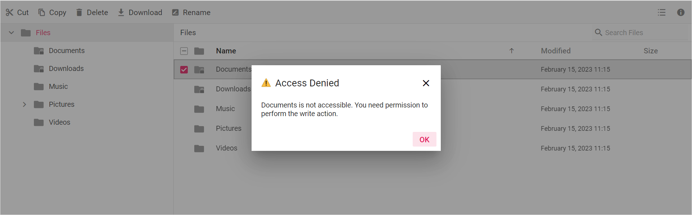

# Access Control

The FileManager allows you to define access permissions for folders and files using a set of access rules to user(s).

* [Access Rules](#access-rules)
* [Permissions](#permissions)

## Access Rules

The FileAccessController allows you to define security permissions for folders and files using a set of folder or file access rules.

To set up access rules for folders (including their files and sub-folders) and individual files, use the SetRules() method. The following table represents the AccessRule properties available for file and folder:

| **Properties** | **Applicable for file** | **Applicable for folder** | **Description** |
| --- | --- | --- | --- |
| Copy | Yes | Yes | Allows access to copy a file or folder. |
| Read | Yes | Yes | Allows access to read a file or folder. |
| Write | Yes | Yes | Allows permission to write a file or folder. |
| WriteContents | No | Yes | Allows permission to write the content of folder. |
| Download | Yes | Yes | Allows permission to download a file or folder. |
| Upload | No | Yes | Allows permission to upload to the folder. |
| Path | Yes | Yes | Specifies the path to apply the rules, which are defined. |
| Role | Yes | Yes | Specifies the role to which the rule is applied. |
| IsFile | Yes | Yes | Specifies whether the rule is specified for folder or file. |

The following syntax represents the access Rules for Administrator using file or folder.

```typescript
//Adminstrator
//Access Rules for File
    new AccessRule { Path = "/*.*", Role = "Administrator", Read = Permission.Allow, Write = Permission.Allow, Copy = Permission.Allow, Download = Permission.Allow, IsFile = true },

// Access Rules for folder
   new AccessRule { Path = "*", Role = "Administrator", Read = Permission.Allow, Write = Permission.Allow, Copy = Permission.Allow, WriteContents = Permission.Allow, Upload = Permission.Allow, Download = Permission.Deny, IsFile = false },

```

The following syntax represent the access Rules for Default user using file or folder.

```typescript
//Default User
//Access Rules for File
    new AccessRule { Path = "/*.*", Role = "Default User", Read = Permission.Deny, Write = Permission.Deny, Copy = Permission.Deny, Download = Permission.Deny, IsFile = true },

// Access Rules for folder
     new AccessRule { Path = "*", Role = "Default User", Read = Permission.Deny, Write = Permission.Deny, Copy = Permission.Deny, WriteContents = Permission.Deny, Upload = Permission.Deny, Download = Permission.Deny, IsFile = false },

```

## Permissions

It helps to explain how to apply security permission to file manager file or folder using access rules. The following table represent the value that determines the permission.

| **Value** | **Description** |
| --- | ---|
| Allow | Allows you to do read, write, copy, and download operations. |
| Deny | Denies you to do read, write, copy, and download operations. |

Use the `Role` property to apply created roles to the file manager. After that, the file manager displays folder or file and allow permisssion based on assigned roles.

The following syntax represent how to apply permission based on assigned roles

Permission denied for administrator to write a file or folder.

```typescript
// For file
 new AccessRule { Path = "/*.*", Role = "Administrator", Read = Permission.Allow, Write = Permission.Deny, IsFile = true},

// For folder
  new AccessRule { Path = "*", Role = "Administrator", Read = Permission.Allow, Write = Permission.Deny, IsFile = false},

```

The following syntax represent how to allow or deny permission based on file or folder access rule.

"Examples"

Permission denied for writing except for particular file or folder.

```typescript
// Deny writing for particular folder
 new AccessRule { Path = "/Documents", Role = "Document Manager", Read = Permission.Allow, Write = Permission.Deny, Copy = Permission.Allow, WriteContents = Permission.Deny, Upload = Permission.Deny, Download = Permission.Deny, IsFile = false },

 // Deny writing for particular file
  new AccessRule { Path = "/Documents/2.png", Role = "Document Manager", Read = Permission.Allow, Write = Permission.Deny, Copy = Permission.Deny, Download = Permission.Deny, IsFile = true },

```

Permission denied for writing and uploading in root folder.

``` typescript
// Folder Rule
 new AccessRule { Path = "/", Role = "Document Manager", Read = Permission.Allow, Write = Permission.Deny, Copy = Permission.Deny, WriteContents = Permission.Deny, Upload = Permission.Deny, Download = Permission.Deny, IsFile = false },
```

The following example demonstrate the file manager rendered with access control support.

























Output be like the below, when write the documents folder.

