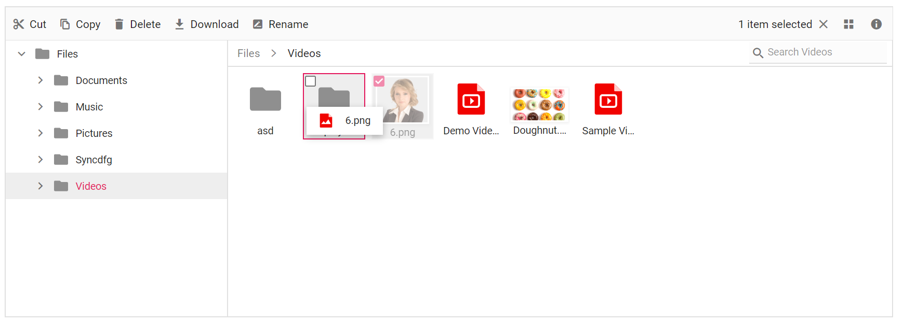

# Drag and Drop in ##Platform_Name## File Manager

The File Manager allows moving files or folders between directories using the `allowDragAndDrop` property. It also supports uploading a file by dragging it from Windows Explorer to the File Manager control. You can enable or disable this support by using the `allowDragAndDrop` property of File Manager.

The events triggered in drag and drop support are:

* `fileDragStart` - Triggers when the file/folder dragging is started.
* `fileDragging` - Triggers while dragging the file/folder.
* `fileDragStop` - Triggers when the file/folder is about to be dropped at the target.
* `fileDropped` - Triggers when the file/folder is dropped.
























The output will look like the image below.

