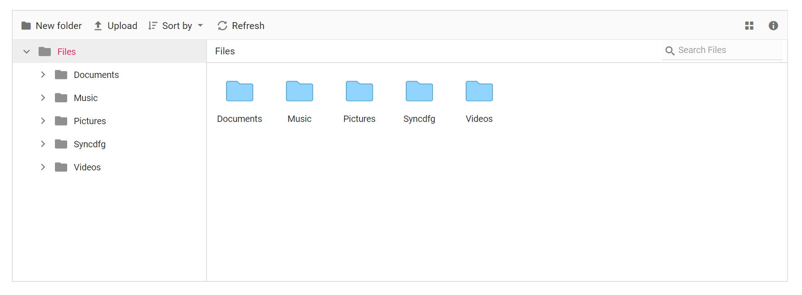

# How to customize thumbnails in ##Platform_Name## File Manager

The default appearance of the File Manager can be customized with your own icon by using the `showThumbnail` property.

The following example demonstrates how to add a custom icon in the largeicons view.
























The output will look like the image below.

