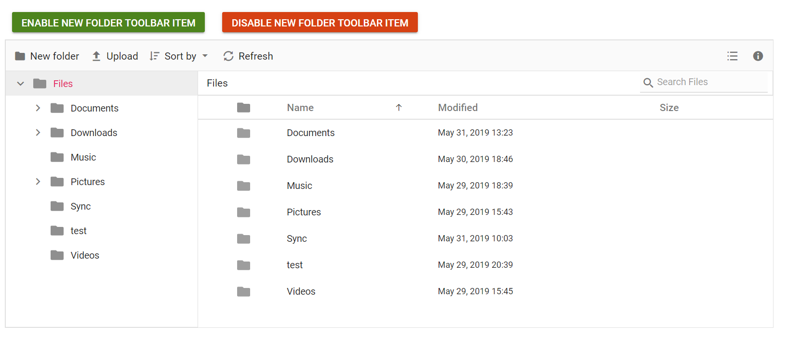
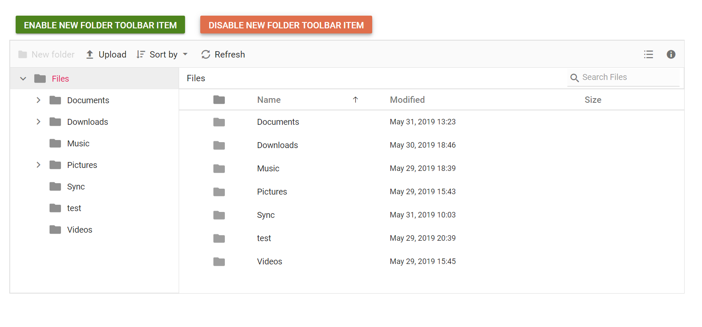

# How to enable or disable a toolbar item in ##Platform_Name## File Manager

The toolbar items can be enabled or disabled by specifying them in the `enableToolbarItems` or `disableToolbarItems` methods, respectively.

The following example shows enabling and disabling toolbar items on button click.
























The output will look like the image below when enabling toolbar items.

The output will look like the image below when disabling toolbar items.

