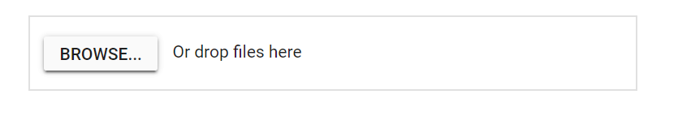
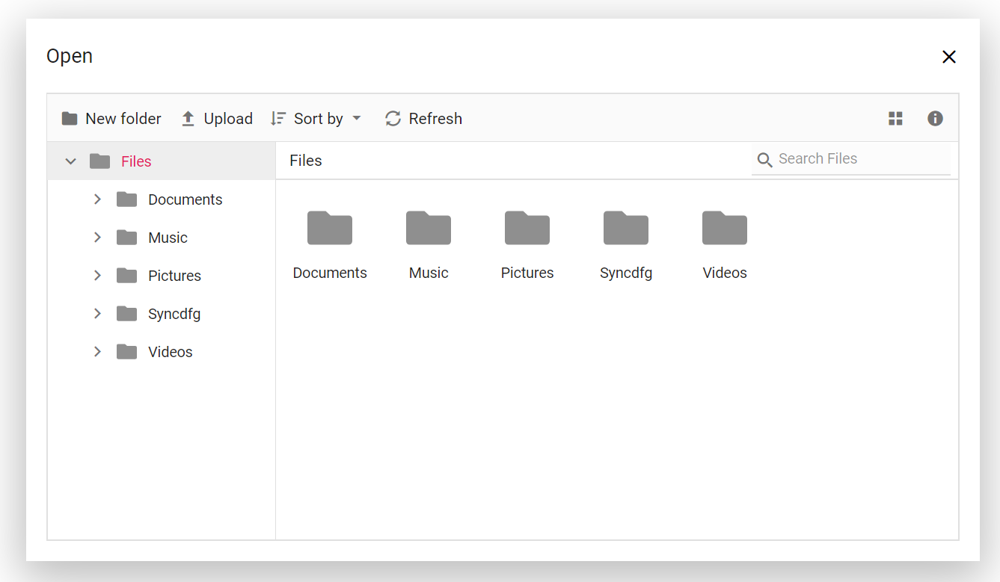
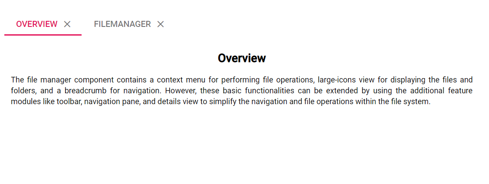

# Nested FileManager

FileManager can be rendered inside the other components like Tab, Dialog, and more.

* [Adding file manager inside the dialog](#adding-file-manager-inside-the-dialog)
* [Adding  file manager inside the tab](#adding-file-manager-inside-the-tab)

## Adding file manager inside the dialog

The following example shows the file manager component rendered inside the dialog. Click the browse button in the Uploader element to open the File Manager inside the Dialog control.






























Initially output be like the below.

After clicking the file browser button, file manager is rendered with dialog. Output be like the below.

## Adding file manager inside the tab

The following example demonstrate that the file manager component is placed inside the content area of tab element.
























Output be like the below for initial view.

Output be like the below, when file manager is placed inside the tab

