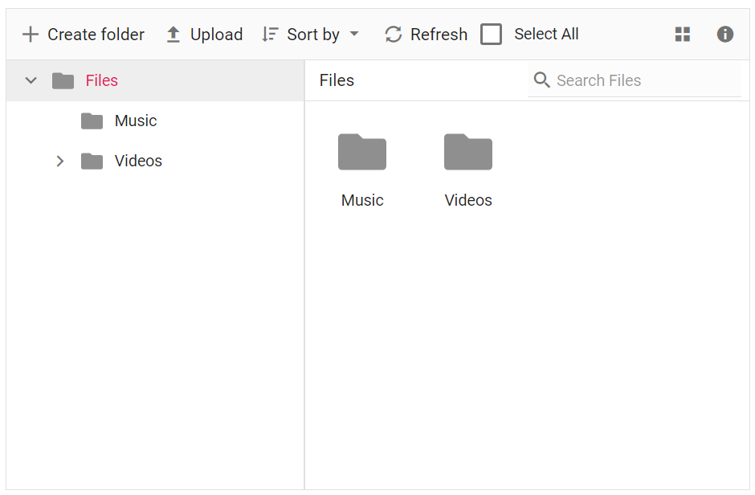

# How to add custom button in toolbar

The toolbar items can be customized using the [`toolbarSettings`](https://help.syncfusion.com/cr/aspnetcore-js2/Syncfusion.EJ2~Syncfusion.EJ2.FileManager.FileManager~ToolbarSettings.html) API and [`toolbarClick`](https://help.syncfusion.com/cr/aspnetcore-js2/Syncfusion.EJ2~Syncfusion.EJ2.FileManager.FileManager~ToolbarClick.html) event.

The following example shows adding a custom item in the toolbar.

The new toolbar button is added using [`toolbarSettings`](https://help.syncfusion.com/cr/aspnetcore-js2/Syncfusion.EJ2~Syncfusion.EJ2.FileManager.FileManager~ToolbarSettings.html). The [`toolbarClick`](https://help.syncfusion.com/cr/aspnetcore-js2/Syncfusion.EJ2~Syncfusion.EJ2.FileManager.FileManager~ToolbarClick.html) event is used to add an event handler to the new toolbar button.
























Output be like the below.

