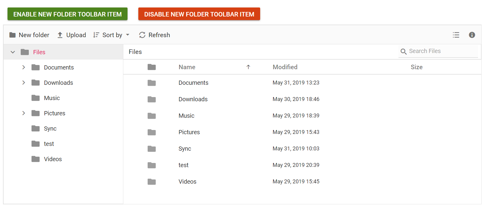
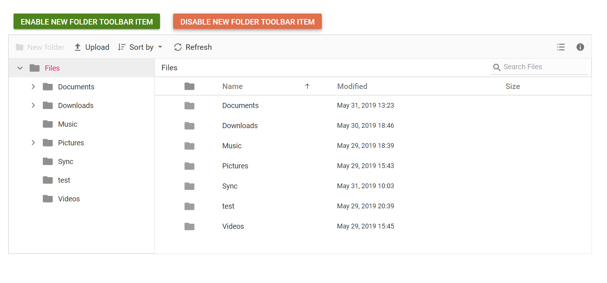

# How to enable/disable toolbar item/items

The toolbar items can be enabled/disabled by specifying the items in `enableToolbarItems` or `disableToolbarItems` methods respectively.

The following example shows enabling and disabling toolbar items on button click.

The new toolbar button is added using [toolbarSettings](https://help.syncfusion.com/cr/aspnetcore-js2/Syncfusion.EJ2~Syncfusion.EJ2.FileManager.FileManager~ToolbarSettings.html). The [toolbarClick](https://help.syncfusion.com/cr/aspnetcore-js2/Syncfusion.EJ2~Syncfusion.EJ2.FileManager.FileManager~ToolbarClick.html) event is used to add an event handler to the new toolbar button.
























Output be like the below when enable toolbar item.

Output be like the below when enable toolbar item.

