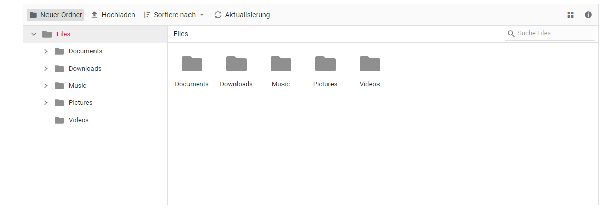

# Localization

The file manager can be localized to any culture by defining the texts and messages of the file manager in the corresponding culture. The default locale of the file manager is `en`(English). The following table represents the default texts and messages of the file manager in `en` culture.

|KEY|Text/Message|
|----|----|
|NewFolder|New folder|
|Upload|Upload|
|Delete|Delete|
|Rename|Rename|
|Download|Download|
|Cut|Cut|
|Copy|Copy|
|Paste|Paste|
|SortBy|Sort by|
|Refresh|Refresh|
|Item-Selection|item selected|
|Items-Selection|items selected|
|View|View|
|Details|Details|
|SelectAll|Select all|
|Open|Open|
|Tooltip-NewFolder|New folder|
|Tooltip-Upload|Upload|
|Tooltip-Delete|Delete|
|Tooltip-Rename|Rename|
|Tooltip-Download|Download|
|Tooltip-Cut|Cut|
|Tooltip-Copy|Copy|
|Tooltip-Paste|Paste|
|Tooltip-SortBy|Sort by|
|Tooltip-Refresh|Refresh|
|Tooltip-Selection|Clear selection|
|Tooltip-View|View|
|Tooltip-Details|Details|
|Tooltip-SelectAll|Select all|
|Name|Name|
|Size|Size|
|DateModified|Modified|
|DateCreated|Date created|
|Path|Path|
|Created|Created|
|Modified|Modified|
|Location|Location|
|Type|Type|
|Permission|Permission|
|Ascending|Ascending|
|Descending|Descending|
|None|None|
|View-LargeIcons|Large icons|
|View-Details|Details|
|Search|Search|
|Button-Ok|OK|
|Button-Cancel|Cancel|
|Button-Yes|Yes|
|Button-No|No|
|Button-Create|Create|
|Button-Save|Save|
|Header-NewFolder|Folder|
|Content-NewFolder|Enter your folder name|
|Header-Rename|Rename|
|Content-Rename|Enter your new name|
|Header-Rename-Confirmation|Rename Confirmation|
|Content-Rename-Confirmation|If you change a file name extension| the file might become unstable. Are you sure you want to change it?|
|Header-Delete|Delete File|
|Content-Delete|Are you sure you want to delete this file?|
|Header-Multiple-Delete|Delete Multiple Files|
|Content-Multiple-Delete|Are you sure you want to delete these {0} files?|
|Header-Folder-Delete|Delete Folder|
|Content-Folder-Delete|Are you sure you want to delete this folder?|
|Header-Duplicate|File exists|
|Content-Duplicate| already exists. Are you sure you want to replace it?|
|Header-Upload|Upload Files|
|Error|Error|
|Validation-Empty|The file or folder name cannot be empty.|
|Validation-Invalid|The file or folder name {0} contains invalid characters. Please use a different name. Valid file or folder names cannot end with a dot or space, and cannot contain any of the following characters: \\/:*?\"<>\||
|Validation-NewFolder-Exists|A file or folder with the name {0} already exists.|
|Validation-Rename-Exists|Cannot rename {0} to {1}| destination already exists.|
|Folder-Empty|This folder is empty|
|File-Upload|Drag files here to upload|
|Search-Empty|No results found|
|Search-Key|Try with different keywords|
|Filter-Empty|No results found|
|Filter-Key|Try with different filter|
|Sub-Folder-Error|The destination folder is the subfolder of the source folder|
|Same-Folder-Error|The destination folder is the same as the source folder.|
|Access-Denied|Access Denied|
|Access-Details|You don't have permission to access this folder|
|Header-Retry|File Already Exists|
|Content-Retry|A file with this name already exists in this folder. What would you like to do?|
|Button-Keep-Both|Keep both|
|Button-Replace|Replace|
|Button-Skip|Skip|
|ApplyAll-Label|Do this for all current items|
|KB|KB|
|Access-Message|{0} is not accessible. You need permission to perform the {1} action.|
|Network-Error|NetworkError: Failed to send on XMLHTTPRequest: Failed to load|
|Server-Error|ServerError: Invalid response from|

The below example shows adding the German culture locale(`de-DE`)
























Output be like the below.

