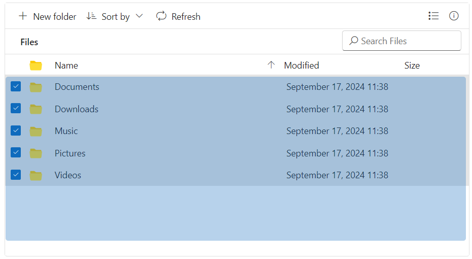

# Multiple Selection in File Manager

The File Manager allows multiple file selection through the [`allowMultiSelection`](https://help.syncfusion.com/cr/aspnetcore-js2/Syncfusion.EJ2~Syncfusion.EJ2.FileManager.FileManager~AllowMultiSelection.html) property (enabled by default). The multiple selection can be done by pressing the `Ctrl` key or `Shift` key and selecting the files. The check box can also be used to do multiple selection. `Ctrl + A` can be used to select all files in the current directory. The [`fileSelect`](https://help.syncfusion.com/cr/aspnetcore-js2/Syncfusion.EJ2~Syncfusion.EJ2.FileManager.FileManager~FileSelect.html) event will be triggered when the items of File Manager control is selected or unselected.

The example below demonstrates how the File Manager allows multiple file selection using the [`allowMultiSelection`](https://help.syncfusion.com/cr/aspnetcore-js2/Syncfusion.EJ2~Syncfusion.EJ2.FileManager.FileManager~AllowMultiSelection.html) property.
























The output will look like the image below.

## Range Selection

The File Manager supports selecting files and folders in specific ranges through mouse drag, similar to File Explorer. This is particularly useful in scenarios where users need to select a large group of files quickly without manually clicking each one. 

### Enabling Range Selection



To enable range selection, you need to set the [enableRangeSelection](https://help.syncfusion.com/cr/aspnetcore-js2/Syncfusion.EJ2.FileManager.FileManager.html#Syncfusion_EJ2_FileManager_FileManager_EnableRangeSelection) property to `true` and ensure that multi-selection is allowed using the [allowMultiSelection](https://help.syncfusion.com/cr/aspnetcore-js2/Syncfusion.EJ2.FileManager.FileManager.html#Syncfusion_EJ2_FileManager_FileManager_AllowMultiSelection) property.












To enable range selection, you need to set the [enableRangeSelection](https://help.syncfusion.com/cr/aspnetmvc-js2/syncfusion.ej2.filemanager.filemanager.html#Syncfusion_EJ2_FileManager_FileManager_EnableRangeSelection) property to `true` and ensure that multi-selection is allowed using the [allowMultiSelection](https://help.syncfusion.com/cr/aspnetmvc-js2/syncfusion.ej2.filemanager.filemanager.html#Syncfusion_EJ2_FileManager_FileManager_AllowMultiSelection) property.











The output will look like the image below.

