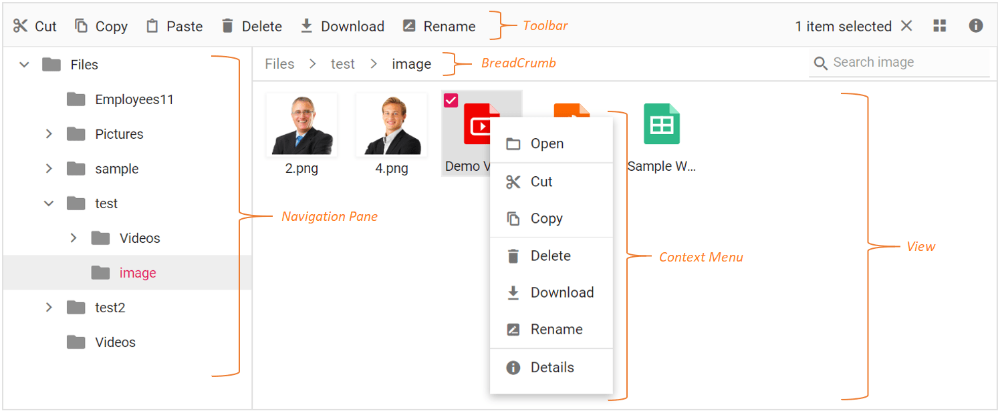
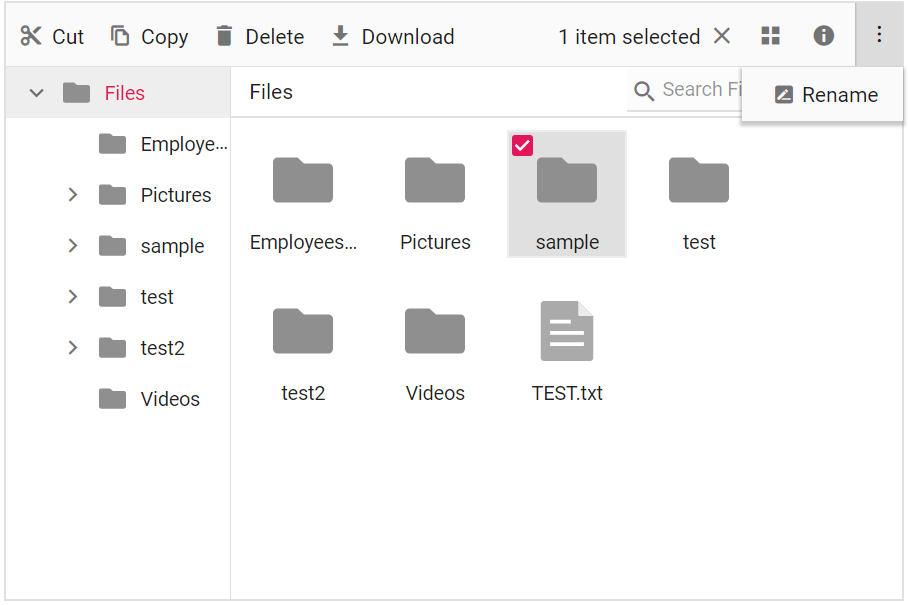

# User Interface Structure

The File Manager UI comprises several sections such as view, toolbar, breadcrumb, context menu, and more. The UI of the File Manager is enhanced with injectable modules like `Details View` for browsing files and folders in a grid, `Navigation Pane` for folder navigation, and `Toolbar` for file operations. The File Manager with all feature modules have the following sections in its UI.

* [Toolbar](#toolbar) (For direct access to file operations)
* [Navigation Pane](#navigation-pane) (For easy navigation between folders)
* [Breadcrumb](#breadcrumb) (For parent folder navigations)
* [View](#view) (For browsing files and folders using large icon view or details view)
* [Context Menu](#context-menu) (For accessing file operations)

The basic File Manager is a light weight control with all the basic functions. The basic File Manager have the following sections in its UI to browse files and folders and manage them with file operations.

* [Breadcrumb](#breadcrumb) (For parent folder navigations)
* [View](#view) (Large Icons view for browsing files and folders)
* [Context Menu](#context-menu) (For accessing file operations)

## Toolbar

The `Toolbar` provides easy access to the file operations using different buttons and it is presented at the top of the File Manager.

If the toolbar items exceed the size of the toolbar, the excess items will be moved to a toolbar popup with a dropdown button at the end of the toolbar.

*Refer [Toolbar](./file-operations/#toolbar) section in file operations to know more about the buttons present in toolbar*.

## Files and folders navigation

The File Manager provides navigation between files and folders using the following two options.

* [Navigation Pane](#navigation-pane)
* [Breadcrumb](#breadcrumb)

### Navigation pane

The File Manager provides a navigation pane that displays the folder hierarchy of the file system and enables easy navigation to the desired folder. Using [`navigationPaneSettings`](https://help.syncfusion.com/cr/aspnetcore-js2/Syncfusion.EJ2.FileManager.FileManagerNavigationPaneSettings.html) minimum and maximum width of the navigation pane can be changed. The navigation pane can be shown or hidden using the `visible` option in the `navigationPaneSettings`.

### BreadCrumb

The File Manager provides breadcrumb for navigating to the parent folders. The breadcrumb in the File Manager is responsible for resizing. Whenever the path length exceeds the breadcrumb length, a dropdown button will be added at the starting of the breadcrumb to hold the parent folders adjacent to root.

## View

View is the section where the files and folders are displayed for the user to browse. The File Manager has two types of views to display the files and folders.

* [Large Icons View](#large-icons-view)
* [Details View](#details-view)

The `large icons view` is the default starting view in the File Manager. The view can be changed by using the [toolbar](#toolbar) view button or by using the view menu in [context menu](#context-menu). The `view` API can also be used to change the initial view of the File Manager.

### Large icons view

In the large icons view, the thumbnail icons will be shown in a larger size, which displays the data in a form that best suits their content. For image and video type files, a **preview** will be displayed. Extension thumbnails will be displayed for other type files.

### Details view

The File Manager view can be changed from large icon to details view by using the [`View`](https://help.syncfusion.com/cr/aspnetcore-js2/Syncfusion.EJ2.FileManager.FileManager.html#Syncfusion_EJ2_FileManager_FileManager_View) property. In the details view, the files are displayed in a sorted list order. This file list comprises of several columns of information about the files such as **Name**, **Date Modified**, **Type**, and **Size**. Each file has its own small icon representing the file type. Additional columns can be added using [`detailsViewSettings`](https://help.syncfusion.com/cr/aspnetcore-js2/Syncfusion.EJ2.FileManager.FileManagerDetailsViewSettings.html) API. The details view allows you to perform sorting using column header.

## Context menu

The context menu appears on user interaction such as right-click. The File Manager is provided with context menu support to perform list of file operations with the files and folders. Context menu appears with varying menu items based on the targets such as file, folder (including navigation pane folders), and layout (empty area in view).

Context menu can be customized using the [`contextMenuSettings`](https://help.syncfusion.com/cr/aspnetcore-js2/Syncfusion.EJ2.FileManager.FileManagerContextMenuSettings.html), [`menuOpen`](https://help.syncfusion.com/cr/aspnetcore-js2/Syncfusion.EJ2.FileManager.FileManager.html#Syncfusion_EJ2_FileManager_FileManager_MenuOpen), and [`menuClick`](https://help.syncfusion.com/cr/aspnetcore-js2/Syncfusion.EJ2.FileManager.FileManager.html#Syncfusion_EJ2_FileManager_FileManager_MenuClose) events.

*Refer [Context Menu](./file-operations/#context-menu) section in file operations to know more about the menu items present in context menu*.

