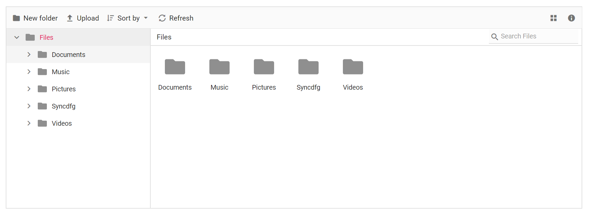
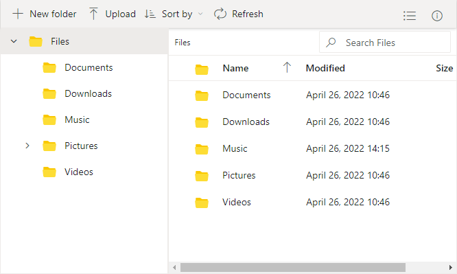

# Views

View is the section where the files and folders are displayed for the user to browse. The [view](https://help.syncfusion.com/cr/aspnetcore-js2/Syncfusion.EJ2~Syncfusion.EJ2.FileManager.FileManager~View.html) API can also be used to change the initial view of the file manager.

 The file manager has two types of [views](https://help.syncfusion.com/cr/aspnetcore-js2/Syncfusion.EJ2~Syncfusion.EJ2.FileManager.FileManager~View.html) to display the files and folders.

* [LargeIcons View](#largeicons-view)
* [Details View](#details-view)

## LargeIcons View

By Default, File Manager is rendered with largeicons view. The following example demonstrate this.
























Output be like the below.

## Details View

The default appearance of the file manager can be changed from largeicons to details view by using [view](https://help.syncfusion.com/cr/aspnetcore-js2/Syncfusion.EJ2~Syncfusion.EJ2.FileManager.FileManager~View.html) property. In the Details view, the files are displayed in a sorted list order. This file list comprises of several columns of information about the files such as **Name**, **Date Modified**, **Type**, and **Size**. The following example demonstrate the file manager with details view.
























Output be like the below.

