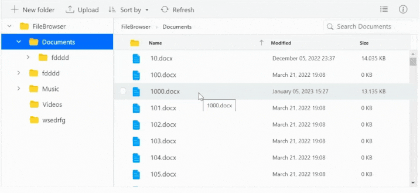

# Virtualization in File Manager Control

File Manager's UI virtualization allows for the dynamic loading of a large number of directories and files in both the detailsView and largeIconsView without degrading performance.

## Enable Virtualization

The virtualization of the File Manager control is based on the height and width of the viewport. The items will be loaded in both `largeIconsView` and `detailsView` based on the viewport size.

In order to enable `virtualization`, you must set the `EnableVirtualization` property to true.

The example below shows a large collection of files in the **Documents** and **Text Documents** folders.





















The output will look like the image below.

## Limitations for Virtualization

* Programmatic selection using the **selectAll** method is not supported with virtual scrolling.

* The keyboard shortcut **CTRL+A** will only select the files and directories that are currently visible within the viewport, rather than selecting all files and directories in the entire directory tree.

* Selected file items are not maintained while scrolling to ensure optimal control performance.
