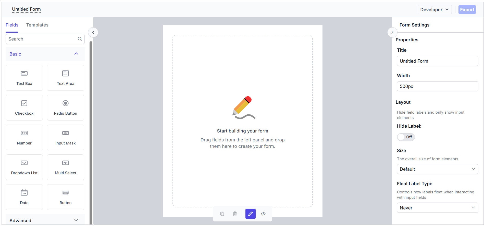

# Getting Started with ASP.NET Core Form Builder

The Form Builder is an intuitive, visual form designer that lets you create and customize forms interactively by dragging and dropping fields—no code required. You can visually design forms, configure field properties, and preview the generated form in real time. The Form Builder also allows you to export the form schema for use with the [Form Renderer](https://ej2.syncfusion.com/aspnetcore/documentation/form-renderer/getting-started) control.

This section explains the steps required to create a simple ASP.NET Core Form Builder and demonstrate the basic usage of the Form Builder control in a ASP.NET Core application using Visual Studio.

## Prerequisites

[System requirements for ASP.NET Core controls](https://ej2.syncfusion.com/aspnetcore/documentation/system-requirements)

## Create an ASP.NET Core Web App with Razor Pages





Create an **ASP.NET Core Web App** using Visual Studio via [Microsoft Templates](https://learn.microsoft.com/en-us/aspnet/core/tutorials/razor-pages/razor-pages-start?view=aspnetcore-10.0&tabs=visual-studio#create-a-razor-pages-web-app) or the [ASP.NET Core Extension](https://ej2.syncfusion.com/aspnetcore/documentation/visual-studio-integration/create-project).





Run the following command to create a new ASP.NET Core Web App.




dotnet new webapp -o RazorPagesFormBuilder
code -r RazorPagesFormBuilder




Alternatively, create an ASP.NET Core Web App using Visual Studio Code via [Microsoft Templates](https://learn.microsoft.com/en-us/aspnet/core/tutorials/razor-pages/razor-pages-start?view=aspnetcore-10.0&tabs=visual-studio-code#create-a-razor-pages-web-app) or the [ASP.NET Core Extension](https://ej2.syncfusion.com/aspnetcore/documentation/visual-studio-code-integration/create-project), or the [C# Dev Kit](https://marketplace.visualstudio.com/items?itemName=ms-dotnettools.csdevkit) extension.





## Install the required ASP.NET Core packages

Install the [Syncfusion.AspNetCore.FormBuilder](https://www.nuget.org/packages/Syncfusion.AspNetCore.FormBuilder) and [Syncfusion.AspNetCore.Themes](https://www.nuget.org/packages/Syncfusion.AspNetCore.Themes) NuGet packages. All Syncfusion ASP.NET Core packages are available on [nuget.org](https://www.nuget.org/packages?q=Syncfusion.EJ2). See the [NuGet packages](https://ej2.syncfusion.com/aspnetcore/documentation/nuget-packages) topic for more details.





1. Go to *Tools → NuGet Package Manager → Manage NuGet Packages for Solution*.
2. Search the required NuGet packages (`Syncfusion.AspNetCore.FormBuilder` and `Syncfusion.AspNetCore.Themes`) and install them.

Alternatively, you can install the same packages using the Package Manager Console with the following commands.




Install-Package Syncfusion.AspNetCore.FormBuilder -Version {{ site.releaseversion }}
Install-Package Syncfusion.AspNetCore.Themes -Version {{ site.releaseversion }}








Open the terminal and run the following commands.




dotnet add package Syncfusion.AspNetCore.FormBuilder --version {{ site.releaseversion }}
dotnet add package Syncfusion.AspNetCore.Themes --version {{ site.releaseversion }}








## Add ASP.NET Core tag helpers

After the packages are installed, open the **~/Pages/_ViewImports.cshtml** file and import the `Syncfusion.AspNetCore.FormBuilder` and `Syncfusion.AspNetCore.Base` tag helpers.




@addTagHelper *, Syncfusion.AspNetCore.FormBuilder
@addTagHelper *, Syncfusion.AspNetCore.Base




## Add stylesheet and script resources

The theme stylesheet and script can be referenced from NuGet through [Static Web Assets](https://ej2.syncfusion.com/aspnetcore/documentation/appearance/theme#static-web-assets). Include the [stylesheet](https://ej2.syncfusion.com/aspnetcore/documentation/appearance/theme) and [script references](https://ej2.syncfusion.com/aspnetcore/documentation/common/adding-script-references) inside the `<head>` of the **~/Pages/Shared/_Layout.cshtml** file.




<head>
    ...
    <link rel="stylesheet" href="_content/Syncfusion.AspNetCore.Themes/styles/fluent2.css" />
    
</head>




## Register the script manager

Open the **~/Pages/Shared/_Layout.cshtml** file and register the script manager (`<ejs-scripts>`) at the end of the `<body>` element as shown below.




<body>
    ...
    <!-- Syncfusion ASP.NET Core Script Manager -->
    <ejs-scripts></ejs-scripts>
</body>




## Add ASP.NET Core Form Builder

Now, add the Syncfusion&reg; ASP.NET Core Form Builder tag helper in the `~/Pages/FormBuilder/Default.cshtml` page.




@page
@model FormBuilder.DefaultModel
@using Syncfusion.EJ2.FormBuilder

<ejs-form-builder></ejs-form-builder>




public class DefaultModel : PageModel
{
    public void OnGet()
    {
    }
}




## Run the application

Press <kbd>Ctrl</kbd>+<kbd>F5</kbd> (Windows) or <kbd>⌘</kbd>+<kbd>F5</kbd> (macOS) to launch the application. The ASP.NET Core Form Builder will render in your default web browser.

## Registering Syncfusion license

The Syncfusion® Form Builder requires a valid license key to be registered in the application. To prevent license validation warnings, refer to the [Syncfusion licensing](https://ej2.syncfusion.com/aspnetcore/documentation/licensing/overview) documentation.

## Basic components of Form Builder

The Form Builder control consists of the following sections:

1. Left Pane / Toolbox — Displays all the supported form fields, which can be dragged and dropped.
2. Central design canvas — Holds the dropped form fields to construct the form.
3. Right Pane — Provides options to customize the form settings as well as the selected form fields.
4. Code view — Displays the form schema during the form design process.
5. Form Preview — Allows you to preview and interact with the generated form in real time once it is created.

## Adding form fields to the design canvas

Form fields can be added to the central design canvas in the following ways:

* **Form Components Panel** — A toolbox of form fields is available in the left-side pane to drag and drop them onto the design canvas.
* **Context Menu in the Design Canvas** — After the first form field is dropped, a button at the end of the central canvas can be used to add additional form fields using a context menu that appears when the button is clicked.

