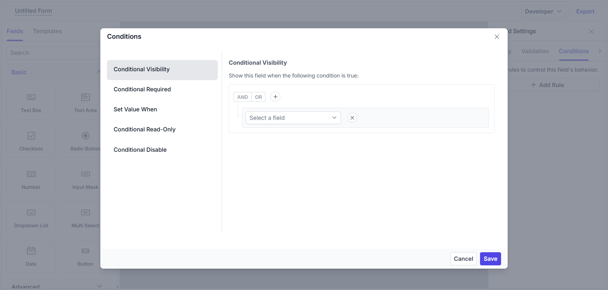

# Conditions Editor in ##Platform_Name## Form Builder control

The **Conditions Editor** is a dialog you can open from the `Conditions` tab in the [Property Panel](./property-panel). It lets you control how a field behaves based on the values of other fields in your form. For example, you can show or hide fields, make them required, or change their value automatically depending on user input.

## Opening the editor

The `Conditions` tab is available for most fields in the Property Panel. Click the **Add Rule** button to open the Conditions Editor dialog.

The dialog has two sections:

- **Left side:** Choose the type of condition you want to add (such as conditional visibility, conditional hide, conditional required, etc.).
- **Right side:** Set up the rule using the visual editor. You can select fields, operators, and values to define when the condition should apply.

Once you save a condition, it appears as a card in the Conditions tab. You can edit or delete conditions at any time.

## Condition types

You can add different types of conditions to control how your form fields behave. The available types may vary depending on the field, but the most common are:

### Conditional Visibility
Show a field only when certain conditions are met. For example, you can make a field appear only if another field has a specific value. If no rule is set, the field is always visible.

### Conditional Hide
Hide a field when certain conditions are met. Use this if you want a field to be shown by default and hidden only in specific cases.

### Conditional Read-Only
Make a field read-only (users can see it but not edit it) when the condition is met. Otherwise, the field is editable.

### Conditional Disable
Disable a field (it will be greyed out and cannot be filled in) when the condition is met. Disabled fields are not included in form submissions.

### Conditional Required
Make a field required only when certain conditions are met. For example, you can require a phone number only if the user selects "Phone" as their contact preference.

### Set Value When
Automatically set a field’s value when a condition is met. For example, you can set a country field to "United States" if another field is set to "US".

### Choice-Based Field
Available for the dropdown list field. This lets you show different options based on the value selected in another field (cascading dropdowns).

### Conditional Data
Available for the Data Grid. This lets you change the data source and the columns of the grid based on other field values.

## How to build rules

Condition rules can be created by following these steps:

1. Select the conditional type needed.
2. A query builder will be displayed on the right side. Other field names will be shown in the dropdown to frame the condition.
3. Once the field is selected, the operators and the values for the conditions will be visible.

You can also group rules together to create more complex logic. The editor lets you add groups using the **Add Group** and **Add Condition** buttons.

Common operators in the conditions include:

| Operator | Behavior |
|---|---|
| Is Empty / Is Not Empty | Checks if a field is blank or filled |
| Equal / Not Equal | Checks if a field matches or does not match a value |
| Contains / Not Contains | Checks if a field includes or does not include a value |
| Starts with / Not Starts With | Checks if a field begins with a certain value |
| Greater than / Less than | Checks if a number or date is above or below a value |
| Greater than or equal / Less than or equal | Checks if a number or date is above or below a value |
