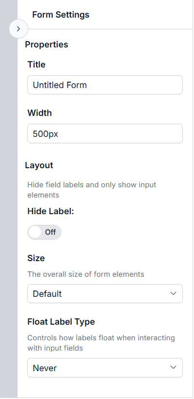

# Form Settings Panel in ##Platform_Name## Form Builder component

The **Form Settings Panel** appears in the right pane of the Form Builder whenever no field is selected on the design canvas — for example, when the canvas is empty or only contains the default Submit button. It lets you configure settings that apply to the entire form.

Some settings, like Hide Label, Size, and Float Label Type, affect every component on the form at once. When you change these, the design canvas updates immediately to reflect your choices. If you have set custom values for individual components, those will remain unchanged.

## Properties tab

### Title

**Title** — The name of your form. This is used as the default file name when you export the form and as the collection name for preview submissions. If you don’t set a name, the default is "Untitled Form". The form name can also be modified at the toolbar at the top of the control.

### Width

**Width** — Controls how wide your form appears. You can enter any valid CSS width value, such as `100%`, `500px`, or `80vw`. The default is `500px`.

## Layout tab

The **Layout** tab lets you adjust appearance settings that affect all fields on your form at once.

The properties, like **Hide Label**, **Size**, and **Float Label Type**, affect every component on the form at once. When you change these, the design canvas updates immediately to reflect your choices. If you have these properties for individual components, those will remain unchanged.

### Hide Label

When enabled, all field labels are hidden and only the input elements are shown. You can still show labels for specific fields by changing their individual settings.

### Size

Sets the overall size of form elements. Choose from **Default**, **Small**, or **Bigger** to make all fields and controls larger or smaller. The default is **Default**.

### Float Label Type

**Float Label Type** — Controls how field labels appear when you interact with input fields. This property applies to all supported components (like TextBox, TextArea, Numeric TextBox, DropDown List, etc.).

| Option | Behavior |
|---|---|
| Never | The label never floats; it stays in its normal position. |
| Always | The label is always shown as a floating placeholder inside the input. |
| Auto | The label floats only when the field is focused or has a value. 
