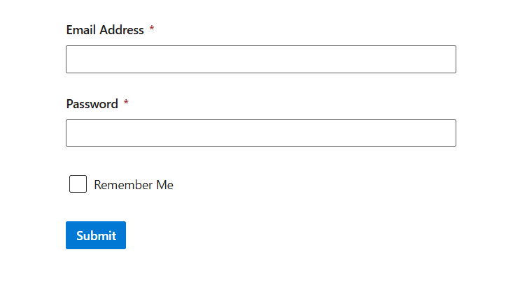

# Getting Started with ASP.NET Core Form Renderer

This section briefly explains how to include the ASP.NET Core Form Renderer in an ASP.NET Core application using [Visual Studio](https://visualstudio.microsoft.com/vs/).

## Create an ASP.NET Core Web App with Razor Pages

Create an **ASP.NET Core Web App** using Visual Studio via [Microsoft Templates](https://learn.microsoft.com/en-us/aspnet/core/tutorials/razor-pages/razor-pages-start?view=aspnetcore-10.0&tabs=visual-studio#create-a-razor-pages-web-app) or the [Syncfusion® ASP.NET Core Extension](https://ej2.syncfusion.com/aspnetcore/documentation/visual-studio-integration/create-project). For detailed instructions, refer to the [ASP.NET Core Web App Getting Started](https://ej2.syncfusion.com/aspnetcore/documentation/getting-started/razor-pages) documentation.

## Install the required ASP.NET Core packages

Install the [Syncfusion.AspNetCore.FormRenderer](https://www.nuget.org/packages/Syncfusion.AspNetCore.FormRenderer) and [Syncfusion.AspNetCore.Themes](https://www.nuget.org/packages/Syncfusion.AspNetCore.Themes) NuGet packages. All Syncfusion ASP.NET Core packages are available on [nuget.org](https://www.nuget.org/packages?q=Syncfusion.EJ2). See the [NuGet packages](https://ej2.syncfusion.com/aspnetcore/documentation/nuget-packages) topic for more details.

Alternatively, you can install the same packages using the Package Manager Console with the following commands.




Install-Package Syncfusion.AspNetCore.FormRenderer -Version {{ site.releaseversion }}
Install-Package Syncfusion.AspNetCore.Themes -Version {{ site.releaseversion }}




## Add ASP.NET Core tag helpers

After the packages are installed, open the **~/Pages/_ViewImports.cshtml** file and import the `Syncfusion.AspNetCore.FormRenderer` and `Syncfusion.AspNetCore.Base` tag helpers.




@addTagHelper *, Syncfusion.AspNetCore.FormRenderer
@addTagHelper *, Syncfusion.AspNetCore.Base




## Add stylesheet and script resources

The theme stylesheet and script can be referenced from NuGet through [Static Web Assets](https://ej2.syncfusion.com/aspnetcore/documentation/appearance/theme#static-web-assets). Include the [stylesheet](https://ej2.syncfusion.com/aspnetcore/documentation/appearance/theme) and [script references](https://ej2.syncfusion.com/aspnetcore/documentation/common/adding-script-references) inside the `<head>` of **~/Pages/Shared/_Layout.cshtml** file.




<head>
    ...
    <link rel="stylesheet" href="_content/Syncfusion.AspNetCore.Themes/styles/fluent2.css" />
    
</head>




## Register the script manager

Open the **~/Pages/Shared/_Layout.cshtml** file and register the script manager (`<ejs-scripts>`) at the end of the `<body>` element as shown below.




<body>
    ...
    <!-- Syncfusion ASP.NET Core Script Manager -->
    <ejs-scripts></ejs-scripts>
</body>




## Add ASP.NET Core Form Renderer

Now, add the Syncfusion&reg; ASP.NET Core Form Renderer tag helper in `~/Pages/FormRenderer/Default.cshtml` page.

The Form Renderer control builds a form from a JSON-based `Schema` and renders the matching EJ2 input controls automatically. The schema has three parts: `Properties` (the form fields), `Layout` (how the fields are arranged in panels and tables) and `Settings` (form-level options such as name and width). In this example, a **Registration Form** is built with first name, last name, phone, user name, password / confirm password (with a custom match validation), a terms checkbox and a Submit button.

### Create the page model

The `DefaultModel` page model builds the schema in `OnGet` and exposes it through the `FormSchema` property so the view can bind it to the Form Renderer tag helper. The supporting classes (`Schema`, `SchemaProperties`, `SchemaSettings`, `TextboxProperty`, `PasswordProperty`, `CheckboxProperty`, `SubmitButtonProperty`, `LayoutNode`) use `[JsonProperty]` attributes to map to the JSON properties consumed by the Form Renderer.




@page
@model EJ2CoreSampleBrowser.Pages.FormRenderer.DefaultModel
@using Syncfusion.EJ2.FormLayout

<ejs-formrenderer id="registrationForm" schema="Model.FormSchema"></ejs-formrenderer>




public class DefaultModel : PageModel
    {
        public Schema FormSchema { get; set; }

        public void OnGet()
        {
            FormSchema = new Schema
            {
                Version = "0.1.0",
                Properties = new SchemaProperties
                {
                    EmailAddress = new TextboxProperty
                    {
                        Id = "textbox_1786013518996_836",
                        Name = "emailAddress",
                        Type = "string",
                        Label = "Email Address",
                        TextboxType = "email",
                        Required = true,
                        Widget = "textbox"
                    },
                    Password = new PasswordProperty
                    {
                        Id = "textbox_1786013518996_700",
                        Name = "password",
                        Type = "string",
                        Label = "Password",
                        TextboxType = "password",
                        Required = true,
                        MinLength = 6,
                        Widget = "textbox"
                    },
                    RememberMe = new CheckboxProperty
                    {
                        Id = "checkbox_1786013518996_85",
                        Name = "rememberMe",
                        Type = "boolean",
                        Label = "Remember Me",
                        Widget = "checkbox"
                    },
                    Submit = new SubmitButtonProperty
                    {
                        Id = "submit_button_initial",
                        Name = "defaultFormsubmit",
                        Type = "button",
                        Label = "Submit",
                        ButtonType = "submit",
                        Widget = "button",
                        Style = "primary",
                        Disabled = false
                    }
                },
                Layout = new List<LayoutNode>
                {
                    new LayoutNode { Type = "field", PropertyId = "emailAddress" },
                    new LayoutNode { Type = "field", PropertyId = "password" },
                    new LayoutNode { Type = "field", PropertyId = "rememberMe" },
                    new LayoutNode { Type = "field", PropertyId = "submit" }
                },
                Settings = new SchemaSettings
                {
                    Name = "Untitled Form"
                }
            };
        }
    }

public class Schema
{
    [JsonProperty("version")]
    public string Version { get; set; }

    [JsonProperty("properties")]
    public SchemaProperties Properties { get; set; }

    [JsonProperty("layout")]
    public List<LayoutNode> Layout { get; set; }

    [JsonProperty("settings")]
    public SchemaSettings Settings { get; set; }
}

public class SchemaProperties
{
    [JsonProperty("emailAddress")]
    public TextboxProperty EmailAddress { get; set; }

    [JsonProperty("password")]
    public PasswordProperty Password { get; set; }

    [JsonProperty("rememberMe")]
    public CheckboxProperty RememberMe { get; set; }

    [JsonProperty("submit")]
    public SubmitButtonProperty Submit { get; set; }
}

public class SchemaSettings
{
    [JsonProperty("name")]
    public string Name { get; set; }

    [JsonProperty("width")]
    public string Width { get; set; }
}

public class TextboxProperty
{
    [JsonProperty("id")]
    public string Id { get; set; }

    [JsonProperty("name")]
    public string Name { get; set; }

    [JsonProperty("type")]
    public string Type { get; set; }

    [JsonProperty("label")]
    public string Label { get; set; }

    [JsonProperty("textboxType")]
    public string TextboxType { get; set; }

    [JsonProperty("required")]
    public bool Required { get; set; }

    [JsonProperty("widget")]
    public string Widget { get; set; }

    [JsonProperty("labelPosition")]
    public string LabelPosition { get; set; }

    [JsonProperty("autocomplete")]
    public bool Autocomplete { get; set; }

    [JsonProperty("size")]
    public string Size { get; set; }
}

public class PasswordProperty
{
    [JsonProperty("id")]
    public string Id { get; set; }

    [JsonProperty("name")]
    public string Name { get; set; }

    [JsonProperty("type")]
    public string Type { get; set; }

    [JsonProperty("label")]
    public string Label { get; set; }

    [JsonProperty("textboxType")]
    public string TextboxType { get; set; }

    [JsonProperty("required")]
    public bool Required { get; set; }

    [JsonProperty("minLength")]
    public int MinLength { get; set; }

    [JsonProperty("widget")]
    public string Widget { get; set; }

    [JsonProperty("labelPosition")]
    public string LabelPosition { get; set; }

    [JsonProperty("size")]
    public string Size { get; set; }
}

public class CheckboxProperty
{
    [JsonProperty("id")]
    public string Id { get; set; }

    [JsonProperty("name")]
    public string Name { get; set; }

    [JsonProperty("type")]
    public string Type { get; set; }

    [JsonProperty("label")]
    public string Label { get; set; }

    [JsonProperty("widget")]
    public string Widget { get; set; }

    [JsonProperty("size")]
    public string Size { get; set; }
}

public class SubmitButtonProperty
{
    [JsonProperty("id")]
    public string Id { get; set; }

    [JsonProperty("name")]
    public string Name { get; set; }

    [JsonProperty("type")]
    public string Type { get; set; }

    [JsonProperty("label")]
    public string Label { get; set; }

    [JsonProperty("buttonType")]
    public string ButtonType { get; set; }

    [JsonProperty("widget")]
    public string Widget { get; set; }

    [JsonProperty("size")]
    public string Size { get; set; }

    [JsonProperty("style")]
    public string Style { get; set; }

    [JsonProperty("disabled")]
    public bool Disabled { get; set; }
}

public class LayoutNode
{
    [JsonProperty("type")]
    public string Type { get; set; }

    [JsonProperty("propertyId")]
    public string PropertyId { get; set; }

    [JsonProperty("id")]
    public string Id { get; set; }

    [JsonProperty("name")]
    public string Name { get; set; }

    [JsonProperty("label")]
    public string Label { get; set; }

    [JsonProperty("hideBorders")]
    public bool HideBorders { get; set; }

    [JsonProperty("rows")]
    public int Rows { get; set; }

    [JsonProperty("cols")]
    public int Cols { get; set; }

    [JsonProperty("children")]
    public List<LayoutNode> Children { get; set; }
}




## Run the application

Press <kbd>Ctrl</kbd>+<kbd>F5</kbd> (Windows) or <kbd>⌘</kbd>+<kbd>F5</kbd> (macOS) to launch the application. The ASP.NET Core Form renderer will render in your default web browser.

## See also

* [Getting Started with Syncfusion&reg; ASP.NET Core using Razor Pages](https://ej2.syncfusion.com/aspnetcore/documentation/getting-started/razor-pages)
* [Getting Started with Syncfusion&reg; ASP.NET Core MVC using Tag Helper](https://ej2.syncfusion.com/aspnetcore/documentation/getting-started/aspnet-core-mvc-taghelper)
* [Form Validation in ASP.NET Core](https://ej2.syncfusion.com/aspnetcore/documentation/form-validator/getting-started)
* [Form Model definition for ASP.NET Core](https://ej2.syncfusion.com/aspnetcore/documentation/form-layout/getting-started)
