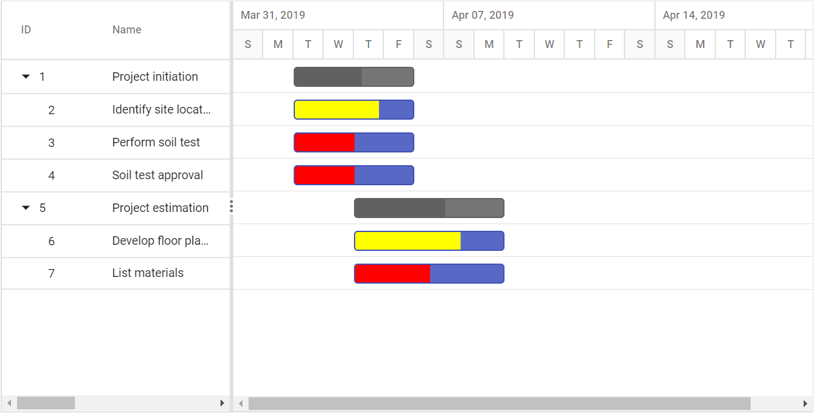

# Appearance customization

## Taskbar customization

### Taskbar Height

Height of child taskbars and parent taskbars can be customized by using [`TaskbarHeight`](https://help.syncfusion.com/cr/aspnetcore-js2/Syncfusion.EJ2.Gantt.Gantt.html#Syncfusion_EJ2_Gantt_Gantt_TaskbarHeight) property. The following code example shows how to use the property.
























> NOTE
The [`TaskbarHeight`](https://help.syncfusion.com/cr/aspnetcore-js2/Syncfusion.EJ2.Gantt.Gantt.html#Syncfusion_EJ2_Gantt_Gantt_TaskbarHeight) value should be lower than the [`RowHeight`](https://help.syncfusion.com/cr/aspnetcore-js2/Syncfusion.EJ2.Gantt.Gantt.html#Syncfusion_EJ2_Gantt_Gantt_RowHeight) property value and these properties accept only pixel values.

### Conditional formatting

The default taskbar UI can be replaced with custom templates using the [`QueryTaskbarInfo`](https://help.syncfusion.com/cr/aspnetcore-js2/Syncfusion.EJ2.Gantt.Gantt.html#Syncfusion_EJ2_Gantt_Gantt_QueryTaskbarInfo) event. The following code example shows customizing the taskbar UI based on task progress values in the Gantt control.
























### Taskbar template

You can design your own taskbars to view the tasks in Gantt by using [`TaskbarTemplate`](https://help.syncfusion.com/cr/aspnetcore-js2/Syncfusion.EJ2.Gantt.Gantt.html#Syncfusion_EJ2_Gantt_Gantt_TaskbarTemplate) property. And it is possible to map the template script element’s ID value to this property. It is also possible to customize the parent taskbars and milestones with custom templates by using [`ParentTaskbarTemplate`](https://help.syncfusion.com/cr/aspnetcore-js2/Syncfusion.EJ2.Gantt.Gantt.html#Syncfusion_EJ2_Gantt_Gantt_ParentTaskbarTemplate) and [`MilestoneTemplate`](https://help.syncfusion.com/cr/aspnetcore-js2/Syncfusion.EJ2.Gantt.Gantt.html#Syncfusion_EJ2_Gantt_Gantt_MilestoneTemplate) properties.
























## Task labels

The Gantt control maps any data source fields to task labels using the [`LabelSettings.LeftLabel`](https://help.syncfusion.com/cr/aspnetcore-js2/Syncfusion.EJ2.Gantt.GanttLabelSettings.html#Syncfusion_EJ2_Gantt_GanttLabelSettings_LeftLabel), [`LabelSettings.RightLabel`](https://help.syncfusion.com/cr/aspnetcore-js2/Syncfusion.EJ2.Gantt.GanttLabelSettings.html#Syncfusion_EJ2_Gantt_GanttLabelSettings_RightLabel), and [`LabelSettings.TaskLabel`](https://help.syncfusion.com/cr/aspnetcore-js2/Syncfusion.EJ2.Gantt.GanttLabelSettings.html#Syncfusion_EJ2_Gantt_GanttLabelSettings_TaskLabel) properties. You can customize the task labels with templates.
























## Connector lines

The width and background color of connector lines in Gantt can be customized using the [`ConnectorLineWidth`](https://help.syncfusion.com/cr/aspnetcore-js2/Syncfusion.EJ2.Gantt.Gantt.html#Syncfusion_EJ2_Gantt_Gantt_ConnectorLineWidth) and [`ConnectorLineBackground`](https://help.syncfusion.com/cr/aspnetcore-js2/Syncfusion.EJ2.Gantt.Gantt.html#Syncfusion_EJ2_Gantt_Gantt_ConnectorLineBackground) properties. The following code example shows how to use these properties.
























## Customize rows and cells

While rendering the TreeGrid part in Gantt, the [`RowDataBound`](https://help.syncfusion.com/cr/aspnetcore-js2/Syncfusion.EJ2.Gantt.Gantt.html#Syncfusion_EJ2_Gantt_Gantt_RowDataBound) and [`QueryCellInfo`](https://help.syncfusion.com/cr/aspnetcore-js2/Syncfusion.EJ2.Gantt.Gantt.html#Syncfusion_EJ2_Gantt_Gantt_QueryCellInfo) events trigger for every row and cell. Using these events, you can customize the rows and cells. The following code example shows how to customize the cell and row elements using these events.
























## Grid lines

In the Gantt control, you can show or hide the grid lines in the TreeGrid side and chart side by using the [`GridLines`](https://help.syncfusion.com/cr/aspnetcore-js2/Syncfusion.EJ2.Gantt.Gantt.html#Syncfusion_EJ2_Gantt_Gantt_GridLines) property.

The following options are available in the Gantt control for rendering the grid lines:

* Horizontal: The horizontal grid lines alone will be visible.
* Vertical: The vertical grid lines alone will be visible.
* Both: Both the horizontal and vertical grid lines will be visible on the TreeGrid and chart sides.
* None: Gridlines will not be visible on TreeGrid and chart sides.

> By default, the [`GridLines`](https://help.syncfusion.com/cr/aspnetcore-js2/Syncfusion.EJ2.Gantt.Gantt.html#Syncfusion_EJ2_Gantt_Gantt_GridLines) property is set to `Horizontal` type.

The following code example shows how to change the gridlines rendering mode in the Gantt control.
























## Splitter

In the Gantt control, the Splitter separates the TreeGrid section from the Chart section. You can change the position of the Splitter when loading the Gantt control using the [`SplitterSettings`](https://help.syncfusion.com/cr/aspnetcore-js2/Syncfusion.EJ2.Gantt.Gantt.html#Syncfusion_EJ2_Gantt_Gantt_SplitterSettings) property. By splitting the TreeGrid from the chart, the width of the TreeGrid and chart sections will vary in the control. The [`SplitterSettings.Position`](https://help.syncfusion.com/cr/aspnetcore-js2/Syncfusion.EJ2.Gantt.GanttSplitterSettings.html#Syncfusion_EJ2_Gantt_GanttSplitterSettings_Position) property denotes the percentage of the TreeGrid section’s width to be rendered and this property supports both pixels and percentage values. You can define the splitter position as column index value using the [`SplitterSettings.ColumnIndex`](https://help.syncfusion.com/cr/aspnetcore-js2/Syncfusion.EJ2.Gantt.GanttSplitterSettings.html#Syncfusion_EJ2_Gantt_GanttSplitterSettings_ColumnIndex) property. You can also define the splitter position with built-in splitter view modes by using the [`SplitterSettings.View`](https://help.syncfusion.com/cr/aspnetcore-js2/Syncfusion.EJ2.Gantt.GanttSplitterSettings.html#Syncfusion_EJ2_Gantt_GanttSplitterSettings_View) property. The following list is the possible values for this property:

* `Default`: Shows Grid side and Gantt side.
* `Grid`: Shows Grid side alone in Gantt.
* `Chart`: Shows chart side alone in Gantt.
























### Change splitter position dynamically

In Gantt, we can change the splitter position dynamically by using `setSplitterPosition` method. We can change the splitter position by passing value and type parameter to `setSplitterPosition` method. Type parameter will accept one of the following values 'position', 'columnIndex', 'viewType'. The following code example shows how to use this method.
























