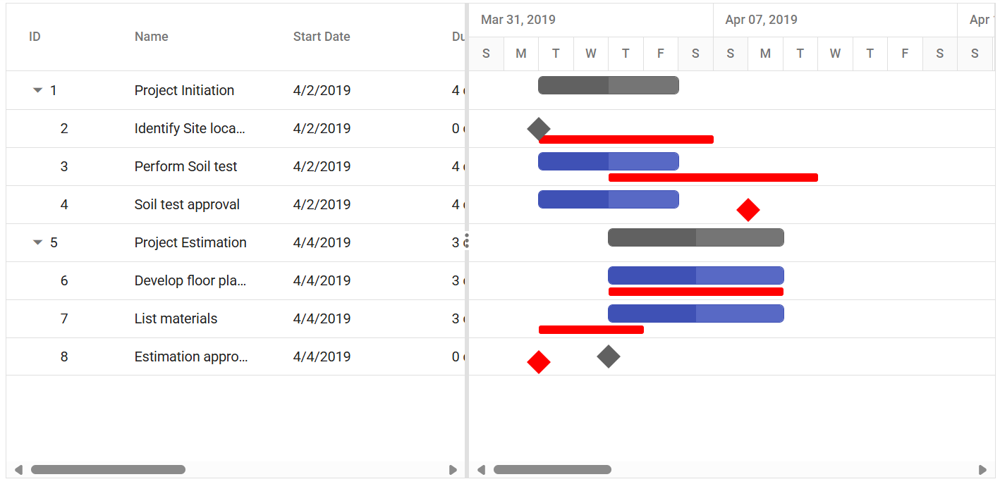

# BaseLine

The baseline feature enables users to view the deviation between the planned dates and actual dates of the tasks in a project. Baseline dates or planned dates of a task may or may not be same as the actual task dates. The baseline can be enabled by setting the [`RenderBaseline`](https://help.syncfusion.com/cr/aspnetcore-js2/Syncfusion.EJ2.Gantt.Gantt.html#Syncfusion_EJ2_Gantt_Gantt_RenderBaseline) property to `true` and the baseline color can be changed using the [`BaselineColor`](https://help.syncfusion.com/cr/aspnetcore-js2/Syncfusion.EJ2.Gantt.Gantt.html#Syncfusion_EJ2_Gantt_Gantt_BaselineColor) property. To render the baseline, you should map the baseline start and end date values from the data source. This can be done using the [`BaselineStartDate`](https://help.syncfusion.com/cr/aspnetcore-js2/Syncfusion.EJ2.Gantt.GanttTaskFields.html#Syncfusion_EJ2_Gantt_GanttTaskFields_BaselineStartDate) and [`BaselineEndDate`](https://help.syncfusion.com/cr/aspnetcore-js2/Syncfusion.EJ2.Gantt.GanttTaskFields.html#Syncfusion_EJ2_Gantt_GanttTaskFields_BaselineEndDate) properties. The following code example shows how to enable a baseline in the Gantt control.
























The following screenshot shows the baseline in Gantt control.

