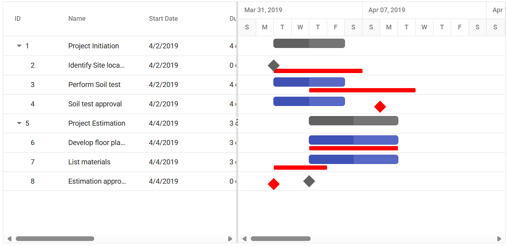
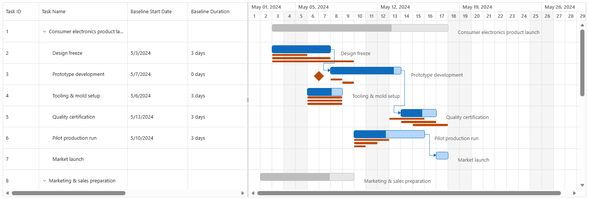

# BaseLine in ##Platform_Name## Syncfusion Gantt Component



The baseline feature in the Gantt component enables comparison between original planned schedules and actual task execution timelines. This visualization provides clear insights into schedule deviations, helping assess project performance and identify areas requiring attention. Baseline functionality displays both the original planned timeline and current progress side-by-side for comprehensive project tracking.

Before implementing baseline functionality, ensure the data source includes baseline date fields and configure the [taskFields](https://help.syncfusion.com/cr/aspnetcore-js2/Syncfusion.EJ2.Gantt.Gantt.html#Syncfusion_EJ2_Gantt_Gantt_TaskFields) object with appropriate field mappings. The baseline feature requires proper field mapping to display planned versus actual timelines effectively.

**Baseline fields**:

- [baselineStartDate](https://help.syncfusion.com/cr/aspnetcore-js2/Syncfusion.EJ2.Gantt.GanttTaskFields.html#Syncfusion_EJ2_Gantt_GanttTaskFields_BaselineStartDate): Represents the originally planned start date of a task. This value is used to compare against the actual start date to identify schedule deviations.
- [baselineEndDate](https://help.syncfusion.com/cr/aspnetcore-js2/Syncfusion.EJ2.Gantt.GanttTaskFields.html#Syncfusion_EJ2_Gantt_GanttTaskFields_BaselineEndDate): Represents the originally planned end date of a task. It is used to compare against the actual end date.
- [baselineDuration](https://help.syncfusion.com/cr/aspnetcore-js2/Syncfusion.EJ2.Gantt.GanttTaskFields.html#Syncfusion_EJ2_Gantt_GanttTaskFields_BaselineDuration): Represents the total planned duration of the task. This value is critical for baseline visualization. To represent a baseline milestone, this property must be explicitly set to `0`. Setting `baselineStartDate` and `baselineEndDate` to the same value without setting `baselineDuration` to `0` will result in a one-day baseline task, not a milestone.

## Implement baseline

To enable baseline, configure the Gantt component by setting [renderBaseline](https://help.syncfusion.com/cr/aspnetcore-js2/Syncfusion.EJ2.Gantt.Gantt.html#Syncfusion_EJ2_Gantt_Gantt_RenderBaseline) to `true`, mapping `baselineStartDate`, `baselineEndDate`, and optionally `baselineDuration` in `taskFields`. To customize appearance set the [baselineColor](https://help.syncfusion.com/cr/aspnetcore-js2/Syncfusion.EJ2.Gantt.Gantt.html#Syncfusion_EJ2_Gantt_Gantt_BaselineColor) property or the .`e-baseline-bar` CSS class for advanced styling.

```typescript
List<GanttDataSource> data = new List<GanttDataSource>
{
    ...

    new GanttDataSource
    {
        TaskID = 7,
        TaskName = "List materials",
        StartDate = new DateTime(2019, 4, 4),
        Duration = 3,
        Progress = 50,
        ParentID = 5,
        BaselineStartDate = new DateTime(2019, 4, 2),
        BaselineEndDate = new DateTime(2019, 4, 4),
        BaselineDuration = 2 // Regular baseline
    },
    new GanttDataSource
    {
        TaskID = 8,
        TaskName = "Estimation approval",
        StartDate = new DateTime(2019, 4, 4),
        BaselineStartDate = new DateTime(2019, 04, 02),
        Duration = 0,
        Progress = 50,
        ParentID = 5,
        BaselineDuration = 0 // Milestone baseline
    }
};
```

```cs
// Here you can customize base line color.
<ejs-gantt id='Gantt' dataSource="ViewBag.dataSource" height="450px" renderBaseline="true" baselineColor="red" projectStartDate="03/31/2019" projectEndDate="05/31/2019">
...
</ejs-gantt>
```

```css
.e-gantt .e-gantt-chart .e-baseline-bar {
  height: 4px;
  border-radius: 2px;
  opacity: 0.9;
  background-color: #4caf50;
}
```

The following example demonstrates complete baseline configuration with proper field mapping:












The baseline feature in the Gantt component enables comparison between original planned schedules and actual task execution timelines. This visualization provides clear insights into schedule deviations, helping assess project performance and identify areas requiring attention. Baseline functionality displays both the original planned timeline and current progress side-by-side for comprehensive project tracking.

Before implementing baseline functionality, ensure the data source includes baseline date fields and configure the [TaskFields](https://help.syncfusion.com/cr/aspnetmvc-js2/Syncfusion.EJ2.Gantt.Gantt.html#Syncfusion_EJ2_Gantt_Gantt_TaskFields) object with appropriate field mappings. The baseline feature requires proper field mapping to display planned versus actual timelines effectively.

**Baseline fields**:

- [BaselineStartDate](https://help.syncfusion.com/cr/aspnetmvc-js2/Syncfusion.EJ2.Gantt.GanttTaskFields.html#Syncfusion_EJ2_Gantt_GanttTaskFields_BaselineStartDate): Represents the originally planned start date of a task. This value is used to compare against the actual start date to identify schedule deviations.
- [BaselineEndDate](https://help.syncfusion.com/cr/aspnetmvc-js2/Syncfusion.EJ2.Gantt.GanttTaskFields.html#Syncfusion_EJ2_Gantt_GanttTaskFields_BaselineEndDate): Represents the originally planned end date of a task. It is used to compare against the actual end date.
- [BaselineDuration](https://help.syncfusion.com/cr/aspnetmvc-js2/Syncfusion.EJ2.Gantt.GanttTaskFields.html#Syncfusion_EJ2_Gantt_GanttTaskFields_BaselineDuration): Represents the total planned duration of the task. This value is critical for baseline visualization. To represent a baseline milestone, this property must be explicitly set to `0`. Setting `BaselineStartDate` and `BaselineEndDate` to the same value without setting `baselineDuration` to `0` will result in a one-day baseline task, not a milestone.

## Implement baseline

To enable baseline, configure the Gantt component by setting [RenderBaseline](https://help.syncfusion.com/cr/aspnetmvc-js2/Syncfusion.EJ2.Gantt.Gantt.html#Syncfusion_EJ2_Gantt_Gantt_RenderBaseline) to `true`, mapping `BaselineStartDate`, `BaselineEndDate`, and optionally `BaselineDuration` in `TaskFields`. To customize appearance set the [BaselineColor](https://help.syncfusion.com/cr/aspnetmvc-js2/Syncfusion.EJ2.Gantt.Gantt.html#Syncfusion_EJ2_Gantt_Gantt_BaselineColor) property or the .`e-baseline-bar` CSS class for advanced styling.

```typescript
List<GanttDataSource> data = new List<GanttDataSource>
{
    ...

    new GanttDataSource
    {
        TaskID = 7,
        TaskName = "List materials",
        StartDate = new DateTime(2019, 4, 4),
        Duration = 3,
        Progress = 50,
        ParentID = 5,
        BaselineStartDate = new DateTime(2019, 4, 2),
        BaselineEndDate = new DateTime(2019, 4, 4),
        BaselineDuration = 2 // Regular baseline.
    },
    new GanttDataSource
    {
        TaskID = 8,
        TaskName = "Estimation approval",
        StartDate = new DateTime(2019, 4, 4),
        BaselineStartDate = new DateTime(2019, 04, 02),
        Duration = 0,
        Progress = 50,
        ParentID = 5,
        BaselineDuration = 0 // Milestone baseline.
    }
};
```

```cs
@Html.EJS().Gantt("Gantt")
    .DataSource((IEnumerable<object>)ViewBag.DataSource)
    .RenderBaseline(true)
    .BaselineColor("red") // Here you can customize base line color.
    .Render()
```

```css
.e-gantt .e-gantt-chart .e-baseline-bar {
  height: 4px;
  border-radius: 2px;
  opacity: 0.9;
  background-color: #4caf50;
}
```

The following example demonstrates complete baseline configuration with proper field mapping:











The following screenshot shows the baseline in Gantt control.



## Customize baseline templates

The `baselineTemplate` property allows customization of baseline rendering by replacing the default baseline UI with a custom HTML structure. This enables advanced scenarios such as rendering additional baseline elements, visual indicators, or multiple baselines using task-specific data.

Set the `baselineTemplate` property with a template string or function. The template receives the task data object, which can be used to dynamically generate baseline elements.

### Multiple baseline rendering using template

By default, the Gantt component supports a single baseline per task. However, using the `baselineTemplate`, you can extend this behavior to render multiple baselines by maintaining additional baseline data within a custom field in your data source.

This enables rich visualization scenarios such as:

- Comparing original vs revised schedules.
- Visualizing multiple planning phases.
- Highlighting deviations across timeline checkpoints.

The following example demonstrates how to render multiple baselines using `baselineTemplate`.
























