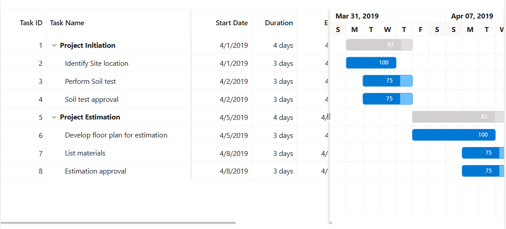
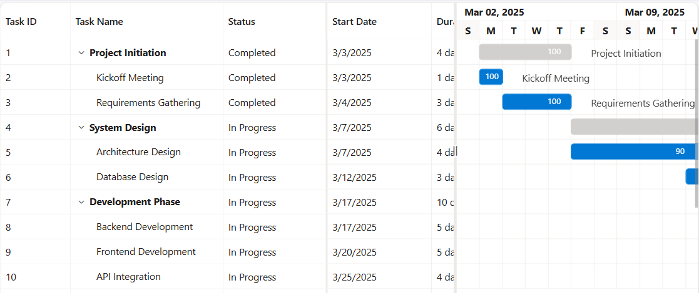
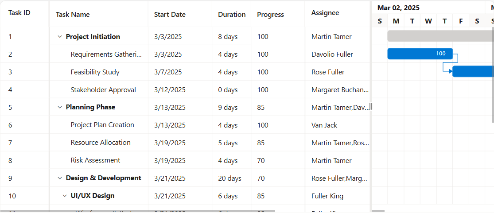
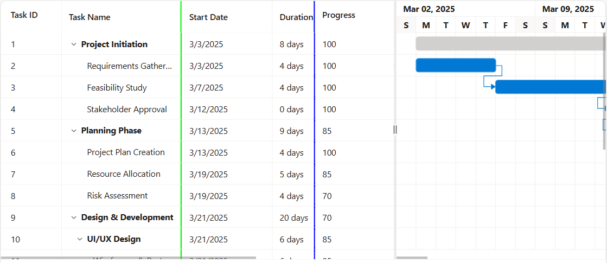

---
layout: post
title: Column Pinning (Frozen) in ##Platform_Name## Gantt Chart | Syncfusion
description: Learn here all about column pinning (Frozen) in Syncfusion ##Platform_Name## Gantt Chart control of Syncfusion Essential JS 2 and more.
platform: ej2-asp-core-mvc
control: Column Pinning (Frozen)
publishingplatform: ##Platform_Name##
documentation: ug
--- 

# Column Pinning (Frozen) in ##Platform_Name## Gantt Chart Control

The Syncfusion<sup style="font-size:70%">&reg;</sup> ##Platform_Name## Gantt Chart control provides a frozen columns feature that keeps selected columns fixed while scrolling horizontally through large datasets. This functionality ensures that critical information remains visible at all times, improving readability and user experience. By maintaining key columns in view, it simplifies navigation and makes referencing important data points easier when working with extensive project details.



To enable frozen columns, use the `frozenColumns` property in the Gantt Chart control. In the following example, the `frozenColumns` property is set to **2**, which keeps the first two columns fixed on the left while the remaining columns can be scrolled horizontally.












To enable frozen columns, use the `FrozenColumns` property in the Gantt Chart control. In the following example, the `FrozenColumns` property is set to **2**, which keeps the first two columns fixed on the left while the remaining columns can be scrolled horizontally.













## Freeze particular columns



The Syncfusion<sup style="font-size:70%">&reg;</sup> ##Platform_Name## Gantt Chart provides a feature that enables freezing specific columns, significantly enhancing data visibility and improving the user experience. The [isFrozen](https://help.syncfusion.com/cr/aspnetcore-js2/Syncfusion.EJ2.Gantt.GanttColumn.html#Syncfusion_EJ2_Gantt_GanttColumn_IsFrozen) property is used at the column level to freeze a specific column at any desired index on the left side, offering flexibility in managing which columns are frozen.

To freeze a particular column in the Gantt, set the `isFrozen` property of the column to **true**. The following example demonstrates how to freeze a particular column in the Gantt Chart using the `isFrozen` property.












The Syncfusion<sup style="font-size:70%">&reg;</sup> ##Platform_Name## Gantt Chart provides a feature that enables freezing specific columns, significantly enhancing data visibility and improving the user experience. The [IsFrozen](https://help.syncfusion.com/cr/aspnetmvc-js2/Syncfusion.EJ2.Gantt.GanttColumn.html#Syncfusion_EJ2_Gantt_GanttColumn_IsFrozen) property is used at the column level to freeze a specific column at any desired index on the left side, offering flexibility in managing which columns are frozen.

To freeze a particular column in the Gantt, set the `IsFrozen` property of the column to **true**. The following example demonstrates how to freeze a particular column in the Gantt Chart using the `IsFrozen` property.













## Freeze direction



In the Syncfusion<sup style="font-size:70%">&reg;</sup> ##Platform_Name## Gantt, the **freeze direction** feature allows you to position frozen columns either to the left, right, or in a fixed position, while still allowing the remaining columns to be horizontally movable. To achieve this, the [column.freeze](https://help.syncfusion.com/cr/aspnetcore-js2/Syncfusion.EJ2.Gantt.GanttColumn.html#Syncfusion_EJ2_Gantt_GanttColumn_Freeze) property can be utilized. This property is used to specify the freeze direction for individual columns. The types of the `column.freeze` directions:

* **Left**: When the `column.freeze` property is set to **Left**, specific columns will be frozen on the left side.

* **Right**: When the `column.freeze` property is set to **Right**, certain columns will be frozen on the right side.

* **Fixed**: The fixed direction locks a column at a fixed position within the Gantt Chart columns. This ensures that the column is always visible during horizontal scroll.

In the following example, the **TaskID** column is frozen on the left side, the **resources** column is frozen on the right side and the **Progress** column is frozen on the fixed of the content table.












In the Syncfusion<sup style="font-size:70%">&reg;</sup> ##Platform_Name## Gantt, the **freeze direction** feature allows you to position frozen columns either to the left, right, or in a fixed position, while still allowing the remaining columns to be horizontally movable. To achieve this, the [Column.Freeze](https://help.syncfusion.com/cr/aspnetmvc-js2/Syncfusion.EJ2.Gantt.GanttColumn.html#Syncfusion_EJ2_Gantt_GanttColumn_Freeze) property can be utilized. This property is used to specify the freeze direction for individual columns. The types of the `Column.Freeze` directions:

* **Left**: When the `Column.Freeze` property is set to **Left**, specific columns will be frozen on the left side.

* **Right**: When the `Column.Freeze` property is set to **Right**, certain columns will be frozen on the right side.

* **Fixed**: The fixed direction locks a column at a fixed position within the Gantt Chart columns. This ensures that the column is always visible during horizontal scroll.

In the following example, the **TaskID** column is frozen on the left side, the **resources** column is frozen on the right side and the **Progress** column is frozen on the fixed of the content table.











N> The freeze direction is not compatible when both the `isFrozen` and `frozenColumns` properties are enabled simultaneously.



## Change default frozen line color

The frozen line borders of frozen columns in the Syncfusion<sup style="font-size:70%">&reg;</sup> ##Platform_Name## Gantt Chart control can be customized by applying custom CSS styles to the respective frozen columns. This allows to change the border color of left, right, and fixed frozen columns to match your application's design and theme.

To change the default frozen line color, use the following CSS class names and apply the desired border color:

For left frozen columns: 

```css
.e-gantt .e-leftfreeze.e-freezeleftborder {
    border-right-color: rgb(0, 255, 0) !important;
}
```
For right frozen columns:

```css
.e-gantt .e-rightfreeze.e-freezerightborder {
    border-left-color: rgb(0, 0, 255) !important;
}
```
For fixed frozen columns, both left and right borders need to be specified as mentioned below:

```css
.e-gantt .e-leftfreeze.e-freezeleftborder {
    border-right-color: rgb(0, 255, 0) !important;
}

.e-gantt .e-rightfreeze.e-freezerightborder {
    border-left-color: rgb(0, 0, 255) !important;
}
```
The following example demonstrates how to change the default frozen line color using CSS:
























