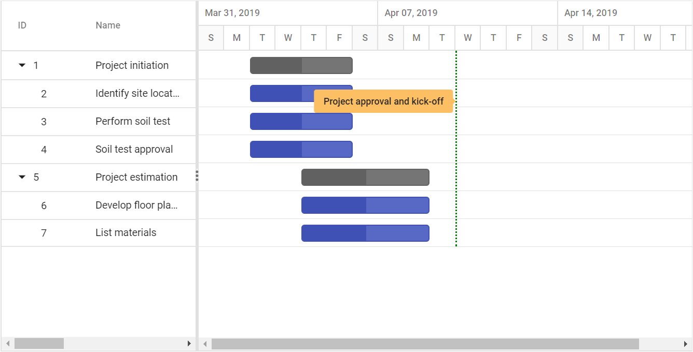

# Event Markers

The event markers in the Gantt control is used to highlight the important events in a project. Event markers can be initialized by using the [`EventMarkers`](https://help.syncfusion.com/cr/aspnetcore-js2/Syncfusion.EJ2.Gantt.Gantt.html#Syncfusion_EJ2_Gantt_Gantt_EventMarkers) property, and you can define date and label for the event markers using the [`Day`](https://help.syncfusion.com/cr/aspnetcore-js2/Syncfusion.EJ2.Gantt.GanttEventMarker.html#Syncfusion_EJ2_Gantt_GanttEventMarker_Day) and [`Label`](https://help.syncfusion.com/cr/aspnetcore-js2/Syncfusion.EJ2.Gantt.GanttEventMarker.html#Syncfusion_EJ2_Gantt_GanttEventMarker_Label) properties. You can also customize it using the [`CssClass`](https://help.syncfusion.com/cr/aspnetcore-js2/Syncfusion.EJ2.Gantt.GanttEventMarker.html#Syncfusion_EJ2_Gantt_GanttEventMarker_CssClass) properties. The following code example shows how to add event markers in the Gantt control.
























