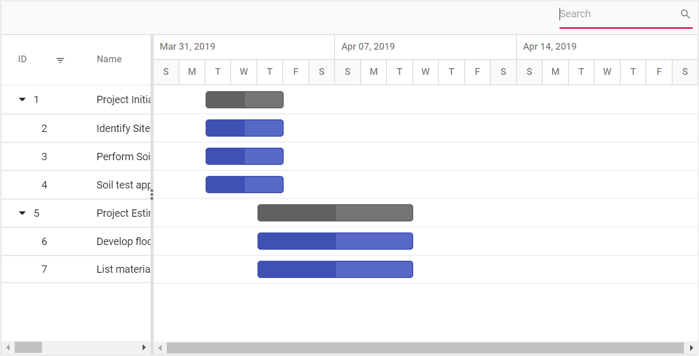
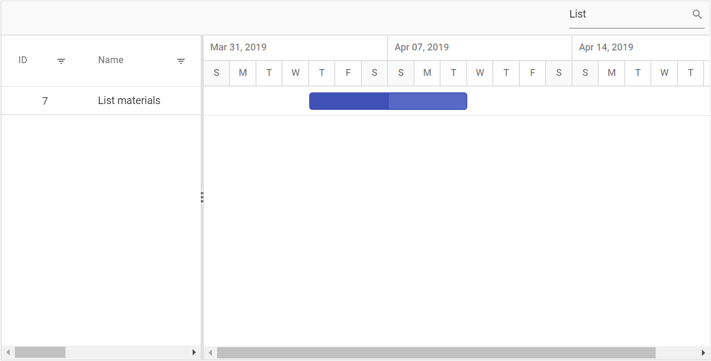

# Filtering

Filtering allows you to view specific or related records based on filter criteria. This can be done in the Gantt control by using the filter menu support and toolbar search support. To enable filtering in the Gantt control, set the [`AllowFiltering`](https://help.syncfusion.com/cr/cref_files/aspnetcore-js2/Syncfusion.EJ2~Syncfusion.EJ2.Gantt.Gantt~AllowFiltering.html) to `true`. Menu filtering support can be configured using the [`FilterSettings`](https://help.syncfusion.com/cr/cref_files/aspnetcore-js2/Syncfusion.EJ2~Syncfusion.EJ2.Gantt.Gantt~FilterSettings.html) property and toolbar searching can be configured using the [`SearchSettings`](https://help.syncfusion.com/cr/cref_files/aspnetcore-js2/Syncfusion.EJ2~Syncfusion.EJ2.Gantt.Gantt~SearchSettings.html) property.

## Menu filtering

The Gantt control provides the menu filtering support for each column. You can enable the filter menu by setting the [`AllowFiltering`](https://help.syncfusion.com/cr/cref_files/aspnetcore-js2/Syncfusion.EJ2~Syncfusion.EJ2.Gantt.Gantt~AllowFiltering.html) to `true`. The filter menu UI will be rendered based on its column type, which allows you to filter data. You can filter the records with different operators.
























> The [`AllowFiltering`](https://help.syncfusion.com/cr/cref_files/aspnetcore-js2/Syncfusion.EJ2~Syncfusion.EJ2.Gantt.Gantt~AllowFiltering.html) property should be set to `true` to enable the filter menu.
> Setting the [`Columns.AllowFiltering`](https://help.syncfusion.com/cr/cref_files/aspnetcore-js2/Syncfusion.EJ2~Syncfusion.EJ2.Gantt.GanttColumn~AllowFiltering.html) property to `false` prevents rendering filter menu for a particular column.

### Filter hierarchy modes

The Gantt supports a set of filtering modes with the [`FilterSettings.HierarchyMode`](https://help.syncfusion.com/cr/cref_files/aspnetcore-js2/Syncfusion.EJ2~Syncfusion.EJ2.Gantt.GanttFilterSettings~HierarchyMode.html) property. The following are the types of filter hierarchy modes available in the Gantt control:

* `Parent`: This is the default filter hierarchy mode in Gantt. The filtered records are displayed with its parent records. If the filtered records do not have any parent record, then only the filtered records will be displayed.

* `Child`: Displays the filtered records with its child record. If the filtered records do not have any child record, then only the filtered records will be displayed.

* `Both`: Displays the filtered records with its both parent and child records. If the filtered records do not have any parent and child records, then only the filtered records will be displayed.

* `None`: Displays only the filtered records.
























### Initial filter

To apply the filter at initial rendering, set the filter to `predicate` object in the [`FilterSettings.Columns`](https://help.syncfusion.com/cr/cref_files/aspnetcore-js2/Syncfusion.EJ2~Syncfusion.EJ2.Gantt.GanttFilterSettings~Columns.html) property.
























### Filter operators

The filter operator for a column can be defined in the `FilterSettings.Columns.Operator` property.

The available operators and its supported data types are:

Operator |Description |Supported Types
-----|-----|-----
startswith |Checks whether the value begins with the specified value. |String
endswith |Checks whether the value ends with the specified value. |String
contains |Checks whether the value contains the specified value. |String
equal |Checks whether the value is equal to the specified value. |String &#124; Number &#124; Boolean &#124; Date
notequal |Checks for the values that are not equal to the specified value. |String &#124; Number &#124; Boolean &#124; Date
greaterthan |Checks whether the value is greater than the specified value. |Number &#124; Date
greaterthanorequal|Checks whether the value is greater than or equal to the specified value. |Number &#124; Date
lessthan |Checks whether the value is less than the specified value. |Number &#124; Date
lessthanorequal |Checks whether the value is less than or equal to the specified value. |Number &#124; Date

> By default, the `FilterSettings.Columns.Operator` value is `equal`

### Diacritics

By default, the Gantt control ignores the diacritic characters while filtering. To include diacritic characters, set the [`FilterSettings.IgnoreAccent`](https://help.syncfusion.com/cr/cref_files/aspnetcore-js2/Syncfusion.EJ2~Syncfusion.EJ2.Gantt.GanttFilterSettings~IgnoreAccent.html) to true.

In the following sample, type **Perform** in the **TaskName** column to filter diacritic characters.
























### Filtering a specific column by method

You can filter the columns dynamically by using the `filterByColumn` method.
























### Clear filtered columns

You can clear all the filtering condition done in the Gantt control by using the `clearFiltering` method.
The following code snippet explains the above behaviour.
























## Search

You can search records in the Gantt control by using the `search` method with search key as a parameter. The Gantt control provides an option to integrate the search text box in the toolbar by adding the search item to the [`Toolbar`](https://help.syncfusion.com/cr/cref_files/aspnetcore-js2/Syncfusion.EJ2~Syncfusion.EJ2.Gantt.Gantt~Toolbar.html) property.
























The following screenshot shows the output of searching for string in Gantt control.

### Initial search

In the Gantt control, you can load a task with some search criteria and this can be done by using the [`SearchSettings`](https://help.syncfusion.com/cr/cref_files/aspnetcore-js2/Syncfusion.EJ2~Syncfusion.EJ2.Gantt.Gantt~SearchSettings.html) property.
To apply search at initial rendering, set the value for [`Fields`](https://help.syncfusion.com/cr/cref_files/aspnetcore-js2/Syncfusion.EJ2~Syncfusion.EJ2.Gantt.GanttSearchSettings~Fields.html), [`Operator`](https://help.syncfusion.com/cr/cref_files/aspnetcore-js2/Syncfusion.EJ2~Syncfusion.EJ2.Gantt.GanttSearchSettings~Operator.html), [`Key`](https://help.syncfusion.com/cr/cref_files/aspnetcore-js2/Syncfusion.EJ2~Syncfusion.EJ2.Gantt.GanttSearchSettings~Key.html), and [`IgnoreCase`](https://help.syncfusion.com/cr/cref_files/aspnetcore-js2/Syncfusion.EJ2~Syncfusion.EJ2.Gantt.GanttSearchSettings~IgnoreCase.html) in the [`SearchSettings`](https://help.syncfusion.com/cr/cref_files/aspnetcore-js2/Syncfusion.EJ2~Syncfusion.EJ2.Gantt.Gantt~SearchSettings.html) property.
























> By default, Gantt searches all the bound column values. To customize this behaviour, define the [`SearchSettings.Fields`](https://help.syncfusion.com/cr/cref_files/aspnetcore-js2/Syncfusion.EJ2~Syncfusion.EJ2.Gantt.GanttSearchSettings~Fields.html) property.

### Search operators

The search operator can be defined in the [`SearchSettings.Operator`](https://help.syncfusion.com/cr/cref_files/aspnetcore-js2/Syncfusion.EJ2~Syncfusion.EJ2.Gantt.GanttSearchSettings~Operator.html) property to configure specific searching.

The following operators are supported in searching:

Operator |Description
-----|-----
startsWith |Checks whether a value begins with the specified value.
endsWith |Checks whether a value ends with the specified value.
contains |Checks whether a value contains the specified value.
equal |Checks whether a value is equal to the specified value.
notEqual |Checks for the values that are not equal to the specified value.

> By default, the [`SearchSettings.Operator`](https://help.syncfusion.com/cr/cref_files/aspnetcore-js2/Syncfusion.EJ2~Syncfusion.EJ2.Gantt.GanttSearchSettings~Operator.html) value is `contains`.

### Search by external button

To search the Gantt records from an external button, invoke the `search` method.
























### Search specific columns

By default, the Gantt control searches all the columns. You can search specific columns by defining the specific column's field names in the [`SearchSettings.Fields`](https://help.syncfusion.com/cr/cref_files/aspnetcore-js2/Syncfusion.EJ2~Syncfusion.EJ2.Gantt.GanttSearchSettings~Fields.html) property.
























> In above sample, you can search only `TaskName` and `Duration` column values.

### Clear search by external button

You can set [`searchSettings.key`](../api/gantt/searchSettings/#key) property as `empty` string, to clear the searched Gantt records from external button.
























