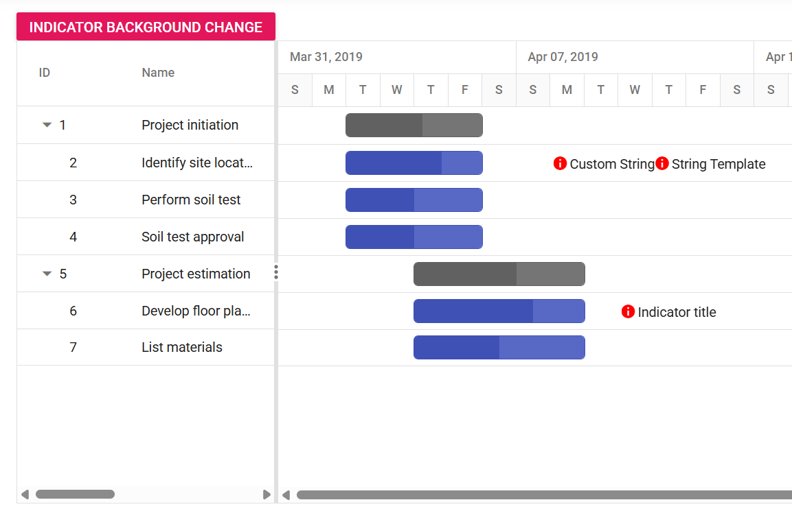

# Dynamically change indicator background color in Gantt component

Indicators are a great way to highlight important points or events on tasks within the Syncfusion Gantt Chart. By default, these indicators have a black background color. However, the background color can be dynamically changed based on specific conditions or actions within the application.

The following code snippets demonstrate how to achieve this.


















